# story-fm 기획서

**이 게임이 지금 어떻게 동작하는가**의 단일 소스. 결정 로그도 변경 이력도 없다 —
그건 git이 한다. 각 문서는 "오늘의 사실"만 담고, 코드와 어긋나면 문서를 코드에 맞춘다.

## 지도 — 폴더가 곧 층이다

```mermaid
flowchart LR
  OV["overview.md<br/>세 층 · 한 턴의 길 · 게임 루프 · 화면"]
  subgraph UI["ui/ — 화면이 무엇을 어떤 값으로 그리는가"]
    DS["design-system.md<br/>토큰 · 구단 색 · 서체 · 표면 · 모션"]
  end
  subgraph LLM["llm/ — 그것을 어떻게 말하는가 (상태를 못 바꾼다)"]
    direction TB
    PL["pipeline.md<br/>한 턴: 입력 조립 → 모델 → 출력 → 코어"]
    AG["agents.md<br/>열 에이전트의 계약 · 결산 · 교섭 · 스냅샷"]
    PR["prompts.md<br/>출력 문법 · 도구 표면 · 프롬프트 원칙"]
    MO["models.md<br/>llm.yml · 어댑터 · 실패 종류 · 예산"]
  end
  subgraph SIM["simulation/ — 무엇이 일어나는가 (결정적 순수 함수)"]
    direction TB
    MA["match.md<br/>전력 패킷 · xG 구간 시뮬 · 평점"]
    SE["season.md<br/>달력 · tick · 훈련 · 시즌 전환"]
    TR["transfer.md<br/>협상 · 설득 · 메디컬 · AI 시장"]
    FI["finance.md<br/>원장 · 보고서 · PSR"]
    CA["career.md<br/>감독 능력 · 평판 · 보드"]
    BH["balance-harness.md<br/>밴드를 재는 하네스"]
  end
  subgraph DATA["data/ — 무엇이 존재하는가 (카탈로그 + 세이브)"]
    direction TB
    GS["game-state.md<br/>2-레이어 · 엔티티 지도 · 세이브 호환"]
    PY["player.md<br/>16축 · 역할 · 폼 · 성장 · 안개"]
    TE["team.md<br/>체급 · 프로필 · 1·2군"]
    CO["competition.md<br/>리그 · 컵 · 대항전 · 승강"]
    PE["people.md<br/>페르소나 · 화자 · 회견 · 심경 · 인물 사전"]
    SO["sources.md<br/>데이터 출처 · 라이선스 부채"]
  end
  OV --> UI
  OV --> LLM
  OV --> SIM
  OV --> DATA
  LLM -->|"도구 호출 (Zod)"| SIM
  SIM <-->|읽고 쓴다| DATA
```

| 폴더                       | 무엇                                                       | 성격             |
| -------------------------- | ---------------------------------------------------------- | ---------------- |
| [data/](data/)             | 무엇이 존재하는가 — 선수·팀·대회·인물·세이브               | 카탈로그와 상태  |
| [simulation/](simulation/) | 무엇이 일어나는가 — 경기·시즌·이적·재정·커리어             | 결정적 순수 함수 |
| [llm/](llm/)               | 그것을 어떻게 말하는가 — 파이프라인·에이전트·프롬프트·모델 | 상태를 못 바꾼다 |
| [ui/](ui/)                 | 화면이 무엇을 어떤 값으로 그리는가 — 토큰·구단 색·서체     | 값의 단일 소스   |

## 읽는 순서

**처음이면** [overview.md](overview.md) → [llm/pipeline.md](llm/pipeline.md) 둘이면 전체
그림이 잡힌다 — 세 층이 어떻게 이어지는지, 감독의 한마디가 모델을 지나 상태가 되는 길이
어디를 지나는지. 그다음은 만지려는 도메인의 문서 하나다.

**에이전트가 작업 앞에 읽을 것** — 손댈 도메인의 문서 한 편과, 그 문서의 「⚠️ 불변식」
절. 문서마다 끝에 **코드 위치** 표가 있어 규칙이 사는 파일로 바로 간다. LLM 호출을
건드리면 [llm/pipeline.md](llm/pipeline.md) §4(도구의 세 겹)와 §6(앵커 ± 한도)이 계약이다.

## 무엇을 하려는가

| 하려는 일                        | 읽을 것                                                                                                    |
| -------------------------------- | ---------------------------------------------------------------------------------------------------------- |
| 게임이 뭔지 알고 싶다            | [overview.md](overview.md)                                                                                 |
| 모델 입력·출력이 어떻게 흐르는지 | [llm/pipeline.md](llm/pipeline.md)                                                                         |
| LLM 호출을 추가·변경한다         | [llm/pipeline.md](llm/pipeline.md) §4·§6 · [llm/agents.md](llm/agents.md) · [llm/models.md](llm/models.md) |
| 프롬프트·도구 설명을 고친다      | [llm/prompts.md](llm/prompts.md)                                                                           |
| 모델·제공자·시한·예산을 바꾼다   | [llm/models.md](llm/models.md) · `config/llm.yml`                                                          |
| 선수 능력치·성장·자리를 만진다   | [data/player.md](data/player.md)                                                                           |
| 구단·스쿼드 구성을 만진다        | [data/team.md](data/team.md)                                                                               |
| 대회 규정을 만진다               | [data/competition.md](data/competition.md)                                                                 |
| 대사·화자·인물·회견을 만진다     | [data/people.md](data/people.md)                                                                           |
| 세이브 구조·호환을 만진다        | [data/game-state.md](data/game-state.md)                                                                   |
| 경기 결과·밸런스를 만진다        | [simulation/match.md](simulation/match.md)                                                                 |
| 밸런스 눈금을 재고 옮긴다        | [simulation/balance-harness.md](simulation/balance-harness.md)                                             |
| 일정·tick·시즌 전환을 만진다     | [simulation/season.md](simulation/season.md)                                                               |
| 이적·계약·협상을 만진다          | [simulation/transfer.md](simulation/transfer.md)                                                           |
| 구단 살림을 만진다               | [simulation/finance.md](simulation/finance.md)                                                             |
| 감독 성장·보드·경질을 만진다     | [simulation/career.md](simulation/career.md)                                                               |
| 선수·팀 데이터의 출처를 묻는다   | [data/sources.md](data/sources.md)                                                                         |
| 화면의 색·서체·간격을 만진다     | [ui/design-system.md](ui/design-system.md)                                                                 |

## 문서의 규약

- **현재만 적는다.** "예전에는 …였다"는 문장은 두지 않는다 — 이유가 필요하면 지금의 규칙이
  막는 사고를 한 구절로 적는다.
- **숫자는 이름으로 부른다.** 밸런스 상수는 코드가 갖고(`RATING_BAND` · `OPENING_DAYS` …),
  문서는 그 이름과 뜻을 적는다. 값을 문서에 다시 적을 때는 코드와 같아야 한다.
- **문서마다 「⚠️ 불변식」과 「코드 위치」가 있다.** 불변식은 깨지면 게임이 조용히 틀리는
  것들이고, 코드 위치는 그 문서의 규칙이 사는 파일이다.
- **행동이 바뀌면 문서가 먼저, 코드가 뒤다** (AGENTS.md §5). 문서와 코드가 어긋난 것을
  발견하면 코드가 불변식을 어긴 경우가 아닌 한 문서를 코드에 맞춘다.

> 비전과 개발 규약은 저장소 루트의 [AGENTS.md](../AGENTS.md).
