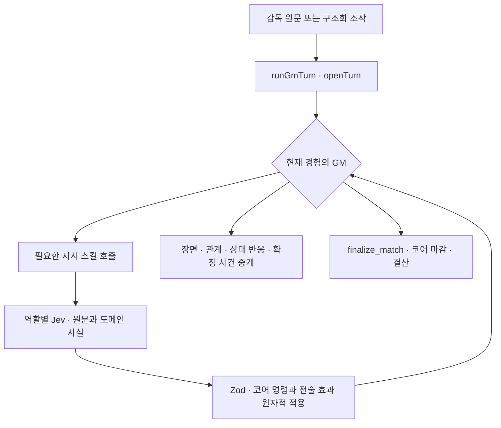

# 에이전트 — 누가 무엇을 하나

평시 GM은 `tactic_orders`·`training_orders`·`finance_orders`를 필요할 때 호출한다.
역할별 Jev 해석기는 감독 원문과 도메인 사실에서 명령 인자를 반환한다.
일반 대화에는 선행 해석기를 실행하지 않는다.

경기 지시의 타입 판독과 생성형 결산, 훈련 평가, 이력 압축, 온보딩은 각각 다른 근거를 읽는다.
산문과 시트 강도를 분리하는 실험은 `harness/`의 기록 비교 전용이다.

이야기의 작업 기억은 GM의 컨텍스트이고 지속적 인물 정보는 로어북 편집 에이전트가 갱신한다. 이력 압축은 대화를 요약한다.
상태는 검증된 코어 명령으로만 바뀐다. 선수 능력·포지션·역할·체력·적응·폼과 경기 결과,
재정·계약과 합의 조건의 원장은 검증된 코어 명령으로 갱신한다.

모델 배치는 [models.md](models.md), 입력·출력 규약은 [prompts.md](prompts.md)에 있다.

## 0. 용어

**스킬**은 GM이 직접 부르는 도구다. 생성형 에이전트가 반환하는 JSON은 **출력
스키마**이고, Jev가 받는 Choice·Noul·Score는 **평가 질문**이다. 둘 다 실행 도구가
아니다. 검증된 값으로 상태를 바꾸는 결정적 함수는 **코어 명령**이다.

## 1. 호출과 책임의 목록

아래 표는 호출 책임을 정리한다.
설정 키와 실제 모델은 `config/llm.yml`, 스킬의 정확한 선언은 `SKILL_CATALOG`와
`MATCH_TOOL_DEFINITIONS`가 소유한다.

설정된 역할과 모델의 원본은 `config/llm.yml`이다.

| 호출 / 설정 키                           | 누가 시작하는가                 | 책임과 경계                                                                                              |
| ---------------------------------------- | ------------------------------- | -------------------------------------------------------------------------------------------------------- |
| 평시 GM / `gm`                           | 평시 턴                         | 서사·관계·진행·조회·`update_character`. 지시는 `tactic_orders`·`training_orders`·`finance_orders`로 전달 |
| 매치 GM / `match-gm`                     | 경기 턴                         | 확정 사건 중계·벤치 대화. `tactic_orders`·`update_character`·`finalize_match`                            |
| 협상 GM / `negotiation-gm`               | 협상 화면 조작·예약된 답변      | 건별 하나의 GM이 모든 상대의 판단·반응을 담당. 제안·동의·메디컬은 코어 도구로 검증                       |
| 협상 이력 압축 / `negotiation-compactor` | 협상 이력 창 상한               | 해당 건의 쟁점·양보·거절 이유. 조건·동의 원장은 따로 보존                                                |
| 세계 시장 / `market-planner`             | 게임 날짜 진행                  | 구단의 보강·재계약·고용 판단. 협상 개설과 고용 명령을 app에서 검증                                       |
| 평시 전술 / `tactic-orders` (Jev)        | 평시 `tactic_orders`            | 현재 전술·선수 사실과 원문에서 명령 선택                                                                 |
| 훈련·육성 / `training-orders` (Jev)      | `training_orders`               | 훈련·육성 명령 선택                                                                                      |
| 재정 / `finance-orders` (Jev)            | `finance_orders`                | 티켓 가격 변경                                                                                           |
| 경기 전술 / `match-reader` (Jev)         | 경기 `tactic_orders`            | 직접 명령과 복합 전술 효과. 원문 출처와 시트는 함께 검증·적용                                            |
| 경기 결산 / `finalize-match` (Jev)       | 마감 스킬 또는 마감 보장 경로   | 평점·성장, 코어 앵커 ± 한도. 평점 근거는 매치 GM                                                         |
| 훈련 결산 / `training-rater` (Jev)       | 날짜 진행                       | 훈련 구간 평가, 코어 앵커 ± 한도                                                                         |
| 이력 압축 / `history-compactor`          | 평시 이력 창 상한               | 지난 일·열린 이야기·인물 후보, 실패하면 접지 않음                                                        |
| 로어북 편집 / `lorebook-editor`          | 스토리·협상·경기 GM의 편집 요청 | 비동기 항목 편집, 실패 시 원본·요청 보존                                                                 |
| 온보딩 / `onboarding-judge`              | 새 게임 생성                    | 배경·구단의 첫 장면, 실패하면 생성 중단                                                                  |

일반 대화에는 선행 평가가 없다. 세 지시 스킬이 필요할 때만 내부 해석기를 부른다.
`tactic_orders`는 평시에는 `tactic-orders`, 경기에는 `match-reader`를 사용한다.
라우팅은 `state.phase`가 정하지만 이 값 자체를 모델 입력에 싣지 않는다.

`lorebook-editor`는 스토리·협상·경기 GM의 저장된 편집 요청을 비동기로 처리하는 생성형
에이전트다. 로어북만 갱신하며 경기·계약·재정·고용 원장을 변경하지 않는다.

협상 화면은 평시 턴과 별도 API·이력을 사용한다. 하나의 건 안에서는 상대 구단·선수 측·
내부 업무가 같은 협상 GM의 이력에 들어가고, 다른 협상의 원문은 섞지 않는다.
메인 GM은 진행 현황과 결과를 읽고 `start_negotiation`으로 건을 열 수 있다.
감독이 연 새 건은 입력을 기다린다. 같은 `negotiation-gm` 설정의 읽기 전용 구조화 호출이
감독의 첫 제안 문구만 생성하고, 성공 도구 기록의 payload에 저장해 placeholder로 제공한다.
이 호출에는 도구가 없으며 상대 발화·제안 발송·답변 예약을 만들지 않는다. 기존 건을 다시
열면 생성 호출을 반복하지 않는다. 메인 GM의 제안 요청도 해당 건을 여는 데서 끝난다.
협상 GM은 자연어로 논의한 조건을 유저 구단의 비구속 초안으로 정리하고 상대가 제시할
조건을 상대 명의의 구조화 제안으로 기록한다. 유저 구단의 수락·서명은 조건 요약을 확인하는
직접 조작으로만 기록하며, 대화의 동의 표현으로 대신하지 않는다. [협상](../../negotiation/README.md)에 세부 경계가 있다.

### 직접 지시의 적용 경계

`createInstructionTool`은 인자가 없는 스킬이며, 모델이 감독 발화를 다시 쓰지 못한다.
앱이 보관한 이번 턴 원문을 `runInstructions`에 넘기고, 같은 스킬은 한 턴에 한 번만
해석한다. 각 호출은 그 역할의 명령 목록만 본다. 구조화 조작은 이미 코어가 적용한
값이며 표시 문구를 자연어로 재실행하지 않는다. 빈 원문에는 평가를 보내지 않는다.

질문·가정·인용·부정과 실행할 지시를 구분하고, 선수·날짜는 현재 후보를 선택한다.
금액·수·문자열은 감독 원문에서 근거가 있는 값만 옮긴다. **분류 확률은 의도의 확률이지
강도가 아니다.** 금액·계약·명령을 확률 평균으로 섞거나 자신감을 효과에 곱하지 않는다.

선택이 모호하거나 필요한 값이 없으면 **해당 스킬의 지시 묶음을 보류**하고 확인할 내용을 GM에게
넘긴다. 일부만 실행하지 않는다. 명령 묶음은 복제 상태와 임시 호출·journal에서 검사한다.
하나라도 코어가 거절하면 묶음이 만든 상태·금전 장부·호출 기록·명령 journal을 전부 반영하지 않고, 전부
성공한 경우만 원상태와 기록에 합친다. 평가 시도와 보류 사유의 진단 기록은 남는다.
서로 다른 역할 스킬을 여러 번 부른 턴에서는 각 스킬의 묶음이 이 경계를 따르며,
여러 스킬을 하나의 전역 트랜잭션으로 합치지는 않는다. 실패를 생성형 해석기로 우회하지 않는다.

선택지는 원문·코어 스키마·현재 명단과 지명된 선수·역할·포지션에서 만든다. 날짜
후보는 오늘부터 90일 뒤까지와 원문에 명시된 유효 ISO 날짜이며, 후보에 없거나 선택이 모호하면 확인한다. 숫자·문자열
후보를 놓쳤다는 이유로 임의 값을 보충하지 않는다. 배열·객체는 최대 8단계의 적응형
질문으로 펼치며 배열 32항목·선택지 255개·질문 512개·발화 8,000자 상한을 넘으면
잘라 적용하지 않고 보류한다. 단순 스칼라 명령도 의도와 인자를 나누어 평가하므로
평가 요청 하나가 언제나 지시 전체인 것은 아니다.

Choice 인자는 유일한 최대 선택지가 과반 확률을 얻어야 채택한다. 이는 보수적인
기권 조건이며 보정된 정확도나 한국어 품질 보증이 아니다. 육성 목록의 추가·제거·
교체·전체 해제는 선택된 목록 모드와 현재 명단을 코어가 합성하고, 관계없는 기존 항목을
유지한다. 명시적 전체 해제와 값 누락은 다른 지시다.

## 2. GM — 평시

장면과 분량은 감독의 요청과 이야기 맥락에 맞춰 정한다. 도구를 다 부른 뒤 장면을
한 번에 쓰고, 감독을 대신 연기하지 않는다
(문법과 철칙은 [prompts.md](prompts.md)).

- **직접 지시는 해당 스킬 안에서 검증한다.** GM이 필요한 지시 스킬을 부르면 Jev가
  원문을 해석하고, 적용·보류 결과가 도구 답으로 돌아온다. GM은 그 결과로 장면·후속 질문을 쓴다.
- **등번호는 GM이 직접 부른다** (`set_squad_number` — `playerId` · `number` · `take`).
  인자가 감독이 부른 선수와 번호 둘뿐이라 해석기를 거치지 않는다. 번호의 범위·중복·
  넘겨받음은 코어가 검증하고, 반려는 도구 답으로 돌아온다 ([../player.md](../player.md) §1.1).
- **경기로 장면을 넘기는 스킬은 그 턴의 마지막 호출이다.** `start_match`가 성공하면
  평시 GM의 호출은 거기서 끝나고, 그 뒤의 장면은 생성되지 않는다 ([models.md](models.md)
  §3-1 `handoff`). 같은 응답에서 뒤에 선 호출은 실행되지 않는다. 경기는 킥오프 게이트가
  서고 입장한 턴에 매치 GM이 첫 휘슬을 연다.

- **턴은 감독의 다음 말 하나를 제안하며 닫힌다** — GM 둘(평시·경기)이 장면의
  **마지막 줄**에 `<suggest_reply>…</suggest_reply>`로 낸다 ([prompts.md](prompts.md) §1).
  도구가 아니라 출력 문법인 이유는 왕복이다: 도구로 받으면 턴마다 모델 호출이 하나 늘고,
  GM이 쓰는 Gemini는 implicit 캐시라 그 호출의 입력이 정가로 다시 읽힌다 — 기록의 GM 호출
  대부분이 `cacheRead 0`이다 ([models.md](models.md) §4). 코어가 위생 **앞에서** 값을
  꺼내(`takeSuggestion`) `GmTurnResult.suggestion`으로 올리고, 태그 줄은 꺾쇠 블록이라
  위생이 화면과 저장에서 함께 걷는다. 화면은 그것을 입력창의 placeholder로 세우고 Tab·→가
  입력으로 받는다 ([../ui/design-system.md](../ui/design-system.md) §6). 감독이 한 말이
  아니므로 세이브의 턴(`ChatTurn.suggestion`)에만 남고 이력·압축 브리프·해석기 입력 어디에도
  실리지 않는다 — 다음 턴의 모델은 지난 턴의 제안을 모르고, 감독이 보낸 것만 감독의 말이다.
  태그가 없거나 값이 1\~80자 밖이면 그 턴엔 제안이 없고 장면은 그대로다. 장면 안에 선택지를
  늘어놓는 것은 그대로 금지다.
  첫 장면도 제안과 함께 열린다 — 온보딩은 JSON으로 답하므로 태그 대신 출력 스키마의
  `suggestion` 필드로 내고(§4-2), 같은 정규화를 거쳐 첫 턴의 `ChatTurn.suggestion`이 된다.
- **손잡이는 문장이 아니라 구조체로 온다.** 화면은 `TurnOperation`을 API에 넘기고
  (`{ kind: "skip_days", days }` · `{ kind: "skip_to_next_match", date }` ·
  `{ kind: "enter_match" }` · `{ kind: "match_stop" }`),
  프롬프트에 실리는 `<operator>…</operator>` 문구는 서버가 그
  구조체에서 만든다(`operationLabel`). 문장을 되읽는 정규식은 없다 — UI 문구 한 글자에
  시계·배치가 갈리던 자리가 여기였다.
- 코어가 한 일은 **한글 이름으로** 기록되고 칩으로 세우지 않는다 — 시계 이동은
  `시간 경과`다. 호출 이름은 영문이므로 둘은 한눈에
  갈리고, 카탈로그에 없는 영문 이름이 트레이스에 서지 않는다.
- **무엇을 감출지는 이름이 아니라 표식이 정한다** (`ToolCallRecord.silent`). 스킬 카탈로그에
  없는 이름을 걸러 내면 코어가 남기는 기록이 함께 사라진다 — 경기 마감(`finalize_match`)은
  칩과 말풍선(**대회 · "경기 종료"**)으로 서고, 시계 이동과 결산만 표식으로 감춘다.
- **기록은 성공한 호출만 남긴다** (`recordCall`). 실패한 호출은 세계를 움직이지 않았으니
  칩도 말풍선도 설 자리가 없고, 왜 안 됐는지는 그 턴의 장면이 말한다. mock도 같은
  함수를 쓴다(§8).
- **첫 장면에는 폴백이 없다** (§4-2). 실패·잘린 응답(`stopReason === "truncated"`)·문법
  위반은 한 번 다시 시도하고, 그래도 안 되면 게임 자체를 만들지 않는다. 검사는 문법과
  화자까지만 본다 — 장면은 `@`로 시작하고, **감독은 말하지 않는다**.
- **장면 위생은 코어가 건다** — 저장 직전의 `sanitizeSceneText`와 스트리밍의
  `filterSceneStream`이 도구 앞에 흘린 작업 서술과 **값이 같은 반복 시점 헤더**를
  걷어낸다(시각이 달라진 헤더는 장면 전환이라 남는다). 화면과 저장에 같은 것이 서도록
  **둘은 언제나 함께 걸린다**. 헤더 규칙은 평시 GM 턴만이다
  ([prompts.md](prompts.md) §1).
- **꺾쇠 블록은 두 국면이 함께 걷는다** — `<points>`·`<ledger>`는 코어가 읽으라고 넣어
  준 입력 구조라, 모델이 되받아 쓴 것은 평시든 중계든 장면이 아니다. 중계는 그 규칙
  하나만 읽는다(`sanitizeCasterText`·`filterCasterStream`). 문이 코어에 서 있으므로
  모델이 흘려도 화면은 깨지지 않고, 저장된 턴이 다음 턴의 이력으로 돌아가 같은 블록을
  다시 부르는 되먹임도 여기서 끊긴다.
- **도구를 다 쓴 턴도 장면으로 끝난다.** 왕복 상한(8회)의 **마지막 한 번은 도구 없이**
  나가므로([models.md](models.md) §3), 조회와 실행으로 상한을 채운 턴도 문장을 받고
  돌아온다. 그래도 장면이 비면 **코어가 이번 턴의 기록으로 model 턴을 세운다** —
  호출이 남긴 요약을 `@:` 내레이션으로 적을 뿐, 대사를 지어내지는 않는다. 라인업과
  훈련이 바뀐 채 빈 턴이 저장되면 감독은 지시가 먹혔는지 채팅으로 알 수 없다. 기록도
  장면도 없으면 아무것도 저장하지 않고 턴을 되돌린다(§8).

### 시계 — 출처가 날짜의 주인을 정한다

코어의 시계 입구는 **둘**이고 둘 다 `packages/engine/src/app/tick.ts`에 있다. 손잡이가 누른 만큼을 모델보다
**먼저** 굴리는 `advanceForOperation`, 그리고 장면이 닿은 곳을 모델 **뒤에** 따라가는
`applyScenePoint`다. 뒤쪽은 이번 턴 **날짜의 주인**(`ClockSource`)을 함께 받고, 날짜를
미는 규칙은 그 출처가 갖는다 — GM은 턴마다 한 번만 부른다.

| 출처                | 언제             | 날짜                                                           | 그 날 안의 시각      | 선언한 날에 못 닿으면                            |
| ------------------- | ---------------- | -------------------------------------------------------------- | -------------------- | ------------------------------------------------ |
| `header` — 헤더     | 평시의 보통 턴   | 헤더가 가리키는 날까지 굴린다 (경기일·시즌 종료 앞에서 멈춘다) | 그 날에 닿았을 때만  | `short` — `시간 경과` 기록으로 남는다            |
| `operator` — 손잡이 | 손잡이가 굴린 턴 | 고정 — 코어가 턴 앞에서 이미 옮겼다                            | 되감지 않고 따라간다 | 남기지 않는다 — 날짜를 요청한 것이 헤더가 아니다 |
| `ledger` — 장부     | 경기 중·경기일   | 고정 — 하루가 넘어가면 훈련·성장이 통째로 굴러 버린다          | 되감지 않고 따라간다 | `short` — `시간 경과` 기록으로 남는다            |

- **경기 중 고정은 출처와 무관하게 걸린다.** 판이 열려 있으면(`state.phase !== "idle"`)
  주인을 무엇으로 넘겼든 날짜는 서 있다 — 규칙이 부르는 쪽이 아니라 코어에 있다.
- **시각은 세 출처 모두에서 흐르고, 되감기지 않는다.** 경기는 몇 시간에 걸친 일이라
  시계를 통째로 묶으면 상단 띠가 킥오프 시각에 얼어붙는데 채팅의 장면 시각은 계속
  흐르므로 **한 화면의 두 시계가 갈린다.**
- **헤더가 여럿이면 시계는 마지막 것을 따라간다** (`lastScenePoint`). 한 턴 안에서
  시간이 흐르면 위생이 그 전환 헤더를 남기므로([prompts.md](prompts.md) §1), 장면이
  실제로 닿은 곳은 마지막 헤더다. 첫 헤더로만 밀면 채팅은 오후를 세우는데 상단 띠는
  오전에 남아 같은 갈림이 난다.
- **헤더를 못 읽은 멎음은 세어 둔다** — 자유 텍스트가 상태를 움직이는 유일한 경로라
  실패가 조용히 누적된다. 헤더를 못 읽은 평시 턴이 연달아 `STALLED_CLOCK_TURNS`(3)에
  이르면 그 수가 턴 결과(`GmTurnResult.clockStalled`)로 올라가고 화면이 띠로 세운다.
  헤더가 한 번 읽히거나 손잡이가 시계를 옮기면 `0`으로 돌아간다
  (`state.sceneHeaderMisses`). 첫 줄은 로그에 남는다.
- **경기 장면의 분은 시계가 아니다** — 중계의 첫 줄은 장부의 분으로 덧씌워진다
  (`stampMatchScene` — §3 ④). 모델이 적은 분은 화면에 닿기 전에 걷히고, 장부와 갈렸다는
  사실만 로그에 남는다.

### 턴은 앞·호출·뒤로 흐른다

실모드 GM 턴은 `openTurn → callGm → closeTurn`을 지난다. 턴 앞은 시간 조작·카드·
전술판 적용을, 호출은 국면별 입력·도구 루프·장면을, 턴 뒤는 장면 위생·시계·마감·
훈련 결산·저장할 본문을 맡는다. `runInstructions`는 독립 선행 단계가 아니라 GM의
지시 스킬 핸들러 안에서 실행된다.

메인 GM의 `review_board`는 실제 경질·AI 감독 선임을 실행하고,
`offer_manager_job`은 연봉·기간·응답 기한이 명시된 제안을 기록한다. 기대·평가·경고는
로어북에 남긴다 ([보드와 고용](../../story/board.md)).
`respond_to_interview`는 채용 제안 여부와 명시적인 계약 조건을 받는다.
일반 인물 대화의 새 사정은 `update_character`로 비동기 편집을 요청한다.

사건이 없는 날을 건너뛰어도 실제 날짜 변화는 시간 경과 기록으로 남는다. 모델이
장면을 비웠다면 도착한 날짜·시각의 장부 문장으로 턴을 구성한다. 시간·사건·명령·장면이
모두 없는 응답은 취소한다.

## 3. 경기 — 타입 지시·중계·결산

경기 시계와 결과는 클라이언트 공간 시뮬레이터와 서버 체크포인트가 확정한다.
킥오프·골·카드·부상·하프타임에 포인트 산문을 생성하는 호출은 없다. 매치 GM은
확정 사건을 중계하고, 감독이 전술을 지시하면 `tactic_orders`를 부른다.

| 계기      | 호출 관계                                                       | 결과                                            |
| --------- | --------------------------------------------------------------- | ----------------------------------------------- |
| 킥오프    | 경기 시작 → 매치 GM                                             | 첫 휘슬 장면, 초기 시트는 비어 있음             |
| 전술 지시 | 매치 GM → `tactic_orders` → Jev `match-reader` → 코어 → 매치 GM | 명령·전술 효과 적용 또는 묶음 보류, 세계의 반응 |
| 정지점    | 체크포인트 확정 → `match_stop` → 매치 GM                        | 확정 사건 중계, 기존 전술 효과 유지             |
| 종료      | `finalize_match` → 코어 마감 → 결산 → 매치 GM                   | 검증된 평점·성장과 마무리 장면                  |

### 매치 GM (`match-gm`)

이 경기의 중계 이력, 감독 원문, 확정 `<events>`와 현재 장부·전술을 읽는다.
`tactic_orders`는 원문 지시를 검증된 전술 명령과 효과로 옮기고, `finalize_match`는
확정 경기를 마감한다. 벤치 대화는 매치 GM의 장면이며 자동 감정·폼 판정 도구를 두지
않는다. 대화와 결과는 종료 후 메인 GM이 로어북 갱신과 일상 전개에 사용할 수 있도록
전달한다.

### 경기 판독 (`match-reader`) — Jev 명령과 전술 효과

`interpretMatchInstructions`는 현재 전술·선수 사실, 감독 원문과 `buildRecentFlowBlock`의
최근 관측 구간으로 직접 명령과 `set_match_plan` 타입 후보를 고른다. 이는 GM 스킬을
추가한 것이 아니라 공통 컴파일러 안에서 복합 효과를 다루는 출력 계약이다.
능력·포지션·역할·체력·적응·폼은 별도 사실로 유지한다.

직접 명령의 의도 단계에는 명령 계약을 전달하고, 복합 전술은 이름·설명으로 실행
의도를 고른 뒤 선택된 명령의 인자 단계에 출력 스키마를 전달한다. 앞 단계에서
선택한 모양·동작에 따라 적용 가능한 필드만 해석한다. 선행 선택이 아직 없으면
해당 필드를 다음 구조 단계로 미루며 수치 효과에는 개인 동작 필드를 묻지 않는다. 맨마킹은 선수만,
공격 방향 효과는 편과 레인, 형태 유지는 편만 묻는다. 쓰이지 않는 대상 필드를 다시
추정하지 않으며 대상 평가 단계 안에서 처리해 호출 단계를 추가하지 않는다.

복합 효과는 대상·모양·동작을 타입으로 고른다. 코어에서 부호·강도를 쓰지 않는
`behavior`는 `sign=1, step=1`로 정규화하고 불필요한 수치 평가를 생략한다. 나머지
수치 효과는 -3부터 +3까지 일곱 방향·강도 눈금의 Score 분포를 받는다. API 인덱스
0–6의 기대값에서 3을 뺀 값을 부호와 절댓값으로 나눠 `sign`·`step`에 전달한다.
confidence를 강도에 곱하지 않는다. `replace`는 새 효과 전체로 교체,
`clear`는 명시적 전체 해제, `keep` 또는 전술 효과가 없는 출력은 이전 효과 유지다.
단순 교체·자리·역할·6축 변경만으로 복합 효과를 새로 만들지 않는다.

`Point`는 생성형 분석 문장이 아니라 **감독 원문 출처 메타데이터**다. 코어 쪽에서
정한 id와 원문의 `POINT_TEXT_MAX` 이내 앞부분, 효과의 대상 목록을 붙인다. Jev는
포인트 산문을 생성하지 않는다. 각 시트 줄은 이 출처를 가리킨다.

명령과 효과는 같은 복제 상태에서 Zod·대상 실재·팀 예산·대가·소화율을 검증한다.
반려되는 명령이나 효과가 하나라도 있으면 새 묶음 전체를 적용하지 않는다. 기존 효과는
유지되고 확정 경기 사건은 바뀌지 않는다. 성공한 효과는 확정 tick의 입력 로그에 남아
브라우저·서버 재실행이 같은 시트를 쓴다. 인프라 오류는 호출 실패로 올라간다.

### 경기 마감 (`finalize-match`) — 결산만

코어 `finalizeMatch`가 결과와 평점 앵커를 세운 뒤 Jev가 이 경기의 중계와 사실을
출전 선수 전체 한 배치로 읽어 평점 보정·전술 적응·능력치 변화를 평가한다. 평점은
앵커 ±1.2의 7눈금 Score, 적응은 −2~+8의 6눈금 Score 기대값을 쓴다. 능력치 축과
±1은 변화 없음이 포함된 Choice이며 과반 지지가 없으면 보류한다. 타입·분포 전체를
검증한 뒤 코어 한도와 한 번 반영 표식을 적용한다. 실패하면 앵커를 유지한다.

평점 근거는 매치 GM이 `finalize_match.notes`에 쓴다. 출전 선수·길이·인원과
한 번 반영 경계를 검증한다. Jev는 새 문장을 생성하지 않고 GM은 수치 결산을 제출하지
않는다. 마감 보장 경로에는 GM 메모가 없으므로 새 문장을 지어내지 않는다.

결산의 출력에는 `closing`이 없다. 마무리 중계는 결산 결과를 받은 **매치 GM이 한 번만**
쓴다. 도구를 부르지 않아도 종료된 경기는 코어의 마감 보장 경로가 마감한다.
실호출 범위와 한계는 [경기 결산 측정](settlement-evaluation.md)에 적는다.

### 대화만 건 턴은 시계를 옮기지 않는다

경기의 시간은 실행기가 진행하고 서버가 검증한다. 감독 발화나 대화 판정은 경기
분을 만들어 내지 않으며, 정지·재개와 x1 예측 진행은
[live-match.md](../../match/live-match.md) §8의 규칙을 따른다.

## 4. 결산 — 앵커 ± 한도

자주 도는 판정은 전부 같은 구조다: **코어가 앵커를 박고, LLM이 맥락으로 다시 매기고,
코어가 한도로 자른다. 실패하면 앵커가 남는다.** 결산은 훈련과 경기 두 가지이며, 서사적 인물 정보는 로어북으로 관리한다.

| 결산                    | 언제                                         | 누가                         | 대상                                | 폭                                                                              |
| ----------------------- | -------------------------------------------- | ---------------------------- | ----------------------------------- | ------------------------------------------------------------------------------- |
| 훈련 (`training-rater`) | 시간이 흐른 뒤, 그 구간을 **한 묶음으로**    | Jev 한 배치 — Score·Choice   | 그 구간에 훈련한 1군 (부상·정지 밖) | **한 주치** 전술 적응도 −1\~+3 · 자리 0\~2 · 능력치 **날짜마다 최대 6명** 각 ±1 |
| 경기 (`finalize-match`) | `finalize_match` 도구 안, `finalizeMatch` 뒤 | Jev 한 배치 — 중계·사실 (§3) | 출전 선수 전원                      | 앵커 ±1.2 + 근거 한 줄 · 전술 적응도 −2\~+8 · 능력치 11명까지                   |

- **훈련은 구간 전체를 Jev 한 배치로 평가한다.** 선수별·날짜별 호출을 만들지 않는다 —
  구간의 세션 전부가 한 문맥에 실리고, 질문이 선수 × 훈련 날짜로 선다.
  - **능력치는 날짜마다 따로 판정한다** (`p{i}_d{j}`) — 그 선수의 허용 축 ±1을 묶은 Choice라
    한 구간에서 한 선수가 여러 날짜에 서로 다른 축을 움직일 수 있다. 날짜가 질문에
    있으므로 날짜 Choice는 따로 없다.
  - **전술 적응·전향 숙련은 구간 판정 하나다** — Score의 검증된 기대값을 코어가 훈련
    날짜마다 그날 세션 몫으로 나눠 반영하고, 장부에도 그 날짜로 남긴다.
  - **태도는 선수마다 Choice 하나다** — 갈래 코드라 날짜를 들지 않는다.
  - 질문이 `TRAINING_QUESTION_LIMIT`(512)을 넘으면 이어진 훈련 날짜를 한 칸으로 합쳐 한도
    안에 맞춘다(그 칸의 판정은 칸의 마지막 날짜에 남는다). 대상 25명이면 날짜 18개까지 합치지 않는다.
    칸은 판정자와 코어가 같은 함수(`trainingSlots`)로 자른다.
    변화 없음·태도 없음도 후보이며 과반 지지가 없는 분류는 변화 없음으로 보류한다.
    칸에 없는 날짜의 능력치 줄과 같은 칸의 둘째 줄은 코어가 받지 않는다. 자유 문장 근거는
    생성하지 않고 결과 카드의 실제 변화·태도와 성장 기록의 훈련 날짜를 남긴다.
    구조·확률 검증 실패는 전체를 적용하지 않으며 실패 시 빈 결산을 남긴다.
    선수 명단·축·한도·중복 결산은 코어가 다시 검증한다. 경기 결산도 확정 중계와 사실을 읽는 Jev 평가다.
    실호출의 범위와 한계는 [훈련 평가 측정](training-evaluation.md)에 적는다.
- ⚠️ **훈련 결산이 보는 구간은 턴이 시작한 시점부터 도착한 시점까지다.** 시계가 도는
  자리가 둘이라(§2) 시작점은 **장면보다 먼저** 잡아야 한다 — 손잡이 턴은 코어가 장면
  전에 이미 날짜를 옮겨 두므로, 장면 뒤에 잡은 시작점은 도착한 날짜와 같아져 구간이
  길이 0이 되고 훈련이 아예 돌지 않는다.
- ⚠️ **판정의 눈금은 한 주치이고, 폭을 접는 것은 코어다.** 결산은 턴이 넘긴 구간마다
  도므로 호출 횟수는 감독의 페이스가 정한다 — 눈금이 결산당 고정이면 하루씩 진행한
  감독이 같은 훈련으로 다섯 배를 가져간다. 그래서 판정자는 지금의 사다리를 그대로
  내고, 코어가 반영할 때 **훈련 날짜마다** `그날 세션 수 ÷ SESSIONS_PER_WEEK`를 곱한다.
  날짜가 반영의 단위라 구간을 한 번에 넘기든 나눠 넘기든 같은 날짜가 같은 몫을 받는다 —
  인원 상한도 날짜마다 서고, 한 칸까지만 넘기는 규칙도 날짜마다 선다. **프롬프트에는
  구간의 길이를 알리지 않는다** — 훈련 일지가 이미 며칠치인지 말하고, 눈금을 두
  곳에서 접으면 두 번 접힌다 ([player.md](../player.md) §6.1).
- **훈련을 세션마다 부르지 않는 이유**는 훈련엔 경기 같은 사건 목록이 없어 하루치만 보면
  판단할 거리가 없어서다. 그 구간의 훈련 일지 · 그 구간의 대화와 **장부 골격** · 개인
  지시가 함께 간다.
- **대화 창은 「지난 결산 이후」다** — 이 턴의 시작 날짜가 아니라 **마지막 결산 카드의
  `to`**(카드가 없으면 이 턴의 시작)에서 연다. 시계가 움직이지 않은 턴이 이어지거나
  훈련 없는 구간이 끼면 그 사이의 대화가 어느 브리프에도 안 실리는 자리가 생기기
  때문이다. 결산 카드는 판정이 돌지 않은 구간에도 서므로 이 기준은 언제나 있다
  (→ [season.md](../season.md) §4). 길이 난간(`CHAT_KEEP`)은
  그 위에 그대로 선다.
- **훈련 브리프의 대화는 장면이지 코치의 말이 아니다.** 모델 턴의 화자는 「장면」으로
  라벨된다 — 그 턴에는 구단주·선수·기자의 말이 함께 있어 「코치」로 붙이면 판정자가 남의
  말을 코치의 지시로 읽는다. 감독이 실제로 무엇을 걸었는지는 그 턴의 **장부 골격**
  (`turnFactLines` — 호출의 요약과 코어 기록을 `[장부] …` 줄로) 이 말하고, 압축
  브리프가 같은 함수를 읽는다(§5-1). 대화에서 읽을 것은 감독이 주문한 갈래와 근거까지다.
- ⚠️ **폭과 인원의 원본은 코어 상수 하나다** — 훈련 결산의 프롬프트는
  `TACTIC_GAIN_MIN/MAX` · `TRAINING_ATTR_CAP` · `POSITION_TRAIN_MAX`를 그대로 읽어
  문장을 짓는다. 프롬프트에 숫자를 손으로 적으면 코어만 조여지고 판정자는 옛 밴드를
  계속 믿는다 ([player.md](../player.md) §6.1).
- **경기 평점은 앵커가 못 보는 것을 맡는다** — 기록에 남지 않는 지배력, 위기 관리, 짧게
  뛰고 흐름을 바꾼 순간, 그리고 **중계가 그렸던 흐름**. 전술 적응도는 **이 결산이 유일한
  상승 경로**다.
- ⚠️ **한 결산은 장부를 한 번만 움직인다.** 도구 루프는 한 턴에 같은 도구를 여러 번
  부를 수 있다 — "N명은 대상이 아니라 무시" 같은 답을 읽고 모델이 명단을 고쳐 다시
  부르는 것이 그 자리다. 그때마다 반영하면 평점·적응도·능력치가 **호출 횟수만큼**
  쌓여 "코어 앵커 ± 한도"(AGENTS.md §6-4)가 통째로 뚫린다. 그래서 반영 표식은
  **코어의 상태 위에** 둔다 — 경기는 `MATCH.result.rated`, 훈련은 그 구간 훈련
  세션 엔트리의 `settled`. 표식이 서 있으면 두 번째 호출은 **"이미 반영"으로 답하고
  아무것도 하지 않는다.**
- ⚠️ **자르는 기준은 언제나 코어 앵커다.** 이미 보정된 저장값에서 다시 ±폭을 재면 두
  번째 호출이 앵커에서 두 배 벗어난다. 같은 호출 안에 같은 선수가 두 줄로 와도 같다 —
  **첫 줄만** 받는다.
- **경기 결산의 적응도·능력치도 출전 선수만이다.** 평점은 장부(`MATCH.result.ratings`)에
  자리가 있는 선수만 받는데, 적응도·능력치가 그 확인을 건너뛰면 벤치에 앉아 있던 선수가
  90분을 뛴 것과 같은 것을 가져간다.
- **훈련 결산은 카드 한 장을 장부에 남긴다** (`state.trainingReports`) — 구간·세션
  수 · 장부가 실제로 움직인 것(`moved`) · 훈련장에서 눈에 띈 선수의 갈래 코드
  (`marks`). 자유 문장 근거는 빈 문자열이다. **판정이 돌지 않은 구간(mock·실패)에도 빈 카드가 선다** — "장부가
  움직이지 않았다"가 사실이고, 카드가 없으면 모델이 훈련장의 일을 지어낸다
  (→ [season.md](../season.md) §4).

- **생성형 결산의 입력 스키마도 Zod 한 벌에서 파생한다** ([prompts.md](prompts.md) §2).
  못 지난 입력에는 고칠 자리를 돌려주므로 남은 한 번의 재시도가 같은 실패로 끝나지 않는다.
- 결산은 감독이 부른 적 없는 내부 판정이라 호출 칩으로 세우지 않는다.

## 4-3. 로어북 편집

메인·매치 GM의 `update_character`는 대상과 추가 정보 또는 새 인물 항목을 접수한다.
원래 턴과 요청을 함께 저장하고 `lorebook-editor`가 비동기로 기존 정보와
새 정보를 합쳐 키워드·설명·정보를 다시 쓴다. ID와 이름은 고정이다.

같은 항목의 요청은 순서대로 처리하고 완료 시 최신 세이브의 해당 항목만 갱신한다.
원래 턴이 실패하면 요청도 남기지 않는다. 편집 실패는 기존 항목을 유지하며 다음
실행 기회에 재시도한다. 접수만으로 편집 완료를 말하지 않는다.
설정은 `config/llm.yml`의 `lorebook-editor`가 소유한다. 모델 호출은 게임 잠금
밖에서, 완료 반영은 잠금 안에서 최신 세이브와 대상 버전을 확인한다. 게임 GET이
저장된 미완료 요청을 재개하며 `traceBoard`가 편집 호출을 board shelf에 기록한다.
요약 에이전트는 이 경로를 실행하거나 로어북을 편집하지 않는다.

## 4-2. 온보딩 — 배경과 구단에서 첫날을 연다

이름·배경·부임 구단과 실제 초기 정보를 읽어 첫 장면을 쓴다. 첫 장면은 짧다 — 사실
한두 개를 짚고 감독에게 물음 하나를 던지며 닫힌다. 같은 JSON의 `suggestion`이 그 물음에
감독이 할 법한 답 한 문장이고, 입력창의 첫 제안이 된다(§2). 감독의 능력치나 개인
잔액, 시작 사건·기한·단계를 만들지 않는다. 출력 스키마와 장면 문법·화자를 검증하고
실패하면 게임을 저장하지 않는다. 첫 장면과 이어지는 이야기는 대화 이력·요약과
각 GM의 명시적인 로어북 갱신으로 남는다.

## 5. 입력 — 층에 무엇을 두지 않는가

입력은 변경 빈도 순으로 쌓이고(고정 → 레퍼런스 → 요약 → 이력 → 이번 턴 → 스냅샷 →
도구 결과) 앞이 그대로인 만큼 뒤가 제공자별 캐시로 읽힌다. **층의 순서·블록·조립 함수·
경기 턴의 층은 [pipeline.md](pipeline.md) §3이 한 자리에서 그린다** — 여기
적는 것은 그 층에 **무엇을 두면 캐시가 깨지는가**의 규칙이다.

- 이번 유저 메시지는 화면 조작과 감독 발화 뒤에 키워드로 선택한 로어북 본문을
  붙인다. 스냅샷은 그 뒤의 휘발 블록이며 저장 이력에서는 제외한다.
- 검색 대상은 현재 유저 입력과 직전 모델 발화다. 로어북 본문과 요약 후보 목록은
  검색하지 않으며 연쇄 주입하지 않는다. 같은 버전이 현재 이력 안에 있으면 생략한다.
- 주입한 본문·버전을 턴에 저장하고 과거 이력은 그 사본으로 재현한다. 편집 후에도
  지난 턴의 바이트는 바뀌지 않는다. 버전이 바뀌거나 주입한 턴이 요약 밖으로 나갔으면
  다음 키워드 일치 때 다시 주입한다.
- 선수 명단·능력·체력·폼·부상·계약·배치는 현재 조회와 스냅샷의 책임이다. 로어북의
  기록을 현재 축구·계약 원장처럼 읽지 않는다. 레퍼런스에는 안정적인 구단·감독 배경을 둔다.
- 경기 통계·전술·시트는 매 정지점에 변하므로 휘발 경기 상태에 둔다.

### 이력은 평시·경기가 갈린다

`relevantTurns`가 두 국면을 나눈다 — 평시 턴은 `inMatch`가 아닌 턴이다
(`isPeaceTurn`). 섞이면 토큰만이 아니라 **맥락이 오염된다** — 중계가 평시 대화 스무 턴을
읽고 평시 GM이 중계 수십 턴을 읽는다. 대신 다리로 잇는다.

- **평시 → 경기**: `buildMatchBrief` — 직전 평시 턴의 감독 발화 3개를 **그대로** 싣는다.
  요약하면 말투와 의도가 가장 먼저 사라진다.
- **경기 → 평시**: `matchDigest`는 최근 확정 경기 결과·득점·평점·퇴장·부상·교체를
  원장에서 읽는다. 경기 대화와 마무리도 메인 GM에게 전달해 로어북 편집과 다음 장면의
  근거로 사용할 수 있게 한다. 평점이나 계약을 요약에서 다시 확정하지 않는다.
- **창의 크기는 턴 수가 아니라 글자 수가 정한다** — 짧은 문답 12턴과 긴 장면 12턴은
  크기가 몇 배 차이 나, 턴으로 자르면 프롬프트 크기가 예측되지 않는다. 상한 안에 드는
  만큼을 싣는다 (§5-1).
- 그래도 **시작점은 6턴 단위로만 옮긴다** — 매 턴 한 칸씩 미끄러지면 프리픽스가 계속
  달라져 이력 캐시가 한 번도 적중하지 않는다.
- **이번 턴에 밀어 넣은 발화는 이력이 아니다.** 한 턴은 채팅에 하나가 아니라 여럿을
  남긴다 — 전술판 조작이 오퍼레이터 턴으로 먼저 서고 감독 발화가 그 뒤에 선다. 그래서
  뒤에서부터 **모델 턴이 나올 때까지가 이번 턴의 입력**이고, 그만큼이 이력에서 빠진다.
  한 줄만 빼면 조작은 이력과 발화 블록에 두 번 실려 모델이 같은 지시를 두 번 읽고,
  경기 이력과 갈리는 턴(킥오프)에서는 빼야 할 줄이 애초에 그 목록에 없어 **직전 평시
  발화가 대신 잘려 나간다.**
- **경기를 여는 턴은 평시 이력에 남는다.** `start_match`를 부른 턴의 화자는 평시 GM이고,
  중계는 그다음 턴(킥오프)부터다. 끝날 때 국면이 바뀌었다는 이유로 경기 턴으로 표시하면
  중계 이력(`casterHistory`)에도 평시 이력에도 없어 **경기로 들어간 그 장면이 사라진다.**

## 5-1. 압축 — 밀려난 대화는 요약으로 남는다

평시 이력의 길이는 로어북이 붙은 실제 메시지 본문까지 센다. 예산을 넘으면
상한·잔량과 턴 경계에 따라 접힐 구간을 정하고 `history-compactor`를 호출한다.
이전 요약과 새로 접힐 원문, 호출·시간 진행의 장부 사실을 함께 읽는다.

`HistoryDigest.text`는 지난 일, `.open`은 끝나지 않은 이야기와 의도다. 수치·기한·
상태의 원본은 현재 계약·재정 원장이며 열린 이야기로 복제하지 않는다.
요약 에이전트는 카탈로그와 세이브의 후보 색인을 읽고 활용할 만한 최대 30명의
이름·한 줄 설명을 `.candidates`에 남긴다. 입력 풀은 최대 240명이며 이전 요약 후보,
최근 주입, 현재 선수단·페르소나, 요약 회차로 순환하는 새 항목 순으로 구성한다.
선택을 같은 풀에서 보충해 30명(풀이 더 작으면 전원)을 남긴다. 등장 의무가 아니며 이 목록 자체로 상세
로어북을 주입하지 않는다. GM 발화나 유저 입력의 이름·키워드가 다음 주입을 연다.

요약은 로어북·인물·관계를 편집하거나 등록하지 않는다. 메인·매치 GM의 `update_character`와
비동기 편집 에이전트가 그 책임을 가진다 ([로어북](../../story/lorebook.md)).
요약의 크기·형태를 검증하고 원문은 요약이 검증·저장된 지점까지만 모델 이력에서
제외한다. 실패하면 원문과 기존 요약을 유지하고 다음 기회에 재시도한다. 요약되지 않은
원문을 조용히 버리지 않으며 화면의 `state.chat`도 자르지 않는다.

경기는 해당 경기의 이력을 읽으며 완료된 결과·대화와 요약으로 평시를 잇는다.
이력 상한과 잔량은 `packages/engine/src/common/core/history-window.ts`가 소유하고 하네스가 확인한다.

## 6. 상태 스냅샷 — 매 턴 갱신되는 휘발 블록

**자리는 감독 발화 뒤다** — 이력에 남지 않는 블록이라 맨 뒤에 서야 그 앞이 캐시
프리픽스로 이어진다 (§5). **안쪽은 태그로 갈린다** — 한 턴에 열댓 덩어리가 쌓이는
블록이라 레이블 줄로는 경계가 서지 않는다 (→ [prompts.md](prompts.md) §5-1). 태그는 **내용이 있을 때만** 서므로 조용한
턴의 스냅샷은 앞의 셋뿐이다.

| 태그              | 싣는 것                                                                         |
| ----------------- | ------------------------------------------------------------------------------- |
| `<now>`           | 날짜·요일·시각·시즌·리그 순위 · 다음 일정과 **그 경기의 교체 한도** · 예정 훈련 |
| `<club>`          | 포메이션과 선발 평균 적응도 · 재정(잔고·주급) · 완장 · 선수단 인원과 명단       |
| `<manager>`       | 감독 기록 · 보드 기대 · 계약 · 열린 감독직 제안과 두드릴 수 있는 공석           |
| `<alerts>`        | 주의 — 한 줄에 하나                                                             |
| `<medical name>`  | 부상 · 부상 이력 · 과부하 — 의료진의 것 (people.md §3 화자 표)                  |
| `<cues>`          | 선수 근황                                                                       |
| `<coach name>`    | 현재 축구 사실 · 훈련 결산·임대 리포트·2군은 코치의 것 — 화자마다 한 덩어리     |
| `<opponent>`      | 경기 전날·당일의 상대 분석 — 예상 XI·결장·상대 모양과 6축·읽어 낸 지점          |
| `<last_match>`    | 직전 경기 다이제스트 — 결과·득점·최고 평점 · 퇴장·부상·교체                     |
| `<offseason>`     | 은퇴·시상 — 소집 전에만                                                         |
| `<international>` | A매치 휴식기 — 우리 소집 명단·돌아온 몸·지금 부릴 수 있는 1군                   |
| `<time_passed>`   | 손잡이로 넘긴 구간과 그 사이 벌어진 일                                          |
| `<news>`          | 경기 뒤 들어온 소식 · 카드로 세우지 못한 스카우트 보고서                        |
| `<media>`         | 공개 축구 기사 — 시즌 예상·펀딧 평가·경질·부임                                  |
| `<edits>`         | 감독이 화면에서 바꾼 것                                                         |
| `<interview id>`  | 지원한 구단의 감독직 면접과 채용 사실                                           |
| `<board>`         | 보드에 건 요청                                                                  |
| `<buybacks>`      | 행사할 수 있는 되사기 조항                                                      |

무직의 스냅샷은 다른 넷을 쓴다 — `<interview>`(마주 앉은 감독직 면접) · `<job_offers>`
(받은 감독직 제안) · `<vacancies>`(최근 공석) · `<now>`에 선 경질·만료 카드
(career.md §5.1). **`<interview>`가 제안 목록보다 앞이다** — 답할 자리가 먼저이고, 여러 구단의 면접은 구단 또는 면접 ID로 구별한다.

- **`<alerts>`는 현재 원장의 주의 사항을 전달한다.**
  계약 만료 임박, **부상 이력**(창 안에 이력이 있는 가용 1군의
  수와 이름 — [player.md](../player.md) §5.3), 그리고 **과부하**(누적
  피로가 「과부하」에 선 가용 1군의 수와 이름 — §5.5). 다친 뒤에야 서는 부상
  줄과 달리 이 두 줄은 **다치기 전**에 선다 — 없으면 수석코치가 "쉬게 하시죠"라고 말할
  사실이 어디에도 없어, 모델은 짐작으로 말하거나 말하지 않는다. 두 줄을 가르는 것은
  감독이 쥐는 손잡이가 달라서다: 이력은 **이번 경기의 라인업**이고 과부하는 **몇 주의
  훈련·로테이션**이다.
- **`<club>`의 완장 줄** — 주장과 부주장 둘뿐인 한 줄이고, **선수단 줄 위에 따로 선다.**
  이름 뒤에 괄호로 붙이면 가운뎃점으로 이어진 스물다섯 이름 한가운데에 묻혀, GM이
  장부의 완장 대신 **축구 상식으로 아는 주장**을 라커룸에 세운다. 완장은 팀 토크와
  라커룸 장면이 두고 서는 축이라 자기 줄을 갖는다.
- **`<club>`의 선수단 줄** — 인원 한 줄과 1·2군의 이름 명단이다. 인원은 명단의 크기가
  유스 계약·계약 만료 판단의 배경이라 남는다. **수치도 배치도 서지 않는다** — 능력치·컨디션·계약·현재 선발은 조회의
  몫이다 (§5·§7 · [prompts.md](prompts.md) §5-2).
- **`<manager>`의 보드 기대**는 현재 구단과 합의한 기대 문장·평가·고용 상태다.
  체급별 순위표나 경고 카운터로 생성하지 않는다. 재직 중에만 제공한다.
- **`<manager>`의 계약 아래는 감독 자신의 거취다.** 계약 한 줄(연봉·만료일, 보드가
  재계약하지 않기로 했으면 그 사실) 다음에 **열린 감독직 제안**이 한 줄씩 서고 — 보드의
  재계약 · 다른 구단의 접근 · 두드려 얻은 자리, 셋 다 재직 중에 선다
  (→ [career.md](../../story/career.md) §5.1 「재직 중 접근·노크」 · §5.4) —
  그 아래에 지금 두드릴 수 있는 **공석 명부**가 붙는다. 이직 제안의 줄에는 새 구단이 지금
  구단에 물 **보상금**이 함께 실린다. 열흘이면 사라지는 답할 자리라, 화면에만 있으면 GM은
  감독이 무엇을 두고 답하는지 모른 채 장면을 쓴다. **도구 이름은 서지 않는다** — 수락도
  흥정도 지원도 그 도구의 설명이 원본이다 (→ [prompts.md](prompts.md) §5-3).
- **`<media>`**는 시즌 예상·정기 펀딧 평가·기록된 감독 경질과 선임의 공개 사실을
  제공한다. 전달된 소식은 큐에서 소비하며 GM이 대화 맥락에 맞게 기사로 옮긴다.
  상세 인물 정보 주입은 현재 유저 입력·직전 모델 발화의 키워드 검색을 따른다.
- **`<coach>`는 현재 훈련·경기·육성의 참고 사실이다.** 성격 원형으로 정보를 제한하지 않는다.
  훈련 결산과 임대 리포트도 실제 원장에서 읽는다. 사실의 선택은 등장 의무나 자동 대사가 아니며,
  GM이 로어북과 대화 맥락에서 화자와 반응을 고른다.
- **`<opponent>`는 경기 전날과 당일에만 선다** — 코어의 상대 분석 리포트가 그대로 온다
  (→ [match.md](../../match/match.md) §3.6). 감독이 라인업을 정하는
  자리라 그날만 값이 있고, 사흘 전부터 매 턴 실으면 캐시 밖 층을 상대 명단이 통째로
  먹는다. 전술 효과의 감독 원문 출처를 전달한다.
  ⚠️ **예상 XI는 예상이다** — 근거가 된 직전 경기와 추정으로 채운 인원을 함께 적으므로
  GM은 확정으로 말하지 않는다.
- **이번 턴 로어북**은 유저 메시지 끝에 주입하고 본문·버전을 턴에 보존한다.
  상세 계약은 [로어북](../../story/lorebook.md)을 따른다.

- 채용 면접과 감독직 제안 목록은 현재 원장에 있을 때만 싣는다.

## 7. 조회 — 창이 아니라 검색

능력치·배치·타 팀·순위·일정·과거는 컨텍스트에 넣지 않고 **읽기 전용 도구**로
온디맨드 제공한다: `search_players` · `get_squad` · `get_team` · `get_league` ·
`get_match_report` · `get_opponent_report` · `get_career` · `get_history` · `get_finance`. 지난 시즌의 순위표·우승·시상은 `get_history`(시즌 ·
대회 · 팀 · 선수로 좁힌다)가, 감독 자신의 커리어 표는 `get_career`가 답한다.

상대·대회·라운드·날짜 범위·방향(지난/예정)으로 좁혀 "다음 맨유전", "토트넘과 지난
맞대결"에 정확히 답하고, **무엇을 뒤졌는지** 헤더에 밝힌다. 팀·대회 이름은 약칭까지
해석하고 모호하면 후보를 돌려준다. 호출 기록은 남기지 않는다 — 조회 로그가 호출 칩을 덮는다.

**`search_players`는 감독이 묻는 축으로 거른다.** 포지션·이름·나이·가용 상태·1군/2군에
더해 **계약 잔여**(`contractEndsWithinDays` — 무계약은 0일) · **주급 상한**(`maxWage`) · **우리 협회
홈그로운**(`homegrown`) · **성장 가능성 하한**(`minGrowth`) · **최소 지식 수준**
(`knowledge`) · **주발**(`foot`)로 거른다. 정렬은
`rating`·`age`·`fatigue`·`goals`·`apps`·`wage`에 `contract`·`assists`·
`seasonRating`·`growth`가 더해지고, `age`·`fatigue`·`contract`만 **낮은 쪽이 앞**이다.
그래서 "계약 1년 남은 홈그로운 센터백"이 한 번의 호출로 답이 된다 — 축이
없으면 모델은 `limit`만큼 훑고 나머지를 지어낸다. 타 팀 행은 **계약 만료일**을 함께 싣는다.
⚠️ **거르는 자도 노출이다** — 성장 가능성은 행이 찍는 그 단계로 거른다
([player.md](../player.md) §10). 참값으로 거르면 행이 라벨만 보여도
"통과했다"는 사실이 그 값을 그대로 말한다.

**선수 이름도 표기가 흔들리면 편다** (`packages/engine/src/common/core/name-match.ts` · LLM 없이 결정적). 한글은
자모까지 펴서 보고, 표기가 늘 흔들리는 짝(애/에 · 된소리/거센소리 · 왜/외/웨)은 같은
것으로 접는다 — "엔더슨"이 "앤더슨"에 닿는다. 남는 흔들림(오/어 · 받침 · 꼬리)은 편집
거리가 받되 **이름이 짧을수록 엄격**하다 — "케인"은 "케빈"이 아니다. 띄어쓰기·가운뎃점은
무시하고 성만·이름만·로마자(선수 id)로 불러도 찾는다. 같은 해석이 **명령 인자의
선수 자리 전부에** 걸려 있다 — 라인업·개인 훈련·교체·선수 지목에 같은 규칙을 적용한다. 감독이 부른 이름이 그대로 실려 오는데 한 자리라도 정확한 id만
받으면, 컨텍스트에 id가 없는 그 명령은 부를 수 없다.
⚠️ **확신이 하나일 때만 고른다.** 갈리면 후보를 돌려주고 GM이 되묻는다
([prompts.md](prompts.md) §3) — 잘못 집은 선수는 그대로 잘못된 상태 전이가 된다.
입구는 다섯뿐이다 (`packages/engine/src/common/core/player-ref.ts`) — 우리 선수는 `pickOurPlayer`, **계약이 우리
것인** 선수(임대 보낸 사람까지 — 재계약·해지·등재·매각 제안)는 `pickSignedPlayer`, 남의
선수는 `pickRivalPlayer`, 어느 쪽이든 되는 자리만 `pickAnyPlayer`, 채용 사실 카드나 임대
명단처럼 이미 좁혀진 목록은 `pickPlayerAmong`. **자격이 정해진 명령은 그 자격의 문으로 든다** —
재계약을 세계 전체에서 찾으면 남의 팀 동명이인이 후보로 서고, 마킹 상대를 세계 전체에서
찾으면 우리 선수가 후보로 선다. 어느 쪽이든 감독의 말이 후보 둘로 갈려 명령이 실행되지
않는다. **정확한 id를 지목했는데 자격 밖이면 거기서 끝난다** — 근처의 누군가로 바꿔
주면 그것은 감독이 하지 않은 지목이 된다. 반대로 서사가 흘린 id를 이름으로 되돌릴 때는(`humanizePlayerIds`) 낱말
경계에서만 바꾼다 — 부분 문자열까지 치우면 `rodri`가 `rodrigo-muniz`를 반쪽만 바꾼다.
**답할 도구가 없으면 모델은 지어내므로** 컨텍스트 밖 사실에는 각각 읽을 자리를 준다 —
배치는 `get_squad`, 훈련 일정은 `get_league(view="calendar")`, 지난 시즌은 `get_career`,
한 선수의 상세는 `search_players(playerId)`, 끝난 경기 하나는 `get_match_report`,
다음 상대는 `get_opponent_report`.

**순위표는 세 벌이고 개인 순위가 함께 있다** (`get_league`). `view="standings"`에
`split="home"`·`"away"`를 주면 그 소계로 다시 세운 표가 온다 — "우리 원정 성적이 왜
이러냐"에 합계표를 들고 답하면 모델은 나머지를 지어낸다. 모든 표의 각 행에는 최근
5경기 폼이 함께 선다. `view="leaders"`는 그 대회의 **개인 순위**(득점·도움·평점·
클린시트·징계)와 **팀 열**(득점·실점·슛·xG)을 한 번에 낸다 — 득점왕 경쟁도 "우리 리그
도움 1위"도 여기서 답이 나온다. **리그·국내 컵·대항전 모두에 선다**: `competition`으로 국내
컵과 대항전을, `season`으로 지나간 시즌의 표를 부른다 — "챔스 득점왕 경쟁 어때"가
답이 되는 자리다 (→ [competition.md](../../match/competition.md) §2 「개인 순위」).
⚠️ **지나간 시즌은 개인 순위만 낸다** — 팀 열은 그 시즌의 경기에서 나오는데 시즌
전환이 그 경기를 갈아 끼운다. 없는 것은 없다고 답하는 자리다.

**한 선수의 대회별 기록은 두 자리에 선다** — 상세 카드(`search_players(playerId)`)가
**이번 시즌과 지난 시즌**의 대회별 한 줄을, `get_history(player)`가 **시즌마다** 그
줄을 낸다. "작년 챔스에서 몇 골"은 통산·팀별 합으로는 답이 없다 — 행은 대회 축을
갖는데(→ [game-state.md](../game-state.md) §3.4) 접어 낸 합만 보이면
모델이 그 자리에서 수를 지어낸다.

**끝난 경기는 리포트가 답한다** (`get_match_report`). 타임라인·팀 스탯(슛·xG·점유)·
선수별 기록·평점과 그 한 줄 근거·MOTM이 한 번의 호출로 온다 — "지난 리버풀전 xG"에
스코어만 들고 답하면 모델은 나머지를 지어낸다. 경기는 상대·대회·날짜로 고르고, 고르지
않으면 가장 최근에 끝난 우리 경기다 (→ [match.md](../../match/match.md) §9.3).

**다음 경기의 상대는 리포트가 답한다** (`get_opponent_report`). 상대 예상 XI(직전 경기
선발에서 투영)·결장자·상대 모양과 6축·최근 폼이 한 번의
호출로 온다 — 감독이 "누굴 노릴까"·"쟤네 어떻게 나와"를 경기 전에 물으면 순위와 최근
5경기만 들고 답하지 말고 이걸 부른다. 경기는 상대·대회·날짜로 고르고, 고르지 않으면
다음 우리 경기다 (→ [match.md](../../match/match.md) §3.6).
⚠️ **예상 XI는 예상이다** — 상대가 로테이션을 돌리면 갈린다. 도구가 그 사실을 근거
경기와 함께 밝히므로 GM은 확정으로 말하지 않는다.

⚠️ **사건에는 도구가 없다.** 감독이 묻지 않은 것을 모델이 조회할 이유는 없으므로, 그 턴에
일어난 일은 **일어난 자리에서 사실을 싣는다** — §6의 스냅샷 블록이 그 자리다.

## 8. mock 모드와 실패

`LLM_MODE=mock`은 자연어 품질 평가가 아니라 같은 시나리오가 코어까지 도는지 확인하는
경로다. 생성형 호출 자리는 `ScriptedGameLLM`, 직접 지시 자리는 `ordersScript`의
명령 묶음을 쓰며 실모드와 같은 Zod·코어 명령·원자적 적용 경계를 지난다. 표에 없는
발화를 생성형 해석기로 보충하지 않는다. 훈련·경기 결산 등 모델을 생략하는
자리는 코어 앵커나 사실을 유지한다.

- 생성형 출력이 없거나 스키마를 어기면 `readOutput`이 `ModelOutputError`로 만들고
  `retryOnce`가 한 번 다시 요청한다. 결산 실패는 앵커, 압축 실패는 접지 않음,
  온보딩 실패는 게임 생성 중단이다. 경기 판독의 실패 경계는 §3과 같다.
- TypeSafe 전송·스키마 재시도는 어댑터의 하나의 전체 시한 안에 있다. 의미를 고르지
  못한 직접 지시는 확인 대상으로 반환하며, API 인증·연결·시한 실패를 감독 발화
  오류처럼 꾸미지 않는다. 제시된 명령 묶음 일부만 적용하지 않는다.
- GM 호출은 이미 도구가 실행됐거나 텍스트 델타가 나갔으면 통째로 재시도하지 않는다.
  동일한 명령을 두 번 적용하거나 장면을 두 번 흘리는 것을 막는다.
- 호출 기록은 `recordCall`이 성공한 상태 변경에 세운다. 조회는 호출 칩을 만들지
  않는다. 직접 지시 묶음의 기록과 journal도 성공한 묶음에서만 확정한다.
- 모델이 장면을 비웠지만 이 턴의 코어 기록이 남으면 그 기록을 표시한다. 실패한 모델
  대신 새로운 대사를 지어내지는 않는다. 저장 실패·턴 오류는 픽션 밖의 안내로 올린다.

## 9. 역할별 실행과 검증

감독 지시는 네 지시 스킬 안에서 역할별 Jev 평가로 해석한다. 역할별 명령 목록과
도메인 문맥을 공통 컴파일러에 전달하며, 원자적 적용은 `packages/agents/src/app/workflows/instructions.ts`가
조합한다. 런타임 의존성은 `common → {story, negotiation, match} → app`이다.

위임과 철회는 `player`·`kind`·`all` 범위를 명시한다. 빠진 대상을 전체로 확대하지 않는다.
전술은 자연어와 현재 후보의 의미를 대응하고, 금액·수량은 원문의 정확한 값과 명시된
변환 후보를 사용한다. 질문·인용·실행 보류는 명령으로 적용하지 않는다.

현재 경로를 확인하는 수동 하네스는 [직접 지시](instruction-evaluation.md),
[훈련](training-evaluation.md), [경기 결산](settlement-evaluation.md)이다.
[판독 비교](match-reader-evaluation.md)는 별도의 비교 하네스이며 운영 호출에 포함되지 않는다.

## 10. ⚠️ 불변식

- **결산의 실패는 게임을 막지 않는다.** 평점 하나 때문에 경기 결과가 되감기거나 시간
  진행이 막히는 편이 더 나쁘다.

- **평시 이력과 경기 이력을 한 배열로 합치지 않는다.** 두 다리(brief·digest)가 유일한
  연결이다.
- **상태 스냅샷은 저장 이력에 남지 않는다** — 누적되면 지난 날짜·지난 스코어가 이력에
  쌓여 모델을 혼란시킨다.
- **이번 턴 유저 메시지는 다음 턴 이력의 같은 자리와 글자까지 같다** — 스냅샷은 발화
  뒤에 서고, 조작과 발화는 보낼 때도 다시 그릴 때도 한 함수가 그린다 (§5).
- **`state.phase`를 모델 입력에 넣지 않는다.** 라우팅용 값이지 모델이 읽을 정보가 아니다.
- **압축은 `state.chat`을 줄이지 않는다.** 접히는 것은 프롬프트에 싣는 구간이지 세이브가
  아니다 — 채팅 화면의 이력은 언제나 전부 있다.
- **요약이 없으면 접지 않는다.** 요약 실패는 압축을 미루는 것이지 구간을 버리는 것이 아니다.

## 11. 구현 범위와 한계

- 출력 후검증 실패의 재시도는 `retry.ts`의 `retryOnce`가 호출 전체를 한 번 다시 실행한다.

## 코드 위치

| 무엇                                  | 어디                                                                                                                                                                        |
| ------------------------------------- | --------------------------------------------------------------------------------------------------------------------------------------------------------------------------- |
| 직접 지시 평가·원자적 적용            | `packages/agents/src/common/instruction-compiler.ts` · `packages/agents/src/app/workflows/instructions.ts`                                                                  |
| GM 턴 실행·라우팅 (앞·호출·뒤)        | `packages/agents/src/app/gm.ts`                                                                                                                                             |
| 시계 이동 (손잡이·헤더 — 코어)        | `packages/engine/src/app/tick.ts` (`advanceForOperation` · `applyScenePoint`)                                                                                               |
| 온보딩 (판정 + 첫 장면)               | `packages/agents/src/story/onboarding-judge.ts` · `packages/agents/src/app/workflows/story/onboarding-judge.ts`                                                             |
| 입력 빌더 (레퍼런스·스냅샷·이력·헤더) | `packages/agents/src/app/gm-input.ts`                                                                                                                                       |
| 이력 압축 판정 (코어 순수 함수)       | `packages/engine/src/common/core/history-window.ts`                                                                                                                         |
| 이력 요약 (LLM)                       | `packages/agents/src/story/history-compactor.ts`                                                                                                                            |
| 매치 GM 프롬프트·스킬·구간 대본       | `packages/agents/src/match/match-gm.ts` · `packages/agents/src/app/workflows/match/match-gm.ts`                                                                             |
| 경기 지시 (타입 명령·시트)            | `packages/agents/src/match/jev-match-reader.ts` · `packages/agents/src/match/recent-flow.ts` · `packages/agents/src/app/workflows/instructions.ts`                          |
| 경기 마감 (평점·성장)                 | `packages/agents/src/match/finalize-match.ts` · `packages/agents/src/app/workflows/match/finalize-match.ts`                                                                 |
| 훈련 결산                             | `packages/agents/src/story/training-rater.ts` · `packages/agents/src/app/workflows/story/training-rater.ts`                                                                 |
| 장부 골격 (`turnFactLines`)           | `packages/engine/src/common/core/turn-facts.ts`                                                                                                                             |
| 온보딩 판정 프롬프트·호출             | `packages/agents/src/story/onboarding-judge.ts` · `packages/agents/src/app/workflows/story/onboarding-judge.ts`                                                             |
| 결산 한도·검사 (코어)                 | `packages/engine/src/story/players/training-report.ts` · `packages/engine/src/app/workflows/story/players/training-report.ts` · `packages/engine/src/match/flow/ratings.ts` |
| 재시도·앵커 폴백                      | `packages/agents/src/common/retry.ts`                                                                                                                                       |
| mock 모드 어댑터 선택 · 첫 장면       | `packages/agents/src/app/mock-gm.ts`                                                                                                                                        |
| mock 대본 (발화 → 도구 호출 표)       | `packages/agents/src/app/mock-script.ts`                                                                                                                                    |
| 대본 어댑터 (`GameLLM` 계약)          | `packages/llm/src/scripted-adapter.ts`                                                                                                                                      |
| 조회 도구 구현                        | `packages/engine/src/app/lookup.ts`                                                                                                                                         |
