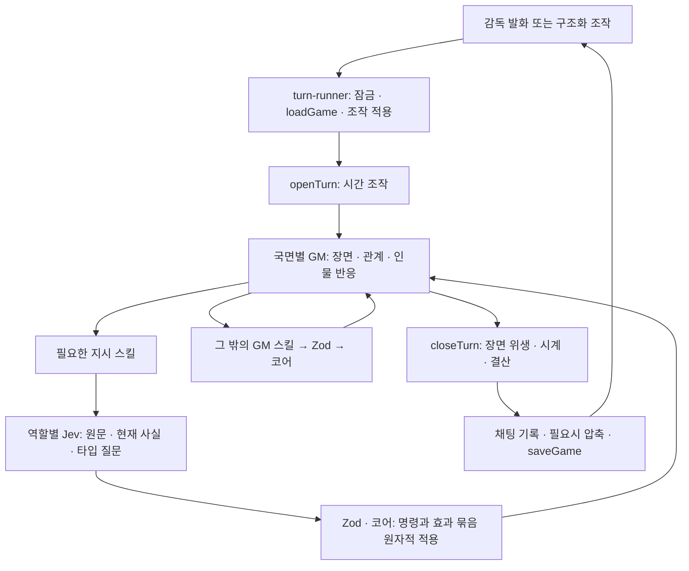

# 한 턴의 파이프라인 — 입력 · 평가 · 장면 · 코어

감독의 말은 현재 경험의 GM이 읽는다. 전술·훈련·재정을 바꾸는 지시면
GM이 해당 스킬을 부르고, 역할별 Jev가 원문을 타입 명령으로 옮긴다. 일반 대화 앞에
평가를 추가하지 않는다. 상태 변경은 **Zod와 결정론적 코어 명령**을 통해서만 일어나며,
장면 본문을 다시 읽어 명령을 만들지 않는다.

책임과 호출 관계는 [agents.md](agents.md), 입력·출력 문법은 [prompts.md](prompts.md),
제공자·모델·예산·추적은 [models.md](models.md)가 원본이다.

## 1. 요청에서 저장까지

`runGmTurn`은 `openTurn → callGm → closeTurn`을 지난다. `runInstructions`는
GM 도구 루프 안에서 요청한 역할만 해석한다. 원문이 없는 조작 턴이나 첫 입장·첫
착석 장면을 지시로 재해석하지 않는다.

웹의 `runTurnLocked`는 잠금 안에서 게임을 읽고 성공한 턴만 저장한다. 턴 전체가 실패하면
그 요청의 메모리 변경을 저장하지 않는다. 직접 지시 묶음 내부의 원자성과 별개로,
이 저장 경계가 요청 전체의 롤백을 맡는다. 진단 트레이스와 사용량은 실패해도 남을 수
있으며 게임 상태의 성공 기록과 구별한다.

| 입출력    | 내용                                                                                         |
| --------- | -------------------------------------------------------------------------------------------- |
| 요청      | `message` 또는 구조화된 `operation`; 전술판 `orders[]`는 모델보다 먼저 코어가 검증·적용      |
| 조작 기록 | 이미 적용한 변경을 GM에게 전달하고, 필요한 지시 문맥에는 `board_moves`로 제공                |
| 스트림    | `delta` 장면 조각 · `ping` 하트비트 · `done` 게임 페이로드 · `error` 문구와 재시도 가능 여부 |
| 저장      | 장면, 성공한 명령 기록, 사건·카드, 코어가 확정한 상태                                        |

## 2. 직접 지시 — 역할별 지시 스킬 안의 타입 평가

`createInstructionTool`은 인자 없는 지시 스킬을 만들고 앱이 보관한 원문을
`runInstructions`에 전달한다. 같은 스킬은 한 턴에 한 번만 해석한다.
`packages/agents/src/common/instruction-compiler.ts`는 공통 질문·선택·검증을 맡으며 별도 라우터가 아니다.

| GM 스킬              | 평가 역할         | 범위                                                 |
| -------------------- | ----------------- | ---------------------------------------------------- |
| 평시 `tactic_orders` | `tactic-orders`   | 전술·선수 배치                                       |
| `training_orders`    | `training-orders` | 훈련·육성                                            |
| `finance_orders`     | `finance-orders`  | 재정 관리                                            |
| 경기 `tactic_orders` | `match-reader`    | 경기 명령·복합 전술 효과, 현재 사실과 최근 10분 흐름 |

등번호(`set_squad_number`)는 이 표에 없다 — 인자가 선수와 번호 둘뿐이라 GM이 직접
부르는 스킬이고, 검증은 코어 명령이 한다.

도메인은 명령 목록과 문맥을 소유하고 앱은 원자적 적용을 조합한다. 런타임 의존성은
`common → {story, negotiation, match} → app`을 유지한다. Jev에는 실행 도구나
서사 생성 책임이 없다.

평가는 명령 의도와 인자를 선택한다. 단순한 스칼라 지시는 보통 두 평가 단계이며,
배열·객체는 필요한 깊이만큼 확장한다. 모델의 선택 확률은 **그 해석의 확률**이다.
압박 강도·금액에 곱할 배율이 아니다. 유일한 과반 선택을 요구하는 규칙은
불명확한 지시를 실행하지 않기 위한 보수적 경계이며, 보정된 정확도 보증이 아니다.
자세한 후보·크기 제한은 [agents.md](agents.md) §1과 실제 컴파일러가 정의한다.

적용은 다음 경계를 지킨다.

1. 해석이 불명확하면 해당 역할의 지시 묶음을 확인 대상으로 반환한다. 명확한 일부만 먼저 적용하지 않는다.
2. 상태 복사본과 별도 호출 기록으로 명령을 실행하고, journal도 임시 수집한다.
3. 모든 명령이 성공해야 상태·호출 기록·명령 journal을 함께 확정한다. 하나라도 코어가
   반려하면 묶음 전체를 버린다. 평가 시도 자체의 진단 기록은 이 성공 기록과 별개다.
4. 적용·반려 결과는 해당 스킬의 도구 답으로 GM에게 간다. GM은 적용한 지시를 다시
   실행하지 않고, 확인할 부분을 장면 속에서 묻는다. 빈 명령 묶음은 변경을 만들지 않는다.

여러 역할 스킬이 실행되면 각 스킬의 묶음이 독립적으로 이 경계를 따른다. 요청 전체의
저장 여부는 앞서 설명한 웹 턴 경계가 정한다. 목록의 추가·제외는 현재 명단을 보존하며, 명시적인 전체 해제와 대상 누락을 구별한다.
선수의 존재·자격, 실제 금액·계약·전술의 허용 범위는 Zod와 코어가 최종 검증한다.

## 3. 경험별 GM의 입력과 스킬

`state.phase`는 앱의 라우팅 값이다. 모델에 분기 코드를 설명하는 입력으로 싣지 않는다.
각 GM은 해당 경험의 장면과 인물 반응을 맡는다. 협상 화면은 명시적인 협상 id로 라우팅하며
메인 채팅의 모델 이력과 별도로 저장한다. 하나의 협상 GM이 그 건의 모든 상대를 연기한다.
감독의 `start_negotiation`은 새 건 생성 → 도구 없는 첫 제안 문구 생성 → 감독 입력 대기로
끝난다. 문구는 성공 기록의 payload에서 입력창으로 전달하며 실제 협상 답변은 감독의
메시지·제안 발송 뒤에 생성한다. 다른 구단의 접근과 AI끼리의 예약 답변은 시장 흐름을 따른다.

| GM               | 장면의 책임                              | 직접 부르는 스킬                                                                              |
| ---------------- | ---------------------------------------- | --------------------------------------------------------------------------------------------- |
| `gm`             | 일상·훈련·언론·보드·관계                 | `tactic_orders`·`training_orders`·`finance_orders`, `update_character`, 조회·이야기·진행 스킬 |
| `negotiation-gm` | 협상 상대의 판단과 답변                  | 제안·동의·메디컬 스킬, `update_character`                                                     |
| `match-gm`       | 코치와의 대화·확정 사건 중계·경기 마무리 | `tactic_orders`, `update_character`, `finalize_match`                                         |

스킬은 모델이 직접 부르는 도구만 가리킨다. 내부 판정기의 JSON은 출력 스키마이고,
그 결과로 앱이 호출하는 함수는 코어 명령이다. 전체 이름·호출 관계는
[agents.md](agents.md) §1의 표를 따른다.

경기 첫 입장은 도구 없이 장면을 쓴다. 경기의
구조화 조작 턴에는 `finalize_match`만 제공한다. 도구의 Zod가 잘못된 인자를 반려하면
수정할 부분을 도구 결과로 돌려준다. 성공한 상태 변경은 `recordCall`로 남고, 조회는
상태 변경 칩을 만들지 않는다. 도구 왕복은 어댑터의 상한과 호출 전체 시한 안에서 돈다.

### 입력 층과 캐시

입력은 변경 빈도가 낮은 것부터 조립한다. 캐시 지원·요금은 제공자 설정과 실제
사용량을 따른다. 특정 할인율이나 캐시 적중을 보장하지 않는다.

| 층        | 평시                           | 경기                                           |
| --------- | ------------------------------ | ---------------------------------------------- |
| 고정      | `GM_SYSTEM` · GM 도구 정의     | `MATCH_GM_SYSTEM` · 경기 도구                  |
| 레퍼런스  | 구단·감독; 요약은 별도 후속 층 | 구단·감독·수석코치·경기 전 발화                |
| 이력      | 평시 채팅 창                   | 해당 경기 `casterHistory`; 첫 입장만 평시 이력 |
| 이번 턴   | 조작·감독 발화·로어북          | 발화·첫 휘슬 표식·확정 사건·로어북             |
| 상태      | 현재 스냅샷                    | 장부·전술·효과 출처                            |
| 도구 결과 | 지시 적용·조회·코어 실행의 답  | 전술 적용·마감 결과                            |

평시의 이번 턴 메시지와 다음 턴 이력의 같은 자리는 `renderTurnGroup`이 그린다.
날짜·선수 상태 같은 가변 사실은 고정층에 넣지 않는다. `stateNote`는 발화 뒤에 붙고,
`operator_channel` 설정에 따라 별도 메시지 또는 유저 메시지 꼬리로 전달된다.
반환 이력에는 상태 스냅샷을 누적하지 않는다.

이력 창과 압축 시점은 코어의 `history-window.ts`가 정한다. 접히는 원문에는
`turnFactLines`의 장부 사실을 함께 보내고, `history-compactor`가 요약을 반환한다.
압축은 저장 직전에 필요할 때만 돌며 실패하면 접지 않는다. `state.chat` 전체와 화면의
이력은 그대로 남는다. 로어북 주입 본문까지 예산에 포함하고 검증·저장된 요약 지점까지만
모델 이력에서 제외한다. 요약은 로어북을 편집하지 않고 최대 30명의 이름·설명 후보를
남긴다. 후보 목록은 상세 주입의 검색 대상이 아니다. 평시·경기 이력을 무작정
하나로 합치지 않는다.

`update_character`는 원래 턴과 함께 비동기 편집 요청을 저장한다. 턴이 성공적으로
저장된 뒤 `lorebook-editor`가 같은 항목의 요청을 순서대로 처리하고 최신
세이브의 해당 항목만 갱신한다. 실패 시 기존 항목과 요청을 보존한다. 게임 GET은 서버 재시작 뒤에도 저장된 작업을
재개하며 편집 호출은 `traceBoard`의 board shelf에 남는다.
주입한 본문·버전은 턴에 남겨 이후 편집으로 과거 메시지가 바뀌지 않게 한다.
상세는 [로어북](../../story/lorebook.md).

## 4. 경기 — 지시·판독·중계·결산

경기 결과·시각·사건은 결정론적 코어가 정한다. 화면의 예측 진행과 서버의 확정
체크포인트를 구분하며, 턴은 확정 상태를 읽는다. 모델이 중계에 적은 득점·분을
장부로 되읽지 않는다.

- **전술 지시:** 매치 GM의 `tactic_orders` 안에서 Jev `match-reader`가 원문과 현재
  사실·최근 흐름을 읽는다. 직접 명령과 복합 효과는 함께 검증하고 원자적으로 적용한다.
- **킥오프·정지점:** 자동 판독이나 전술 포인트 산문 생성 없이 매치 GM이 확정 사건을
  중계한다. 지시가 없으면 기존 전술 효과를 유지한다.
- **전술 효과:** 구조·대상·방향을 타입 후보로 고르고 Score의 0–3 기대값을 강도로 쓴다.
  `Point`는 감독 원문의 제한 길이 출처이며 모델이 생성한 분석 문장이 아니다.
  선수 능력·포지션·역할·체력·적응도·폼은 독립적인 근거로 남는다. 효과 교체·해제·유지를
  구분하고 실재·예산·대가·소화율 검증에서 잘린 효과가 있으면 묶음 전체를 보류한다.
- **최근 흐름:** `advanceLive`가 실제 tick마다 모은 1초 버킷에서 최대 600초만 읽는다.
  시작 후 10분 미만이면 관측 길이를 그대로 표시하며, 부분 만료 버킷을 버리므로
  충분히 진행한 뒤에도 실제 길이는 599–600초다. 휴식은 늘리지 않고 추가시간·하프
  전환은 단조 증가 tick으로 잇는다. 점유·슈팅·xG·패스·태클·파울·사건을 누적 통계와 구분한다.
- **마감:** 코어가 결과·평점 앵커를 확정하고 Jev `finalize-match`가 평점·성장을
  반환한다. 앵커 ± 한도를 적용하며 실패하면 앵커를 유지한다. 마무리 장면은 매치 GM이
  쓴다. `closeTurn`은 GM이 마감을 놓쳐도 종료 장부를 닫는다.

[기록 입력 비교](match-reader-evaluation.md)는 입력 표현과 강도 판독을 비교하는
하네스다. 운영 스킬 전체의 지연·품질은 이 측정 범위에 포함되지 않는다. 판독 인프라 오류는 호출 실패로 올라가며, 확정 경기 사건은 바뀌지 않는다.
경기에서 평시로 전하는 결과는 코어의 `matchDigest`가 장부에서 만든다.

## 6. 장면 뒤 — 시계와 보조 판정

장면은 위생 처리 후 채팅에 남는다. 평시의 시점 헤더만 코어 시계에 제안되며,
`applyScenePoint`가 되감기·경기일·기한·시즌 경계를 검증한다. 출처는 셋이다.

| 출처       | 날짜의 주인                                                 |
| ---------- | ----------------------------------------------------------- |
| `header`   | 일반 평시 턴: 마지막 장면 헤더를 코어가 검증                |
| `operator` | 시간 조작 턴: `advanceForOperation`이 장면 전에 이동한 날짜 |
| `ledger`   | 경기: 장부가 정한 날짜; 경기 표시 분도 장부에서 부착        |

골·카드 표식도 장부 사건에서 만든다. 헤더가 누락된 연속 턴은 `noteSceneHeader`가
드러낸다. 장면이 비었지만 성공한 명령이 있으면 그 사실로 내레이션을 세운다.
새 대사를 지어내는 폴백은 없다. 시간·사건·명령·장면이 모두 없는 턴은 취소한다.

| 보조 호출              | 시점·출력                            | 검증과 실패 경계                                                   |
| ---------------------- | ------------------------------------ | ------------------------------------------------------------------ |
| `training-rater` (Jev) | 지난 구간 훈련의 적응·자리·능력·태도 | 세션 수에 따른 코어 한도와 결산 표식; 실패해도 진행·기준 상태 유지 |
| `history-compactor`    | 이력 상한의 지난 일·열린 이야기·후보 | 코어가 크기·형태·후보를 검증; 실패하면 접지 않음                   |
| `onboarding-judge`     | 새 게임의 배경 판정·첫 장면          | 장면·문법 검증; 실패하면 게임 생성 중단                            |
| `finalize-match` (Jev) | 확정 경기의 평점·성장                | 코어 앵커·한도·한 번 반영 표식; 실패하면 기준 결산 유지            |

훈련 결산은 실제로 지난 구간만 다루며 같은 대화가 두 결산에 중복되지 않도록 마지막
결산 이후의 이력을 읽는다. 훈련의 수치 한도는 해당 경험 문서를 따른다.

## 6. 실패·재시도·계측

- 생성형 구조화 출력은 `readOutput`의 Zod를 통과해야 한다. 산출이 없거나 잘못되면
  `ModelOutputError`가 되고 `retryOnce`가 한 번 다시 부른다. 인증·연결·예산·시한 등
  `LlmCallError`를 이 경로로 무조건 다시 부르지 않는다.
- GM 호출이 도구를 실행했거나 텍스트 델타를 내보냈으면 전체 호출을 재시도하지 않는다.
  지시 스킬이 남긴 변경도 그 GM 호출이 실행한 도구로 취급한다.
- TypeSafe의 전송·스키마 재시도는 어댑터의 한 전체 시한 안에서 처리한다. 의미를
  결정하지 못한 지시는 확인 대상으로 반환하지만, 인증·연결 오류를 감독의 말이
  불명확했던 것처럼 바꾸지 않는다.
- 각 호출의 실패는 담당 경계가 처리한다. GM·직접 지시의 인프라 오류는 턴 실패로
  올라가고, 결산·압축 등은 위 표의 폴백을 따른다. 화면은 픽션 밖 배너로 오류와
  재시도 가능 여부를 표시한다. 분류와 문구는 `turn-runner.ts`가 소유한다.
- `withGameUsage`의 사용량 장부와 호출 트레이스는 여러 모델 호출·재시도를 함께
  관찰한다. 실패한 시도도 제공자가 보고한 사용량을 포함한다. 누락된 사용량은 0원
  증거가 아니다. 비용·지연 비교는 실제 전체 경로를 측정하고 모델·버전·가격 조건을 남긴다.

`LLM_MODE=mock`은 생성형 자리에 대본 어댑터를 두고, 직접 지시는 `ordersScript`의
명령 묶음을 같은 Zod·원자적 코어 적용 경계로 보낸다. 이는 자연어 품질 평가가 아니다.
실제 호출의 재현 방법과 한계는 [직접 지시 평가](instruction-evaluation.md)와
[판독기 비교](match-reader-evaluation.md)에 있다.

## 7. 코드 위치

| 책임                     | 위치                                                                                                       |
| ------------------------ | ---------------------------------------------------------------------------------------------------------- |
| 요청·NDJSON              | `apps/web/app/api/games/[id]/turn/stream/route.ts`                                                         |
| 잠금·저장·오류 안내      | `apps/web/application/lib/turn-runner.ts`                                                                  |
| 턴 앞·직접 지시·GM·턴 뒤 | `packages/agents/src/app/gm.ts`                                                                            |
| 타입 평가·묶음 적용      | `packages/agents/src/common/instruction-compiler.ts` · `packages/agents/src/app/workflows/instructions.ts` |
| GM 입력·도구             | `packages/agents/src/app/gm-input.ts` · `packages/agents/src/app/gm-tools.ts`                              |
| 경기 판독·마감 배선      | `packages/agents/src/app/workflows/match/`                                                                 |
| 경기 판독·결산 모델 I/O  | `packages/agents/src/match/jev-match-reader.ts` · `recent-flow.ts` · `finalize-match.ts`                   |
| 시계·이력 창             | `packages/engine/src/app/tick.ts` · `packages/engine/src/common/core/history-window.ts`                    |
| 산출 검증·재시도         | `packages/agents/src/common/retry.ts`                                                                      |
| 모델 계약·평가 계약      | `packages/llm/src/game-llm.ts` · `packages/llm/src/game-evaluator.ts`                                      |
| 호출·평가 팩토리·계측    | `packages/llm/src/factory.ts` · `evaluator-factory.ts` · `usage-meter.ts` · `turn-trace.ts`                |

## 협상 요청

협상 API는 게임 잠금 안에서 요청 id와 협상 revision을 확인한다. 조건은 자연어 대화로
제안하며 협상 GM이 초안과 상대 제안을 구조화 도구로 기록한다. 조건 확인·메디컬·서명은
UI의 명시적 조작으로 코어를 호출하며 대화와 상대 응답은 그 협상의 GM을 호출한다.
원문·제안·동의·요약은 협상 건에 저장한다. 검증에 실패한 조작은 저장하지 않는다.
유효한 유저 조작 뒤 상대 모델의 응답이 실패하면 유저 조작은 저장하고 응답 실패를
화면에 알린다. 모델의 부분 실행은 버리고 예정된 답변은 다시 시도할 수 있다.
저장 완료한 요청의 재전송은 모델과 계약 집행을 반복하지 않는다.

세계 시장의 검토는 게임 날짜와 구단별 검토 기록에 따르며 화면 GET으로 실행하지 않는다.
모델이 제출한 구단 계획과 고용 판단은 app에서 각 소유 도메인의 명령으로 조립한다.
