# 데이터 모델

**카탈로그(불변 초기치)와 게임 세이브(가변 상태)의 2-레이어.** 카탈로그는 코드에
있고 모든 게임이 공유하며, 세이브는 게임 하나의 JSON 스냅샷이다. 세이브 안은
정규화된 테이블 집합이고, 계산으로 되돌릴 수 있는 값은 저장하지 않는다.

이 문서는 **무엇이 어디에 있는가**를 다룬다. 각 값의 의미와 공식은 주제 문서에
있다 — 선수 능력치는 [player.md](player.md), 경기 장부는
[../simulation/match.md](../simulation/match.md), 협상은 [../simulation/transfer.md](../simulation/transfer.md), 재정은
[../simulation/finance.md](../simulation/finance.md), 일정은 [../simulation/season.md](../simulation/season.md).

## 1. 2-레이어

|         | 카탈로그                                               | 게임 세이브                                     |
| ------- | ------------------------------------------------------ | ----------------------------------------------- |
| 사는 곳 | 코드 (`packages/engine/src/data/`, `world/catalog.ts`) | `.data/<gameId>.json`                           |
| 수명    | 모든 게임이 공유 · 불변                                | 게임 하나 · 매 tick 변한다                      |
| 읽는 때 | **새 게임을 시작할 때만**                              | 매 요청                                         |
| 예      | 아스날의 이름·리그·초기 체급, 사카의 초기 16축         | 이 세이브의 아스날 체급, 사카 폼·계약·부상 이력 |

나누는 이유는 **같은 세계에서 여러 이야기가 갈라져야 하기 때문**이다. 세이브가
초기치까지 들고 있으면 카탈로그를 고쳤을 때 진행 중인 게임이 함께 흔들리고,
반대로 게임 중의 성장이 카탈로그로 새면 다음 게임의 사카가 지난 게임의 사카가
된다. 그래서 새 게임은 카탈로그를 **복사**해 `GAME_PLAYER`/`GAME_TEAM`을 만들고,
출처는 `GAME_PLAYER.catalogId`로만 링크한다(유스·절차 생성 선수는 `null`).
어드민의 카탈로그 편집이 **새 게임에만** 반영되는 것도 이 구조의 결과다.

팀은 카탈로그 id를 그대로 재사용하고, **카탈로그가 초기치를 주는 값은 게임 시작에
`GAME_TEAM`으로 복사된다** — 이름·약칭·소속 리그·체급·구장·브랜드. 전부 optional
이라 옛 세이브엔 없고, 없으면 카탈로그가 답한다([team.md](team.md) §1).

⚠️ **카탈로그가 갖는 값은 세이브에서 바꿀 수 없다.** 승강이 `state.leagueOf`
(팀 → 지금 속한 리그)로 표현되는 것이 그 예다 — 카탈로그의 `leagueId`는 불변이므로
세이브가 덮어쓰는 자리를 따로 둔다.

그래서 리그를 묻는 자리는 **두 갈래**이고, 어느 쪽인지는 질문이 정한다.

| 질문                                                                                      | 무엇을 읽나                                                  |
| ----------------------------------------------------------------------------------------- | ------------------------------------------------------------ |
| **이 팀이 지금 어느 리그에 있나** — 순위표·일정·중계권·리그 계수·시장 편향·우리 리그 판정 | `leagueOfTeamIn(state, teamId)` (`competition/promotion.ts`) |
| **그 리그가 어떤 리그인가** — 시장 전용(사우디·MLS)인가, 어느 나라인가, 이름·계수 표      | 카탈로그 (`league-catalog.ts` · `team-catalog.ts`)           |

`leagueOfTeamIn`은 세 층을 순서대로 본다 — 승강 결과(`state.leagueOf`) → 게임
시작에 복사한 소속(`GAME_TEAM.leagueId`) → 카탈로그. 가운데 층이 있어야 어드민이
팀의 소속 리그를 옮겨도 진행 중인 세이브의 순위표가 흔들리지 않는다. 리그의 종류와
국적은 승강도 세이브도 건드리지 않으므로 카탈로그가 답한다.

**소속에서 파생하는 판정도 같은 갈래를 탄다.** 둘 다 카탈로그판을 지우지 않고
상태 인지 판을 옆에 세운다 — `leagueOfTeamIn`이 `leagueOfTeam` 옆에 선 모양이다.

| 무엇                     | 세이브                                                 | 카탈로그                             |
| ------------------------ | ------------------------------------------------------ | ------------------------------------ |
| 이 팀이 지금 1부인가     | `isTopFlightIn(state, teamId)`                         | `isTopFlight(teamId)`                |
| 이 구단의 지금 살림 수준 | `clubEconomyLevelIn(state, teamId)`                    | `clubEconomyLevel(teamId)`           |
| 이 팀의 이름·약칭        | `teamNameIn(state, id)` · `teamShortNameIn(state, id)` | `teamName(id)` · `teamShortName(id)` |
| 이 구단의 구장·브랜드    | `clubProfileIn(state, id)`                             | `clubProfile(id, tier)`              |
| 이 구단의 체급           | `tierOfTeamIn(state, id)`                              | `catalogTierOf(id)`                  |

⚠️ **세계 생성은 카탈로그판을 쓴다** — 새 게임의 스쿼드 분류·절차 생성·축소 세계
(`core/state.ts` · `world/catalog.ts` · `world/scope.ts`)와 초기 잔고·이적 예산은
세이브가 서기 **전에** 도는 자리라 읽을 상태가 없다. 게임이 시작한 뒤 도는
자리 — 재정·시즌 예산·AI 시장·국내 컵 시드 — 만 세이브를 읽는다.

**구단 체급(`tier`)도 같은 갈래다** — 게임 안에서 변하므로 세이브가 갖는다. 카탈로그
값은 게임 시작의 초기치일 뿐이고, 그 뒤로는 `GAME_TEAM.tier`가 단일 소스이며 시즌마다
다시 매겨진다([team.md](team.md) §2). 읽는 자리는 전부 `tierOfTeamIn(state, teamId)`
하나를 지난다 — 카탈로그를 직접 읽으면 어드민이 편집한 순간 진행 중인 세이브의 보드
기대치와 경질 위험선이 그 자리에서 달라진다.

⚠️ **어드민 편집은 진행 중인 세이브의 어떤 값도 움직이지 않는다.** 이름·소속·체급·
구장·브랜드가 전부 위의 통로를 지나는 것이 그 약속의 전부다. 오버라이드 파일이 곧
카탈로그가 되므로(§2), 카탈로그를 매 요청 읽는 자리는 그대로 어드민 편집이 새는
구멍이다.

## 2. 카탈로그

| 카탈로그               | 무엇                                                      | 어디                                                         |
| ---------------------- | --------------------------------------------------------- | ------------------------------------------------------------ |
| `PLAYER_CATALOG`       | 선수 초기치 — 16축·잠재력·포지션·주발·체격·주급           | `world/catalog.ts` (`playerCatalog()`)                       |
| `TEAM_CATALOG`         | 구단 — 이름·약칭·리그·**초기** 체급(1\~4)·기본 포메이션   | `data/team-catalog.ts`                                       |
| `LEAGUE_CATALOG`       | 리그 — 나라·`kind`·계수·실선수 여부·중계권 배율·티켓 단가 | `data/league-catalog.ts`                                     |
| `CUP_CATALOG`          | 유럽 대항전 3종 — 규모·티켓·통과 방식·상금                | `data/cup-catalog.ts`                                        |
| `DOMESTIC_CUP_CATALOG` | 국내 컵 6종 — 진입 라운드·추첨 방식·홈 배정·날짜          | `data/domestic-cup-catalog.ts`                               |
| `CLUB_PROFILES`        | 구장 규모·상업 브랜드 — 재정의 기준선                     | `data/club-profile.ts`                                       |
| 인물 시드              | 실제 수석코치·구단주 이름                                 | `data/coach-seeds.ts` · `owner-seeds.ts`                     |
| 선수 시드              | EPL 실선수 · 유럽 4대 리그 · 시장 전용 리그               | `data/epl-players.ts` · `eu-squads.ts` · `market-leagues.ts` |
| 부상 이력 시드         | 유리몸 성향의 출발점 — `wikidataId`로 시드에 붙는다       | `data/injury-history.ts`                                     |
| 이름 풀                | 절차 생성 선수·가상 인물의 이름 — 나라별                  | `data/names.ts`                                              |

- `PLAYER_CATALOG`은 시드에서 **결정적으로 파생**된다(`deriveAxes`) — 저장된 표가
  아니라 함수의 결과이고, `overall`은 아예 갖지 않는다(파생).
- **`weeklyWage`는 실측이고, 없는 것이 기본이다.** 공개 주급이 있는 선수만 값을
  갖고 나머지는 모델이 어림한다(`initialWages`). 그래서 어드민 편집 창의 빈 주급
  칸은 **0이 아니라 "값 없음"**이다 — 0을 실으면 새 게임의 계약이 £0/주가 된다.
  이미 있는 실측을 지우려면 `null`을 보낸다.
- **선수 한 명의 편집은 한 번에 저장된다.** 소속 이동·포지션·능력치를 같은 요청에
  담아도 검증이 다 끝난 뒤 한 번 쓴다 — 나눠 쓰면 뒤가 거절될 때 앞의 절반만 남아
  화면과 파일이 갈린다.
- 어드민 편집은 **오버라이드 파일**로 저장되고, 있으면 그것이 코드의 시드를
  대신한다 — 선수는 `.data/player-catalog.json`, 팀·전술 성향·구단 프로필은
  `.data/team-catalog.json`, 리그는 `.data/league-catalog.json`, 컵(유럽 + 국내)은
  `.data/cup-catalog.json`. 넷 다 원자적 쓰기이고, 읽는 자리는 상수가 아니라
  접근자 함수를 쓴다(`playerCatalog()` · `teamCatalog()` · `leagueCatalog()` ·
  `cupCatalog()` · `domesticCupCatalog()`) — 모듈 로드 시점에 굳으면 편집이
  새 게임에 닿지 않는다. 편집 범위와 검증 불변식은 [team.md](team.md) §1 ·
  [competition.md](competition.md) §1.
- **오버라이드는 검사를 통과한 것만 카탈로그가 된다.** 넷 다 로드할 때 모양을
  보고(선수 카탈로그는 Zod 스키마) 어긋나면 통째로 시드로 돌아간다 — 반쪽만 읽은
  카탈로그로 새 게임을 세우면 실패가 저장한 순간이 아니라 한참 뒤에 터진다.
  손으로 고친 파일도 같은 문을 지난다.
- **모양을 통과해도 성립하지 않을 수 있다.** 그래서 `createGame`이 세계를 세우기
  전에 **불변식을 한 번 더 묻고 어기면 `throw`한다**(`assertCatalogValid`) — 폴백은
  없다. 조회는 막지 않으므로 어드민 화면은 깨진 카탈로그도 열어 고칠 수 있다
  ([team.md](team.md) §1 · [competition.md](competition.md) §7).
- `LeagueCatalogEntry.kind`가 그 리그가 게임에서 하는 일을 정한다 —
  `playable`(5대 리그) · `cup-only`(2부, 컵만) · `market-only`(사우디·MLS, 경기 없음) ·
  `free`(무소속 — 리그가 아니라 리그 밖). ⚠️ **부(division) 필드는 없다.** 1부인지
  2부인지도 `kind`가 답하고(`isTopLeague` = `playable` · `isCupOnlyLeague` =
  `cup-only`), 부로는 사우디 프로 리그 같은 "자국 1부지만 경기는 하지 않는" 리그를
  표현할 수 없다.
- 데이터 출처와 라이선스는 [sources.md](sources.md).

### 어드민 쓰기는 열려 있을 때만 연다

**카탈로그 오버라이드는 디스크에 쓰는 길이고, 어드민 라우트에는 로그인이 없다.**
배포된 인스턴스에서 그 길이 열려 있으면 요청 하나로 세계의 초기치가 바뀌고
`catalog-reset`은 편집을 통째로 지운다. 그래서 `apps/web/app/api/admin/catalog/**`의
`POST`·`PATCH`·`DELETE`는 문을 먼저 지난다.

| 무엇         | 값                                                                                    |
| ------------ | ------------------------------------------------------------------------------------- |
| 켜지는 조건  | `ADMIN_ENABLED`가 있으면 그 값(`1`·`true`가 열림), 없으면 `NODE_ENV !== "production"` |
| 닫혔을 때    | **본문 없는 404** — 없는 길이 된다. 400도 403도 아니다                                |
| 거는 자리    | 래퍼 `adminWrite()` 하나 (`apps/web/app/api/admin/admin-guard.ts`)                    |
| 열려 있는 것 | 조회(`GET`)는 막지 않는다 — 카탈로그를 읽는 것으로는 아무것도 바뀌지 않는다           |

- **`ADMIN_ENABLED`가 먼저다.** 배포한 인스턴스에서 자기 카탈로그를 고쳐야 하면
  `ADMIN_ENABLED=1`이 그 길이고, 개발 서버에서 닫힌 동작을 확인하려면
  `ADMIN_ENABLED=0`이 그 반대다. `NODE_ENV`는 아무도 값을 주지 않았을 때의 기본값일
  뿐이다. 빈 문자열은 값을 준 것이 아니다 — 셸이 비운 변수가 문을 열어 버리면 안 된다.
- **문은 래퍼로 건다.** 라우트마다 첫 줄을 적는 방식이면 다음에 붙는 쓰기 핸들러가
  그 줄을 빠뜨려도 아무도 모른다. `export const PATCH = adminWrite(async (…) => …)`는
  빠뜨릴 자리가 없다.
- **e2e는 빌드된 앱(`next start`)을 보므로 `NODE_ENV`가 production이다.**
  `playwright.config.ts`의 webServer가 `ADMIN_ENABLED=1`을 주어 어드민 스펙이 그대로
  돈다 — 그 한 줄이 탈출구가 실제로 작동한다는 증거이기도 하다.

## 3. 게임 세이브 — 엔티티 지도

`GameState`(`packages/engine/src/core/state.ts`)가 세이브 전체다. Zod 스키마가
곧 엔티티 정의이고 거의 전부 `packages/domain/src/`에 있다.

### 3.1 메타

| 필드                         | 무엇                                                                                                          | 정의                       |
| ---------------------------- | ------------------------------------------------------------------------------------------------------------- | -------------------------- |
| `id` `seed` `createdAt`      | 세이브 식별 · 모든 난수의 뿌리                                                                                | `core/state.ts`            |
| `season` `date` `clock?`     | 시즌 번호 · 날짜 · 하루 안의 시각(`HH:MM`)                                                                    | `core/state.ts`            |
| `calendar`                   | `SeasonCalendar` — 프리시즌 시작·소집일·개막일                                                                | `competition/calendar.ts`  |
| `userTeamId` `phase`         | 감독의 팀 · `idle`/`matchday`/`match` (라우팅 전용)                                                           | `core/state.ts`            |
| `pendingMatch`               | 진행 중인 경기 — 패킷·장부·캐스터 이력·킥오프 전술·입장 여부(`entered`)·구간 시뮬의 연속 시계(`segmentClock`) | `core/state.ts`            |
| `world?`                     | 이 세계의 범위 (테스트용 축소 세계)                                                                           | `world/scope.ts`           |
| `leagueOf?`                  | 승강 결과 — 팀 → 지금 속한 리그                                                                               | `competition/promotion.ts` |
| `dismissal?`                 | 경질 사실 카드 — 있으면 감독은 무직이다 (career.md §5.1)                                                      | `domain/manager.ts`        |
| `managerOffers?`             | 감독직 제안 — 공석 구단이 무직 감독을 부른 기록                                                               | `domain/manager.ts`        |
| `formUnitScale?`             | 폼 눈금 마이그레이션 마커 (§6)                                                                                | `core/state.ts`            |
| `mirrorProficiencyStripped?` | 미러 자리 주발 보정 벗기기 마커 (§6)                                                                          | `core/state.ts`            |

### 3.2 팀 · 선수

| 엔티티                           | 무엇                                                                                               | 정의                |
| -------------------------------- | -------------------------------------------------------------------------------------------------- | ------------------- |
| `teams` `GameTeam`               | AI 전술 역량치 · 현 감독 이름/부임일 + 카탈로그에서 복사한 정체성(이름·약칭·소속·체급·구장·브랜드) | `domain/team.ts`    |
| `players` `GamePlayer`           | 16축·상태·포지션 목록·주장·부주장·임대·성장 캐리 + 국적(협회 코드)·홈그로운 협회                   | `domain/player.ts`  |
| ↳ `PlayerAttributes`             | 16축 + `overall`(파생 캐시) + `potential`                                                          | `domain/player.ts`  |
| ↳ `PlayerState`                  | 폼(−1\~1) · 체력(0\~100) · 부상 성향 · 심경 한 줄                                                  | `domain/player.ts`  |
| ↳ `PlayerPosition`               | 가능 포지션 + 적응도 + `isNatural`(하나 이상)                                                      | `domain/player.ts`  |
| `tactics` `TeamTactics`          | 팀당 1개 — `spec` + `assignments` + `shelved` + `setPieceTakers` + 팀 기억                         | `domain/tactics.ts` |
| ↳ `TacticsSpec`                  | 모양 이름(파생 — 프리셋 밖도 담는다) + 전술 6축(각 1\~5)                                           | `domain/tactics.ts` |
| ↳ `TacticAssignment`             | **라인업의 원본** — 자리·좌표·역할·적응도·개인 지시·개인 기억                                      | `domain/tactics.ts` |
| ↳ `PlayerDirective`              | 결과에 닿는 개인 지시 5종 (`instruction`은 사람이 읽는 말)                                         | `domain/tactics.ts` |
| ↳ `DrilledTactics`               | 전술 지문 → 그때 도달한 적응도 (선수별)                                                            | `domain/tactics.ts` |
| ↳ `ShelvedFamiliarity`           | **배치가 없는 동안 적응도·기억이 머무는 자리** (2군·예비)                                          | `domain/tactics.ts` |
| ↳ `SetPieceTakers`               | 죽은 공을 차는 사람 — `corner`·`freeKick`·`penalty` 각각 선수 id(옛 세이브엔 없다)                 | `domain/tactics.ts` |
| `contracts` `Contract`           | **주급의 원본** — 선수당 `active` 정확히 1건                                                       | `domain/records.ts` |
| `finances` `TeamFinance`         | 팀당 1개 — 잔고·이적 예산·원장·낙하산                                                              | `domain/records.ts` |
| ↳ `LedgerEntry`                  | 원장 한 줄 — 유저 팀만 상세, 최근 3개월 롤링                                                       | `domain/records.ts` |
| `financeReports` `FinanceReport` | 월간 보고서 — 영구 보존, 매월 1일 발행                                                             | `domain/records.ts` |
| ↳ `highlights`                   | 그달의 큰 비정기 항목 — 원장이 잘려도 남는 날짜·금액                                               | `domain/records.ts` |

### 3.3 일정 · 대회

| 엔티티                               | 무엇                                                                                                                              | 정의                    |
| ------------------------------------ | --------------------------------------------------------------------------------------------------------------------------------- | ----------------------- |
| `schedule` `ScheduleEntry`           | **일정 축 단일화** — 경기·훈련·이적창 개폐·추첨·컵 라운드                                                                         | `domain/schedule.ts`    |
| `matches` `MatchRecord`              | 경기 — 대회·단계·라운드·킥오프·중립 여부                                                                                          | `domain/schedule.ts`    |
| ↳ `MatchResult`                      | `null`=미진행. 스코어·득점자·도움·분·출전 명단·연장·승부차기(합계 + 킥 하나하나)·평점 + **사건 타임라인·선수별 기록·점유** (아래) | `domain/schedule.ts`    |
| `trainingSessions` `TrainingSession` | 라벨 + `focus` + `auto`(기본 배치) + `rest`(비워 둔 자리)                                                                         | `domain/schedule.ts`    |
| `windows` `TransferWindow`           | 이적창 — 리그별(`leagueId`)이면 그 협회만                                                                                         | `domain/records.ts`     |
| `euroEntrants` `EuroEntry`           | 이번 시즌 대항전 참가 팀 — **추첨은 이미 일어난 사실**                                                                            | `competition/europe.ts` |
| `leagueHistory` `LeagueFinalTable`   | 최근 세 시즌 리그별 최종 순위 — 체급 재산정의 성적 축이 읽는다                                                                    | `domain/records.ts`     |

`ScheduleEntry.refId`가 type별 대상을 가리킨다: `match`→`MATCH.id`,
`training`→`TRAINING_SESSION.id`, `window-*`→`TRANSFER_WINDOW.id`,
`draw`·`cup-round`→`"<대회id>:<단계>"`(별도 엔티티 없음).

⚠️ **끝난 경기의 사건과 기록은 결과에 남는다** — `MatchResult.events`(장부의
`ledger.events` 그대로) · `playerStats`(양 팀, `MatchStatLine`) · `possession`.
셋 다 optional이라 옛 세이브는 그대로 열리고 `SAVE_VERSION`은 6 그대로다. 사건과
선수별 기록은 **감독의 경기에만** 남고(간이 시뮬에는 장부가 없다) 점유는 모든
경기에 남는다. 크기는 잰 값으로 경기당 10.3KB · 한 시즌 60경기 ≈600KB이며, 시즌
롤오버가 `matches`를 통째로 갈아 끼우므로 쌓이지 않는다
(→ [match](../simulation/match.md) §4).

### 3.4 선수 부속 기록

전부 `gamePlayerId`로 선수를 참조한다. 공통 패턴: **현재 상태 = 아직 닫히지 않은
row, 지난 일 = 그대로 이력.**

| 엔티티                             | 무엇 · "현재"의 표현                                                                                          | 정의                |
| ---------------------------------- | ------------------------------------------------------------------------------------------------------------- | ------------------- |
| `injuries` `Injury`                | 부위·심각도·원인 — `returnedOn === null`이 현재 부상                                                          | `domain/records.ts` |
| `bookings` `Booking`               | 경고·퇴장 (경기·분)                                                                                           | `domain/records.ts` |
| `suspensions` `Suspension`         | 정지 — `status === "active"`, 잔여는 `length − served`                                                        | `domain/records.ts` |
| `transfers` `Transfer`             | **팀 변경 원장** — 이적·임대·자유·유스·은퇴                                                                   | `domain/records.ts` |
| `growthLog` `GrowthEntry`          | 성장 한 칸 — 대상은 축·`pos:CODE`·`tactical`, 출처는 `origin` 코드. **감독 팀 선수만** (아래 ⚠️)              | `domain/records.ts` |
| `trainingReports` `TrainingReport` | 훈련 결산 카드 — 한 구간(`from`~`to`)이 남긴 것: 세션 수 · `moved` · `marks`(갈래 코드와 근거 한 줄). 40장 링 | `domain/records.ts` |
| `seasonStats` `SeasonStat`         | 시즌 × 팀 — 출전·득점·도움·`ratingSum`                                                                        | `domain/records.ts` |
| `issues` `PlayerIssue`             | 라커룸 불만 (`unhappy`)                                                                                       | `domain/records.ts` |
| `settlingEvents` `SettlingEvent`   | 면담·팀토크·주장 지명이 새 영입에게 남긴 크레딧                                                               | `domain/records.ts` |
| `transferList` `TransferListing`   | 이적 리스트 등재 — 호가와 함께                                                                                | `domain/records.ts` |
| `playerTraining` `PlayerTraining`  | 개인 훈련 — 겨냥한 축(1·2군) · 배우는 자리(1군만)                                                             | `domain/records.ts` |
| `roleMemory` `RoleMemory`          | 역할 기억 — 선수 × 자리 → 마지막에 맡긴 역할                                                                  | `domain/tactics.ts` |
| `scoutReports` `ScoutReport`       | 스카우트 파견 — `completedOn === null`이 파견 중                                                              | `domain/records.ts` |
| `deferredScouts` `DeferredScout`   | 동시 한도에 막혀 못 나간 파견 요청 — 다음 턴 입력에 사실로 남는다 ([player.md](player.md) §9.4)               | `domain/records.ts` |
| `milestones` `Milestone`           | 마일스톤 — 데뷔·첫 골·구단 통산 문턱·해트트릭. **감독 팀 선수만** (아래 ⚠️)                                   | `domain/records.ts` |

⚠️ **`growthLog`는 감독 팀 선수 것만 담는다.** 4,000행에서 오래된 쪽부터 잘리는
로그인데, 코어 월간 성장(`developsByCore` — 우리 2군 + 모든 타 팀)을 전부 남기면
매월 ≈2,000행이 들어와 두 달이면 감독의 훈련·경기 기록이 밖으로 밀린다. 읽는 곳은
성장 일지·선수 카드 "최근 성장"·달력 요약 셋뿐이고 전부 우리 선수만 거르므로 타 팀
행은 자리만 차지한다. **능력치 자체는 소속과 무관하게 그대로 움직인다** — 로그에
안 남는 것이지 안 자라는 것이 아니다 ([player.md](player.md) §6.3).

⚠️ **`milestones`도 감독 팀 선수 것만 담는다.** 읽는 곳이 회견 사실 카드·심경
여운·서사 메모·선수 상세 넷인데 전부 우리 선수의 자리다. 리그 전체를 적으면 시즌마다
수백 행이 들어와 우리 선수의 기록이 그 안에 묻히고, 아무도 읽지 않는다. **기록 자체는
소속과 무관하게 그대로 쌓인다** — `seasonStats`는 모든 팀의 것이라 남의 선수 통산도
`careerOf`가 그대로 낸다(§5 파생). 남는 것이 우리 것뿐인 것이지, 남의 선수가 100경기를
못 채우는 것이 아니다.

⚠️ **마일스톤은 클럽 단위다** — "우리 팀에서 100경기"이지 "통산 100경기"가 아니다.
원장은 게임 시작 뒤의 출전만 알고 **부임 전 커리어는 시드에 없으므로**, 서른 살에
들어온 선수에게 통산 문턱을 세우면 코어가 사실이 아닌 것을 사실로 낸다. 클럽 안의 수는
전부 원장 안에 있어 정직하다. 시즌·팀별 표와 통산 합계는 그와 별개로 `careerOf`가
`seasonStats`에서 파생한다.

### 3.5 진행 중인 흥정 · 세계의 부름

| 엔티티                                | 무엇                                                          | 정의                   |
| ------------------------------------- | ------------------------------------------------------------- | ---------------------- |
| `negotiations` `Negotiation`          | 진행 중 협상 — 영입·매각·재계약·임대(양방향)                  | `domain/records.ts`    |
| ↳ `NegotiationRound`                  | 오퍼 한 번 — 조건·응답 예정일·코어 확률·판정·`pitch`          | `domain/records.ts`    |
| ↳ `Medical`                           | 합의와 계약 사이의 검진 — `scheduled`/`passed`/`flagged`      | `domain/records.ts`    |
| ↳ `PitchClaim`                        | 설득 논거 10종 — 코어가 사실 대조한다                         | `domain/persuasion.ts` |
| `pressConferences` `PressConference`  | 기자회견 — 열린 시점과 답한 시점이 갈린다                     | `domain/press.ts`      |
| ↳ `PressFact`                         | **사실 카드** (질문 문장이 아니다) — 기자는 이 밖을 못 묻는다 | `domain/press.ts`      |
| `approaches` `Approach`               | 다가옴 — 압력이 임계를 넘어 코어가 연 자리 (people.md §8)     | `domain/press.ts`      |
| `approachPressure` `ApproachPressure` | 압력 눈금 — 주제별 누적과 계단. 파생할 수 없는 유일한 값      | `domain/press.ts`      |
| `pressLeaks` `PressLeak`              | 언론 유출 — 다음 회견이 실어 갈 때까지만 남는다 (§8 계단 4)   | `domain/press.ts`      |
| `aiDeals` `AiDeal`                    | 이번 주에 정해진, 날짜가 흩어진 AI 이적                       | `market/ai-market.ts`  |

이것들이 세이브에 남는 이유는 같다 — **두 시점 사이에 걸쳐 있어** 파생으로 되돌릴
수 없다. 협상은 며칠에 걸쳐 오퍼가 오가고, 회견과 다가옴은 열린 뒤 감독이 다음 날
답할 수 있고, AI 이적은 주 단위로 계획해 날짜별로 실행한다. 압력 눈금
(`approachPressure`)만 결이 다르다 — 그것은 **감독이 무엇을 하지 않았는지의 누적**이라
애초에 원본이 장부에 없다 (people.md §8).

### 3.6 감독 · 서사

| 엔티티                                             | 무엇                                                                                                     | 정의                |
| -------------------------------------------------- | -------------------------------------------------------------------------------------------------------- | ------------------- |
| `manager` `Manager`                                | 이름·배경 · 능력치 5축 · 평판 3축 · 보드 경고 · 계약 · **지갑·지출 이력**                                | `domain/manager.ts` |
| `managerXP`                                        | 축별 누적 경험치                                                                                         | `core/state.ts`     |
| `seasonRecords` `SeasonRecord`                     | 시즌 성적 — 감독에 소속(팀을 옮겨도 남는다)                                                              | `domain/records.ts` |
| `trophies` `Trophy` · `achievements` `Achievement` | 우승 · 업적                                                                                              | `domain/records.ts` |
| `awards` `SeasonAward`                             | 리그 시상 — 코드·리그·수상자·근거 수치. **세계 전체**에 쌓인다 ([season.md](../simulation/season.md) §6) | `domain/records.ts` |
| `personas` `Persona`                               | 인물 — 수석코치·구단주·기자. 성격·동기·말투+예시 대사                                                    | `domain/persona.ts` |
| `narrative` `NarrativeNote`                        | GM 기억 — 날짜·문장·중요도(1\~5)                                                                         | `domain/records.ts` |
| `arcs` `NarrativeArc`                              | 서사 아크 — 갈래·주인·단계·제목. 개폐는 장부에서 결정적 (people.md §9)                                   | `domain/records.ts` |
| `chat` `ChatTurn`                                  | 대화 이력 — `user`/`model`/`operator`                                                                    | `core/state.ts`     |
| ↳ `ToolCallRecord`                                 | 스킬 호출 — 요약·항목(`brief`)·카드 payload·톤·`silent`·장면 안 줄 위치                                  | `core/state.ts`     |
| ↳ `SkillBrief`                                     | 화면이 세우는 요약 — 머리줄 + 항목. 없는 기록은 말풍선에 서지 않는다                                     | `core/state.ts`     |
| ↳ `SkillBriefItem`                                 | 항목 하나 — 이름(`label`) · 값(`text`) · 갈래(`note`) · 증감(`delta`)                                    | `core/state.ts`     |
| ↳ `GoalMark` `CardMark`                            | 그 턴의 골·카드 — 장부의 사건이지 중계 문장의 파싱이 아니다                                              | `core/state.ts`     |
| `pendingEdits` `PendingEdit`                       | 아직 GM이 읽지 않은 화면 조작 — 같은 키는 마지막 것만                                                    | `core/state.ts`     |
| `pendingNews`                                      | 아직 GM이 읽지 않은 경기 밖 소식 — 결산이 함께 굴린 재정·다른 경기                                       | `core/state.ts`     |
| `pendingReportCards`                               | 아직 카드로 세우지 않은 스카우트 보고서 — 모델이 그 줄을 읽은 턴에 비워진다                              | `core/state.ts`     |

⚠️ **말풍선 항목의 증감은 숫자로 온다** — `delta`가 있으면 그 항목은 오르내린 값을
말하는 것이고 화면은 **부호로 색을 준다**. 문자열의 `+`·`−`를 찾아 색을 칠하면 포메이션
(`4-2-3-1`)과 증감이 같은 자를 지나고, 코어가 문구를 바꾸는 날 조용히 꺼진다.

⚠️ **`brief`가 없는 기록은 말풍선에 서지 않는다.** 요약 문자열(`summary`)은 모델에게
돌려주는 줄이지 화면의 항목이 아니다 — 화면이 그 줄을 갈라 세우면 코어가 쓴 문장의
첫 줄이 곧 UI가 된다. 말풍선을 갖는 스킬(`PANEL_OF`)은 모두 `brief`를 낸다 — 없는 것은
그 규약보다 오래된 세이브의 기록뿐이고, 그 지시는 채팅의 칩으로 남는다.

⚠️ **능력치 5축은 평판의 `media`와 다른 것이다** — 능력치(`leadership` `tactics`
`training` `negotiation` `analysis`)는 감독이 가진 역량, 평판(`board` `media`
`squad`)은 세계가 그를 보는 눈이다.

## 4. 관계

```mermaid
erDiagram
    TEAM_CATALOG   ||--o{ PLAYER_CATALOG : "시드 소속"
    PLAYER_CATALOG ||--o| GAME_PLAYER : "catalogId"
    TEAM_CATALOG   ||--o| GAME_TEAM : "id 재사용"

    GAME_TEAM ||--o{ GAME_PLAYER : teamId
    GAME_TEAM ||--|| TACTICS : "팀당 1"
    GAME_TEAM ||--|| FINANCE : "팀당 1"
    GAME_TEAM ||--o{ FINANCE_REPORT : "월간"
    FINANCE   ||--o{ LEDGER_ENTRY : "유저 팀 3개월"

    TACTICS     ||--o{ TACTIC_ASSIGNMENT : "라인업의 원본"
    GAME_PLAYER ||--o| TACTIC_ASSIGNMENT : playerId

    GAME_PLAYER ||--o| CONTRACT : "active 1건"
    GAME_PLAYER ||--o{ TRANSFER : "팀 변경 원장"
    GAME_PLAYER ||--o{ INJURY : "미복귀 1건"
    GAME_PLAYER ||--o{ BOOKING : "경고 이력"
    GAME_PLAYER ||--o{ SUSPENSION : "정지"
    GAME_PLAYER ||--o{ GROWTH_ENTRY : "성장 로그"
    GAME_PLAYER ||--o{ SEASON_STAT : "시즌 x 팀"
    GAME_PLAYER ||--o{ SCOUT_REPORT : "스카우팅"
    GAME_PLAYER ||--o{ SETTLING_EVENT : "정착"
    GAME_PLAYER ||--o| TRANSFER_LISTING : "이적 리스트"
    GAME_PLAYER ||--o| PLAYER_TRAINING : "개인 훈련"
    GAME_PLAYER ||--o{ ROLE_MEMORY : "자리별 역할 기억"
    GAME_PLAYER ||--o| PLAYER_ISSUE : "불만"
    GAME_PLAYER ||--o{ NEGOTIATION : "흥정"

    NEGOTIATION     ||--o{ NEGOTIATION_ROUND : "오퍼"
    NEGOTIATION     ||--o| MEDICAL : "합의 뒤"
    TRANSFER_WINDOW ||--o{ TRANSFER : windowId
    TRANSFER_WINDOW ||--o{ NEGOTIATION : windowId

    SCHEDULE_ENTRY ||--o| MATCH : "type=match"
    SCHEDULE_ENTRY ||--o| TRAINING_SESSION : "type=training"
    SCHEDULE_ENTRY ||--o| TRANSFER_WINDOW : "type=window"
    MATCH          ||--o| MATCH_RESULT : "null=미진행"

    MANAGER ||--o{ SEASON_RECORD : "시즌 성적"
    MANAGER ||--o{ TROPHY : "우승"
    MANAGER ||--o{ ACHIEVEMENT : "업적"

    PRESS_CONFERENCE ||--o{ PRESS_FACT : "사실 카드"
```

## 5. 저장하지 않는 것 = 파생

**계산으로 되돌릴 수 있으면 저장하지 않는다.** 저장하면 원본이 둘이 되고, 둘은
언젠가 갈린다.

| 값                    | 어디서 나오나                                                   | 왜 파생인가                                                                                                     |
| --------------------- | --------------------------------------------------------------- | --------------------------------------------------------------------------------------------------------------- |
| 나이                  | `ageOf(birthdate, date)`                                        | 저장하면 생일마다 전 선수를 훑어 올려야 하고, 안 올리면 틀린다                                                  |
| 포메이션 이름         | `shapeOf(points)`                                               | 좌표가 원본이다 — 칩을 옮기면 이름이 따라와야 한다. 프리셋 다섯이 아니어도 된다(자유 배치는 `4-1-3-2`를 만든다) |
| 순위표                | `computeStandings(state, competitionId)`                        | 경기 결과가 원본. 컵은 순위표 자체가 없어 빈 배열이다                                                           |
| 등록 명단 현황        | `squadRegistrationOf(state, teamId)`                            | 1군 명단 + 생년월일 + 홈그로운 협회에서 전부 나온다                                                             |
| 시즌 평점             | `seasonRating(stat)` = `ratingSum ÷ apps`                       | 평균을 저장하면 경기마다 재계산하고 반올림 오차가 쌓인다                                                        |
| 통산·시즌별 기록      | `careerOf(state, playerId)` — `SEASON_STAT` 전 행을 접는다      | 행이 이미 시즌 × 팀이다. 합계를 따로 저장하면 원장과 갈리고, 소급 수정이 합계에 닿지 않는다                     |
| 팀 주급 총액          | `weeklyWagesOf` — 활성 `CONTRACT` 합 + 임대 분담                | 계약이 원본. 임대 분담(`loan.wageShare`)도 여기서 함께 나온다                                                   |
| 이적료 상각           | 활성 계약 + `TRANSFER` 원장                                     | 자산 테이블이 없다 — 계약이 끝나면 상각도 저절로 멈춘다                                                         |
| 지식 수준(안개)       | `knowledgeOf`/`observationOf` — 출전 명단 + 스카우트 리포트     | 오차는 시드 해시라 결정적이다: 같은 질문에 늘 같은 답, 참값은 언제나 구간 안                                    |
| 정착 진행도           | `settlingOf` — 출전·훈련 + `SETTLING_EVENT`                     | 대화만이 표로 남지 않아 그 한 갈래만 원장에 남긴다                                                              |
| 팀 전술 적응도        | `TacticAssignment.familiarity`의 평균                           | 개인 기억이 원본. 팀 값을 저장하면 왕복만으로 값이 불어난다                                                     |
| 임대 복귀             | `GamePlayer.loan{fromTeamId, until}`                            | `teamId`는 "지금 뛰는 팀"일 뿐                                                                                  |
| 현재 부상 · 잔여 정지 | `returnedOn === null` · `lengthMatches − served`                | 닫히지 않은 row가 곧 현재다                                                                                     |
| 일지(diary)           | 기록 테이블 전체                                                | 사건은 이미 다 남아 있다 — `NARRATIVE_NOTE`(GM 기억)만 저장한다                                                 |
| MOTM                  | `motmOf` — `MatchResult.ratings` 최고(동점은 골·도움·출전 시간) | 평점이 원본이다. 저장하면 결산 판정이 평점을 다듬은 뒤 MOTM만 옛 값으로 남는다                                  |
| 이적 일지의 금액      | `TRANSFER.fee`                                                  | 이적 원장은 잘리지 않는다 — 이름 옆의 금액도 거기서 나온다                                                      |
| 리그 소속             | `leagueOfTeamIn` = `state.leagueOf?.[id] ?? 카탈로그`           | 카탈로그가 기본, 세이브는 승강이 있을 때만 덮는다 (§1)                                                          |

**저장하는 파생값 둘** — 예외에는 이유가 있다.

- `PlayerAttributes.overall` — 가중 평균의 캐시다. 읽을 때마다 다시 굴리지 않고
  축이 바뀌는 자리에서만 갱신한다(`recomputeOverall`). ⚠️ **로드할 때는 한 번 다시
  굴린다** — 세이브에 든 값은 저장된 그 순간의 공식으로 찍혀 있어, 공식이 움직이면
  한 세이브 안에 두 눈금이 선다 (→ [player](player.md) §4).
- `PlayerState.injuryProneness` — `INJURY` 표에는 다친 기록만 있고 "안 다치고 몇
  경기를 뛰었나"가 없다. 스캔으로는 오르는 쪽만 셀 수 있어 값이 1 아래로 못
  내려가고, 리그 평균이 시즌마다 위로 밀린다.
- 같은 결로 `PlayerState.moodNote`와 `SETTLING_EVENT`도 저장한다 — 원본이 그
  구간의 대화·사건인데 그건 어디에도 표로 남지 않는다.
- `PlayerState.talkedOn`(마지막 면담 날짜)도 같다. `SETTLING_EVENT`는 **정착 중인
  선수만** 남기므로, 나머지 선수에게 "오늘 이미 이야기했나"를 물을 표가 없다.
  옛 세이브엔 없다 — 없으면 아직 이야기한 적 없는 것으로 읽고 버전을 올리지 않는다.
- `PlayerState.demotedOn`(2군으로 내린 날)도 같다 — 1·2군 이동은 원장에 남지
  않아 "며칠째 2군인가"를 물을 표가 없다. 1군으로 올리면 지워진다. 옛 세이브엔
  없다 — 없으면 감독이 내린 적 없는 것으로 읽고 버전을 올리지 않는다
  (→ [people](people.md) §5).
- `FinanceReport.highlights`도 그렇다 — 원본인 원장이 3개월 뒤 **잘린다.** 파생할
  원본이 사라지므로 절단 전에 큰 건만 옮겨 적는다
  (→ [finance](../simulation/finance.md) §8.2).

## 6. 세이브 호환

**`SAVE_VERSION = 6`** (`core/persistence.ts`). 버전이 다른 파일은 로드를 거부한다 —
부분 마이그레이션이 조용히 깨진 상태를 만드는 것보다 낫다. **거부는 하되 감추지는
않는다**(→ [열 수 없는 세이브](#열-수-없는-세이브)).

원칙은 **버전을 올리지 않는 것**이다:

- 새 테이블은 로드 시 **빈 배열**로 채운다.
- 새 필드는 **optional**로 두고 읽는 쪽이 기본값을 안다.
- 생성이 **결정적**이면(시드에서 늘 같은 값이 나오면) 로드 때 조용히 채운다.

#### 문장에서 카드로 — 옛 세이브가 든 문장

코어는 장부에 완성 문장을 적지 않는다(→ [overview.md](../overview.md) §1 철칙 4).
그 규칙보다 먼저 저장된 세이브는 아직 문장을 들고 있으므로, **문장 칸은 지우지 않고
optional로 넓혀 두고 읽는 쪽이 `카드 ?? 옛 문장` 순으로 본다.** 새로 쓰는 값에는
카드만 적는다 — 두 칸을 함께 채우면 어느 쪽이 원본인지 갈린다.

| 표·필드                                | 새 칸 (카드)                     | 옛 칸 (읽기 폴백)    |
| -------------------------------------- | -------------------------------- | -------------------- |
| `TRANSFER`                             | `reason`                         | `note`               |
| `INJURY`                               | `cause` (`pre_appointment` 포함) | `note`               |
| `GROWTH_ENTRY`                         | `origin`                         | `note`               |
| `NEGOTIATION.medical` · `OFFER`        | `concern` · `origin`             | `note`               |
| `FINANCE_REPORT`                       | `noteCards`                      | `notes`              |
| `PRESS_FACT` (회견 · 다가옴)           | `data`                           | `text`               |
| `APPROACH`                             | `contextCard`                    | `context`            |
| `TROPHY`                               | `competitionId`                  | `competition`        |
| `SEASON_RECORD.board` · `DISMISSAL`    | `expectationCode`                | `expectation`        |
| `NARRATIVE_NOTE`                       | `kind`                           | `[서사]` 접두 문장   |
| `TRAINING_SESSION`                     | `menuId`                         | `label`              |
| `PENDING_MATCH.packet` · `MATCH_EVENT` | 패킷 태그 · `subCause`           | 문자열 키포인트·근거 |

⚠️ **판정하는 자리에는 폴백을 두지 않는다.** 읽어서 **보여 주는** 값만 옛 문장으로
떨어지고, 갈래를 가르는 자리(해지인가·승부수인가·기본 훈련인가)는 카드가 없으면
"모른다"로 본다 — 옛 문구를 다시 대조하기 시작하면 문장을 지운 뜻이 사라진다.
예외는 하나, `TRANSFER.reason`이다: 라커룸이 계약 해지를 알아보는 유일한 표식이라
옛 세이브에서도 갈려야 해서, 없을 때만 옛 문장 두 개와 대조한다.

### 로드가 하는 일 (`validate`)

세 걸음이고, **걸음마다 실패의 뜻이 다르다** — 못 여는 세이브의 `reason`이 그 셋을
가른다(→ [열 수 없는 세이브](#열-수-없는-세이브)).

| 걸음            | 무엇                                       | 실패하면              |
| --------------- | ------------------------------------------ | --------------------- |
| 1. 형태         | 세이브 버전 · 필수 테이블이 있는가         | `version` · `corrupt` |
| 2. 마이그레이션 | 옛 세이브를 지금 모양으로 (아래 표)        | `migration`           |
| 3. 스키마 parse | 도메인 Zod 스키마로 테이블 전체를 검사한다 | `schema`              |

파일을 못 읽는 것(`corrupt`)과 코어가 그 파일을 다루다 넘어지는 것(`migration`)은
다른 사실이다. 하나로 뭉쳐 놓으면 멀쩡한 세이브가 "손상"으로 서고, 고쳐야 할 것이
파일인지 코드인지 감독도 우리도 알 수 없다.

#### 2. 마이그레이션 — 채우고 고치는 것

아래 표는 `migrate`(`core/persistence.ts`)가 부르는 순서 그대로다. **순서가 뜻을
갖는 자리가 있다** — 분류가 끝난 뒤라야 등번호를 채울 수 있고, 빠진 클럽을 채운
뒤라야 컵이 대진을 짤 수 있다.

| 무엇                       | 어떻게                                                                                                                                                                                                                                                                 |
| -------------------------- | ---------------------------------------------------------------------------------------------------------------------------------------------------------------------------------------------------------------------------------------------------------------------- |
| 필수 테이블 검사           | `players` `teams` `tactics` `finances` `contracts` `schedule` `matches` `windows` `calendar` `manager` — 하나라도 없으면 손상으로 본다                                                                                                                                 |
| 빈 배열 채우기             | `ARRAY_FIELDS`(`core/migrations.ts`)에 든 배열 **전부** — 순수한 목록·이력이라 "비어 있음"이 곧 유효한 초기 상태인 테이블들이다. `GameState`에 배열을 더하면 그 목록에도 넣는다 (§8)                                                                                   |
| 감독 능력치 4축 → 5축      | `media → analysis`, `training`은 50(XP는 0)으로 채우고 `media`를 지운다                                                                                                                                                                                                |
| 위치선정 → 위치선정·침투   | `offTheBall`이 없을 때만 — 세이브의 옛 `positioning`을 그 자리의 공격 지분으로 갈라 두 축을 세운다. 두 축의 가중합은 갈리기 전과 같다 (→ [player](player.md) §13.5)                                                                                                    |
| `squadLevel` 분류          | 미분류가 있을 때만 — 전술 배치 선수 + OVR 상위로 25명을 1군에                                                                                                                                                                                                          |
| 패스 스타일                | 세 갈래 문자열 → 1\~5 눈금. **전술 지문**(`drilled.signature`)까지 함께 옮긴다                                                                                                                                                                                         |
| 폼 눈금                    | `formUnitScale`이 없으면 −3\~3을 3으로 나눠 −1\~1로. 마커를 세워 한 번만                                                                                                                                                                                               |
| 사기·피로 → 체력           | `condition`이 없을 때만 — 화면이 쓰던 공식 그대로 합친다                                                                                                                                                                                                               |
| 경기 중 통계 축            | 중단된 경기(`pendingMatch`)의 선수별 기록에 `scoringExpectation`이 없으면 0으로 — 합산이 `NaN`이 되는 자리다 (`match-flow.ts`)                                                                                                                                         |
| 성장 로그 출처             | `source: "reserve"`(폐기된 2군 개발 프로그램)를 `development`로 옮긴다. 스키마에서 그 갈래를 지우려면 parse 앞에서 값이 사라져 있어야 한다 — 남아 있으면 3걸음에서 `schema`로 막힌다. 옮기고 나면 옮길 것이 없어 멱등이다                                              |
| 미러 자리 주발 보정        | `mirrorProficiencyStripped`가 없을 때만 — 좌우 미러 묶음(CB↔LCB·RCB…)에 적혀 있던 주발 보정을 주 포지션 값으로 벗기고 마커를 세운다. 다시 돌면 경기·훈련이 그 자리에 쌓은 적응도를 같이 민다 (→ [player](player.md) §8)                                                |
| 국적                       | 국적이 없는 선수만 — 카탈로그가 아는 선수는 시드가 조사한 값, 모르는 선수는 그 클럽 협회로 세운다. **빈칸을 남기지 않는 것이 이 축의 규칙이다**: 등록 규정도 대표팀도 "국적을 모르는 선수" 갈래를 들 수 없다 (→ [sources.md](sources.md) §4.1)                         |
| 종합 재계산                | 전 선수 `overall`을 16축에서 다시 굴린다. 파생 캐시라 멱등이고, 저장된 옛 눈금이 새 눈금과 한 표에 서지 않게 한다 (→ [player](player.md) §4)                                                                                                                           |
| `addMissingClubs`          | 세이브에 없는 **시드 카탈로그** 클럽(2부 등)을 인스턴스화해 채우고, 그 클럽의 이름·소속·체급·프로필도 시드에서 복사한다. 어드민이 추가한 팀은 시드에 없으므로 진행 중인 세이브에 들어가지 않는다                                                                       |
| 등번호                     | **비어 있는 번호만** — 시드 소속 그대로면 공식 번호를 복원하고, 나머지 빈칸과 팀 안에서 겹친 번호를 결정적으로 채운다. 세이브가 이미 가진 번호는 건드리지 않는다                                                                                                       |
| `migrateEuroPrizeKeys`     | 대항전 상금의 멱등 키를 표시 라벨에서 안정 키로 옮긴다. 리그 페이즈 정산이 리그 페이즈가 끝난 뒤 **매일** 다시 도는 자리라, 옮기지 않으면 이미 받은 상금을 새 키로 한 번 더 받는다. 새 키는 옮김 표에 없어 두 번 돌아도 결과가 같다 (`competition/euro-prize.ts`)      |
| `migrateDomesticPrizeKeys` | 국내 컵 상금의 멱등 키를 표시 라벨에서 안정 키로 옮긴다. 바로 뒤의 `advanceDomesticCups`가 라운드 진출 상금을 다시 정산하므로, 옮기지 않으면 이미 받은 상금이 새 키로 한 번 더 나간다. 새 키는 옮김 표에 없어 두 번 돌아도 결과가 같다 (`competition/domestic-cup.ts`) |
| `advanceDomesticCups`      | 국내 컵 따라잡기 — 결정적·멱등이라 열기만 해도 달력이 채워진다                                                                                                                                                                                                         |
| `ensurePersonas`           | 수석코치·구단주·기자를 시드로 채우고 옛 화자 태그를 이름으로 고친다                                                                                                                                                                                                    |

빈 배열 채우기·감독 능력치·위치선정 분리·`squadLevel`·패스 스타일·폼 눈금·사기와
피로·경기 중 통계 축·성장 로그 출처·미러 자리 주발 보정은 **이름 붙은 순수 함수**다
(`core/migrations.ts`) —
세계를 세우지 않고 전/후를 고정한 테스트가 그 함수를 직접 부른다. 나머지는 세계를
따라잡게 하는 엔진 함수라 상태 전체를 읽는다.

#### 3. 스키마 parse — 스키마가 곧 세이브 계약이다

`packages/domain`의 Zod 스키마는 엔티티 정의(`z.infer`)이자 **로드의 검사**다.
마이그레이션이 끝난 상태를 `SaveSchema`(`core/save-schema.ts`)로 통째로 parse하고
그 결과를 그대로 상태로 쓴다 — `.default()`가 붙은 축은 여기서 채워지고, 스키마에
없는 찌꺼기 키는 여기서 떨어진다.

- **테이블만 검사한다.** 스키마가 없는 축(`calendar` · `pendingMatch` · `chat` …)은
  손대지 않고 통과시킨다 — 검사 밖이지 삭제 대상이 아니다.
- ⚠️ **스키마를 좁히면 옛 세이브가 막힌다.** 필드를 필수로 올리거나 범위를 좁히는
  변경은 같은 PR에 마이그레이션을 함께 쓴다. 스키마는 타입 정의만이 아니라
  **로드가 통과해야 하는 문**이다.

### 버전을 올려야 하는 경우

값의 **뜻**이 바뀌어 옛 값과 새 값을 구분할 수 없을 때다. 경계선은 마커 하나로
버틸 수 있느냐다 — 폼 눈금이 그 예다. 옛 `1`과 새 `1`이 같은 숫자인데 뜻이 정반대라
`formUnitScale` 마커가 어느 눈금인지를 가른다. 그런 마커조차 세울 수 없는 변경
(테이블 통째 개편)은 버전을 올린다. 지금 세이브는 16축의 v6다.

**축을 더하는 것은 그 자체로 버전을 올릴 일이 아니다** — 없던 필드는 **부재가 곧
마커**라, 세이브가 이미 가진 값에서 새 축을 세울 수 있으면 로드가 한 번만 세운다
(감독 4축 → 5축 · 위치선정 → 위치선정·침투가 그것이다). 세울 수 없는 축, 곧 옛
세이브 어디에도 근거가 없는 값을 요구하는 축이라야 버전이 올라간다.

### 열 수 없는 세이브

세이브는 감독이 쌓은 시간이다. **열 수 없게 되는 것과 없었던 일이 되는 것은
다르다** — 로드를 거부한 파일도 목록에는 선다.

목록(`listGameSummaries`)은 요약과 실패를 같은 배열에 담고, `readable`이 둘을
가른다:

| 필드              | 언제      | 무엇                                                       |
| ----------------- | --------- | ---------------------------------------------------------- |
| `readable: true`  | 로드 성공 | 기존 `GameSummary` 그대로 (팀·감독·시즌·날짜)              |
| `readable: false` | 로드 거부 | `id` · `reason` · `saveVersion` · `expected` · `createdAt` |

- `reason` — 어느 걸음에서 멈췄는가. 넷 다 로드를 거부하지만 고칠 자리가 다르다.

| `reason`      | 무엇이 일어났나                                    | 고칠 자리 |
| ------------- | -------------------------------------------------- | --------- |
| `"version"`   | 세이브 버전이 코어와 다르다                        | —         |
| `"corrupt"`   | JSON이 깨졌거나 필수 테이블이 없거나 조각을 잃었다 | 파일      |
| `"migration"` | 마이그레이션이 그 세이브에서 넘어졌다              | 코드      |
| `"schema"`    | 마이그레이션까지 끝난 상태가 스키마와 어긋난다     | 코드      |

- `saveVersion`은 **그 파일이 스스로 말하는 버전**, `expected`는 지금 코어가 여는
  `SAVE_VERSION`. 감독이 "왜 못 여는가"에 답하는 것은 이 두 숫자다. 문장은 화면이
  쓴다 — 코어는 사실만 싣는다.
- `createdAt`은 파일이 갖고 있으면 그 값, 없으면 파일 mtime. 목록의 정렬 축이라
  못 여는 세이브도 제자리에 선다.

화면(`apps/web/app/page.tsx`)은 그 행을 **열리지 않는 카드**로 세운다 — 링크가
아니므로 눌러도 아무 데도 가지 않고, 남는 조작은 삭제뿐이다. 세이브가 그것뿐일
때 "게임이 없습니다"라고 말하지 않는다.

⚠️ **되살리는 것은 별개다.** 이 목록은 옛 세이브를 마이그레이션하지 않는다.
지우거나 그대로 두거나, 둘 중 하나다.

### 파일 내구성

`.data/`는 gitignore·빌드 산출물 밖이라 재빌드·브랜치 전환에도 남는다. 읽기는
본 파일 → `.bak` 순으로 폴백하고, 둘 다 실패하면 목록에 실패 사유와 함께 선다
(위 [열 수 없는 세이브](#열-수-없는-세이브)).

**목록은 `.bak`만 남은 세이브도 센다.** 저장은 본 파일을 `.bak`으로 밀어낸 뒤 새
본 파일을 걸어 넣는데, 그 사이에 죽으면 디스크에는 `.bak`뿐이다. 목록이 `.json`만
훑으면 그 세이브는 폴백이 멀쩡히 읽어 낼 수 있는데도 **화면에서 사라진다** —
감독에게는 게임이 없어진 것과 같다. 목록 화면은
본문을 열지 않는다 — 저장할 때 요약을 `<id>.meta.json` 사이드카로 함께 쓰고,
파일 크기+mtime 지문으로 그게 지금 그 세이브의 요약인지 가린다.

**카탈로그 오버라이드 이름은 게임이 아니다.** `player-catalog` · `team-catalog` ·
`league-catalog` · `cup-catalog`는 같은 디렉터리에 `<이름>.json`으로 살아서 세이브
id와 생김새가 같다. 목록만이 아니라 **로드와 삭제도 그 넷을 거절한다** — 삭제가
막히지 않으면 요청 하나로 어드민이 편집한 카탈로그가 통째로 사라진다. 판정은
엔진이 한다: 라우트의 id 검사는 파일 이름에 쓸 수 있는 글자인지만 보고, 어느 이름이
게임이 아닌지는 오버라이드 경로를 아는 쪽만 안다.

#### 세이브를 이루는 파일

| 파일                         | 무엇                                                           |
| ---------------------------- | -------------------------------------------------------------- |
| `<id>.json`                  | **본체** — 조각으로 뺀 테이블을 뺀 나머지 전부 + `shards` 지도 |
| `<id>.json.bak`              | 직전 본체                                                      |
| `<id>.shard-<hash>.json`     | **조각** — 큰 테이블 하나의 내용. 이름이 곧 내용의 해시다      |
| `<id>.shard-<hash>.json.bak` | 그 조각의 **두 번째 벌** — 직전 세대가 아니라 같은 내용의 사본 |
| `<id>.meta.json`             | 목록 요약 사이드카                                             |

조각으로 빼는 테이블은 `players`와 `contracts` — 둘이 세이브의 86%다. 본체의
`shards`가 `{ players: "<hash>", contracts: "<hash>" }`로 어느 조각을 가리키는지
적는다.

#### 저장이 언제 무엇을 쓰는가

저장은 **바뀐 조각만 쓴다**. 조각 파일 이름이 내용의 해시이므로 테이블이 그대로면
같은 이름이 나오고, 그 파일은 이미 제 크기로 있으니 쓰지 않는다. **손대지 않은 선수
5,743명은 다시 쓰이지 않는다** — 전술판 자동 저장(3초)이 판을 짜는 내내 돌아도
디스크에 닿는 것은 본체 한 조각뿐이다. 선수를 1·2군으로 옮기면 그때 `players` 조각이
두 벌 다 새로 써진다.

무엇이 바뀌었는지는 **직렬화된 내용을 비교해서** 안다. 어디를 고쳤는지 추적하지
않으므로 "고쳤는데 조각을 안 썼다"가 성립하지 않는다.

쓰는 순서가 곧 원자성이다:

1. 조각을 두 벌 tmp → rename으로 놓는다. 조각은 **불변**이라 같은 이름이면 같은
   내용이고, 본체가 가리키기 전에 이미 디스크에 있다. 벌마다 **크기를 대조해**
   없거나 어긋난 것만 쓴다 (아래 [조각이 상하면](#조각이-상하면)).
2. 본체를 tmp에 쓴다.
3. 직전 본체를 `.bak`으로 **밀어낸다**(`rename`) — 복사가 아니다. 이름만 바꾸므로
   매 저장마다 본체 전체를 복사할 바이트가 하나도 없다.
4. tmp를 본체로 rename한다. **여기까지가 저장이다** — 이 rename이 끝난 순간 그 턴은
   디스크에 남았다.
5. 목록용 요약을 `<id>.meta.json` 사이드카로 쓴다.
6. 본체와 `.bak` 어느 쪽도 가리키지 않는 조각을 지운다.

#### tmp 이름은 겹치지 않는다

tmp 파일 이름에는 **pid와 프로세스 안 일련번호와 난수**가 붙는다(`<본이름>.<꼬리>.tmp`).
이름이 `<본이름>.tmp`로 고정이면 같은 디렉터리에 동시에 쓰는 두 쓰기가 한 tmp를
나눠 갖는다 — 한쪽이 쓴 바이트를 다른 쪽이 제 이름으로 rename해 **내용이 뒤바뀐
파일**이 서고, 늦은 쪽의 rename은 이미 사라진 tmp를 찾다 넘어진다. 게임 락은 한
프로세스 안의 한 게임까지만 지켜 주므로(dev 서버 둘, 서버와 CLI, e2e와 손 저장이
한 `.data/`를 볼 때) 이름 자체가 겹치지 않아야 한다.

⚠️ **이 꼬리는 파일 이름에만 산다.** 세이브 내용에도 시뮬 시드에도 섞이지 않는다 —
파일 IO 경계의 값이라 코어의 결정론(AGENTS.md §4)과 무관하다.

tmp 쓰기가 실패하면 그 tmp는 **그 자리에서 거둔다**. 이름이 매번 달라 다음 저장이
같은 이름을 덮어쓰며 치워 주지 않기 때문이다. 프로세스가 통째로 죽어 남은 tmp는
아무도 가리키지 않는 파일로 남고, 목록도 청소도 `.tmp`를 세이브로 세지 않는다.

#### 본체가 걸린 뒤의 실패는 저장의 실패가 아니다

4가 끝나면 그 턴은 이미 디스크에 있다. 그래서 **5·6은 넘어져도 저장을 실패로 만들지
않는다** — 요약 사이드카는 없으면 목록이 본문에서 다시 만들고, 못 거둔 조각은 다음
저장이 다시 거둔다. 둘 중 하나가 던진 예외를 그대로 올려보내면 이미 저장된 턴에
라우트가 500을 돌려주고 화면은 "저장 실패"를 읽는다 — 잃은 것이 없는데 감독은
방금 한 일을 잃었다고 믿는다.

- **1~4는 던진다.** 조각·본체·rename이 실패하면 그것이 곧 저장의 실패다.
- **5~6은 삼키되 로그를 남긴다**(`console.warn("[save] …")`). 조용히 넘기면 사이드카가
  영영 안 써지거나 조각이 계속 쌓여도 아무도 모른다.

#### 끊기면 어디까지 남는가

**직전 저장이 통째로 남는다.** 잃는 범위는 "마지막으로 끝난 저장 이후"이고 그보다
넓어지지 않는다.

| 어디서 끊기나                  | 남는 것                                                                                                           |
| ------------------------------ | ----------------------------------------------------------------------------------------------------------------- |
| 조각 쓰는 중                   | 본체·`.bak` 그대로. 쓰다 만 조각은 tmp라 아무도 가리키지 않고, 한 벌만 놓인 채 끊겨도 다음 저장이 나머지를 메운다 |
| 본체 tmp 쓰는 중               | 본체 그대로 (3·4를 아직 하지 않았다)                                                                              |
| `.bak` 밀어낸 뒤, 본체 놓기 전 | 본체가 잠깐 없다 — 읽기는 `.bak`으로 폴백한다                                                                     |
| 조각 지우는 중                 | 안 지워진 조각이 남을 뿐, 읽기는 온전하다                                                                         |
| 5·6에서 넘어짐                 | 저장은 끝났다 — 요약은 목록이 다시 만들고, 못 거둔 조각은 다음 저장이 거둔다 (로그만 남는다)                      |

가리키는 조각이 **두 벌 다** 없거나 깨졌으면 그 본체는 **손상으로 본다** — 반쪽을
읽느니 `.bak`으로 폴백하는 것이 낫다. `.bak`이 가리키는 조각은 6에서 지우지 않으므로
폴백은 늘 짝이 맞는다.

#### 조각이 상하면

본체와 `.bak`은 보통 **같은** 조각을 가리킨다 — 해시가 같으려면 그 테이블이 그대로여야
하고, `players`는 이적이나 1·2군 이동이 있어야 갈린다. 그래서 조각 파일 하나가 상하면
폴백이 가리키는 곳도 그 파일이다. 세이브의 86%를 담은 표가 `.bak`의 보호 밖에 있는
자리라, 조각만은 두 벌을 두고 **양쪽이 서로를 고친다**.

| 언제      | 무엇을 대조하나                                         | 상한 벌을 어떻게 하나                      |
| --------- | ------------------------------------------------------- | ------------------------------------------ |
| 저장할 때 | 벌마다 파일 **크기** — `stat` 하나라 5MB를 읽지 않는다  | 없거나 어긋나면 메모리의 표로 다시 쓴다    |
| 로드할 때 | 읽어 낸 바이트로 **해시를 다시 만들어 이름과 대조**한다 | 성한 벌의 바이트를 그 자리에 되돌려 놓는다 |

지워진 조각도 잘린 조각도 **다음 저장이 메운다** — 손상이 저장을 건너뛰게 하던
`파일이 있으면 쓰지 않는다`가 크기 대조로 바뀐 자리다. 로드는 크기가 같은 채로 상한
벌까지 잡아낸다: 이름이 곧 내용의 해시라 대조가 정확하고, 로드는 어차피 그 표를
한 번 읽으므로 값이 따로 들지 않는다.

두 벌이 함께 죽어야 비로소 손상이고, 그때 읽는 것이 `.bak` 본체다.

#### 옛 세이브

조각 없이 `players`를 본문에 담은 세이브는 그대로 읽힌다 — `shards`가 없으면 본체가
곧 전부다. 버전은 올리지 않는다(6 그대로). 다음 저장부터 조각으로 갈린다.
반대 방향은 보장하지 않는다 — 조각으로 갈린 세이브를 옛 빌드가 열면 `players`가
없어 손상으로 본다.

#### 사이드카는 실패도 적는다

못 여는 세이브는 로드에 성공한 적이 없어 요약 캐시가 생길 자리가 없다 — 실패를
적지 않으면 목록을 열 때마다 수 MB를 다시 `JSON.parse`한다. 그래서 같은 자리에
`{ unreadable: { reason, saveVersion, createdAt, loader }, source: <지문> }`을 쓰고,
**사유 넷을 가리지 않고 전부 적고 전부 읽는다.** 쓰는 사유와 읽는 사유가 갈리면
그 사유로 실패한 세이브는 캐시가 매번 버려져, 사이드카가 피하려던 전체 파싱을
목록 요청마다 그대로 치른다.

`loader`는 그 판정을 내린 **코드의 지문**이다. 실패 넷은 파일이 아니라 코드가 내린
판정이고(`version`은 `SAVE_VERSION`이, `corrupt`는 필수 테이블 목록이,
`migration`·`schema`는 마이그레이션과 스키마가 정한다), `source` 지문은 **파일이
바뀐 것**만 잡는다. 마이그레이션 버그를 고쳐도 세이브 파일은 그대로이므로, 코드
지문이 없으면 고친 코드가 그 세이브를 다시는 보지 못한다. 값은 세이브를 여는
모듈들(`persistence.ts`·`migrations.ts`·`save-schema.ts`)의 크기+mtime이라 코드가
바뀌면 저절로 달라지고, 그때 그 세이브는 한 번 다시 판정된다. `loader`가 없는 옛
사이드카는 믿지 않는다 — 한 번 다시 읽고 새로 적을 뿐이다.

성공 요약에는 `saveVersion`도 함께 적는다. 지문은 **파일이 바뀐 것**만 잡으므로,
파일이 그대로인데 코어가 여는 `SAVE_VERSION`이 올라가면 옛 성공 캐시가 거짓이
된다 — 그 세이브는 이제 못 여는데 목록은 멀쩡한 게임을 세운다. 성공 요약에
`loader`까지 걸지는 않는다. 요약 여덟 필드는 로더가 고쳐진다고 달라지지 않으므로,
배포마다 멀쩡한 세이브 전부를 다시 파싱하는 값을 치를 이유가 없다.

## 7. id 규약

**전부 결정적이다** — 같은 사건은 같은 id를 낳는다. 그래서 멱등한 재실행이
중복 row를 만들지 않고, 세이브를 손으로 열어도 무엇의 기록인지 읽힌다.

**선수 id에는 소속 클럽이 들어가지 않는다.** 클럽은 바뀌고 id는 평생 그대로이므로,
클럽을 박아 두면 이적한 선수의 id가 곧 거짓이 된다. 이름·생년·번호만 붙는다.
그래서 id로는 그 선수의 소속도 출신(실존 시드인지 절차 생성인지)도 알 수 없다 —
소속은 `teamId`, 생성 여부는 카탈로그의 `synthetic`, 유스 여부는 `catalogId === null`이
답한다.

| 엔티티           | 규칙                                                                                   | 예                                                    |
| ---------------- | -------------------------------------------------------------------------------------- | ----------------------------------------------------- |
| 게임             | `game-<seed36>-<suffix>`                                                               | `game-1x9k2-a3f`                                      |
| 선수             | 이름 슬러그 — 겹치면 `-<생년>`, 그래도 겹치면 `-<번호>`                                | `saka` · `harry-carter-2003`                          |
| 계약             | 초기·유스는 `c-<playerId>`, 그 뒤는 `c-` + 선수 id + 변형 + 날짜                       | `c-saka` · `c-saka-renew-2027-01-14`                  |
| 이적             | `tr-<변형>-<playerId>-<date>`                                                          | `tr-saka-…` · `tr-loan-…` · `tr-retire-<id>-<season>` |
| 협상             | `neg-<변형>-<playerId>-<date>`                                                         | `neg-in-…` · `neg-out-…` · `neg-renew-…`              |
| 부상             | `inj-<playerId>-<date>` (시드 이력은 `inj-seed-…`)                                     |                                                       |
| 정지             | `sus-<playerId>-<matchId>[-red]`                                                       |                                                       |
| 원장             | `led-<date>-<category>-<그날 순번>`                                                    | `led-2026-08-15-matchday-1`                           |
| 월간 보고서      | `fr-<teamId>-<YYYY-MM>`                                                                | `fr-arsenal-2026-08`                                  |
| 스카우트         | `scout-<playerId>-<date>-<n>`                                                          |                                                       |
| 기자회견         | `press-<matchId>` · `press-transfer-<playerId>-<date>`                                 |                                                       |
| 리그 경기        | `m-<competitionId>-<season>-<round>-<homeTeamId>`                                      |                                                       |
| 컵 경기          | `m-<cupId>-<season>-<stage>-p<대진>-l<차수>`                                           | `m-facup-1-qf-p2-l1`                                  |
| 이적창           | `w-<season>-summer\|winter` (리그별은 `w-<season>-<leagueId>-<kind>`)                  |                                                       |
| 일정 엔트리      | 대상 id에 `se-` 접두 — `se-<matchId>` · `se-<sessionId>` · `se-<windowId>-open\|close` |                                                       |
| 추첨 · 컵 라운드 | `se-draw-<cupId>-<season>-<stage>` · `se-round-<cupId>-<season>-<stage>`               |                                                       |
| 추첨 `refId`     | `"<competitionId>:<stage>"` — 별도 엔티티 없음                                         | `facup:r16`                                           |

## 8. ⚠️ 불변식

- **`GAME_PLAYER.teamId` 변경은 `TRANSFER` 기록과 원자적이어야 한다.** 현재값만
  바꾸면 원장에 없는 이동이 생겨 이력·재정·PSR이 전부 어긋난다.
- **활성 계약은 선수당 정확히 1건**이고 그 `teamId`는 선수의 현 소속과 같아야
  한다. 팀 주급 총액이 여기서 파생되므로 둘이 갈리면 재정이 조용히 틀린다.
- **`positions`는 비지 않고 `isNatural`이 하나 이상**이다. 주 포지션이 없으면
  `overall`·포지션군·라인업 판단이 전부 기준을 잃는다.
- **선발은 정확히 11명(GK 1명), 벤치는 매치데이 명단, 배치 없음 = 예비.**
  팀 엔티티에 선발 배열은 없다 — `TACTIC_ASSIGNMENT`가 유일한 원본이다.
- **`familiarity`는 소수다.** 정수로 자르면 85 위에서 판정이 0이 되어 값이 멎는다.
  화면만 반올림한다.
- **새 배열 필드를 `GameState`에 추가하면 `validate`의 `??= []`에 함께 등록한다.**
  안 하면 옛 세이브에서 `undefined`로 남아 첫 접근에서 터진다.
- **새 optional 필드는 "없을 때의 뜻"을 읽는 쪽이 정한다.** 예: `foot` 없음 =
  양발(보정 0), `squadLevel` 없음 = 로드가 분류, `clock` 없음 = `09:00`.
- **`ScheduleEntry`와 그 대상은 함께 지운다.** 엔트리만 남으면 tick이 존재하지
  않는 대상을 매일 찾고, 대상만 남으면 달력에서 사라진 채 상태가 굴러간다.
- **`state.phase`는 라우팅 전용** — 모델 입력에 넣지 않는다.
- **`aiDeals`·`negotiations`처럼 날짜를 품은 계획은 실행 시점에 다시 검사한다.**
  그사이 다치거나 이미 옮긴 선수의 딜은 조용히 무산되는 것이 맞다.
- **`ChatTurn.role`의 `operator`는 감독 발화가 아니다.** 화면에 그리지 않고,
  모델 이력에도 `@:` 화자 없음으로 들어간다.
- **무소속(`freeagents`)은 클럽이 아니다.** 팀 엔티티 한 줄만 갖고 재정도 전술도
  AI 감독도 갖지 않는다 — 새 게임도 로드의 `addMissingClubs`도 같은 모양을 만든다
  ([team.md](team.md) §4).

## 9. 미해결

- **이벤트 소싱이 아니라 스냅샷이다.** `core/persistence.ts`의 `saveGame`이
  `GameState` 전체를 매번 직렬화하므로 세이브 하나가 선수 5,000명을 담는다
  (목록만 `writeSummary`의 사이드카 요약으로, **쓰기**만 내용 주소 조각으로
  우회하고 있다 — 직렬화 자체는 여전히 매번 돈다). 경기는 이미 이벤트 로그이므로
  나머지도 그쪽으로 옮길 여지가 있다 — [아래](#세이브-이벤트-로그--턴-단위-diff-설계-미구현)가
  그 설계이고, **아직 구현하지 않았다.**
- **옛 세이브를 되살리는 길이 없다.** 버전이 다른 파일은 목록에 서기만 하고
  (§6 [열 수 없는 세이브](#열-수-없는-세이브)), 지우거나 그대로 두는 것 외에
  감독이 할 수 있는 일이 없다.
- **조각 세이브의 역방향 호환은 보장하지 않는다.** 조각(`shards`)을 가리키는
  본체는 조각을 모르는 옛 코어에서 필수 테이블이 없는 파일로 읽힌다 —
  같은 `SAVE_VERSION`이어도 코어를 되돌리면 열리지 않는다.

### 폐기 필드 — 걷어낸 것과 남는 것

읽는 곳이 없는 필드는 **타입과 스키마에서 지우고, 옛 세이브는 마이그레이션이
받는다.** `SAVE_VERSION`은 그대로다(§6 — 올리지 않는 것이 원칙).

| 필드                                    | 어떻게                                                                                                                                                                                                                                                                  |
| --------------------------------------- | ----------------------------------------------------------------------------------------------------------------------------------------------------------------------------------------------------------------------------------------------------------------------- |
| `PENDING_MATCH.script` · `scriptCursor` | 타입에서 지웠다(`core/state.ts`) — 구간 시뮬레이터가 사건을 그때그때 굴리므로 경기 전체를 미리 만들지 않는다. `pendingMatch`는 스키마 밖(`passthrough`)이라 옛 세이브가 든 두 키는 로드에서 떨어지지 않고, 그 경기가 끝나 `pendingMatch`가 `null`이 될 때 함께 사라진다 |
| `GROWTH_SOURCE.reserve`                 | 갈래를 지우고 `migrateGrowthSources`가 옛 로그의 그 값을 `development`로 옮긴다(§6). 그 갈래만 따로 읽는 자리가 없어서 — 훈련 결산 요약이 `training`을 거를 뿐이다 — 옮겨도 화면의 성장 일지는 그대로다                                                                 |

⚠️ **`enum`의 갈래는 optional로 넓힐 수 없다.** 없어도 되는 **필드**는 optional로
두고 읽는 쪽이 기본값을 알면 되지만, **값** 하나를 스키마에서 빼면 그 값을 든 옛
세이브가 3걸음(`schema`)에서 막힌다. 갈래를 지우는 변경은 그래서 마이그레이션과
한 PR이다.

### 세이브 이벤트 로그 — 턴 단위 diff (설계, 미구현)

경기는 이미 이벤트 로그다. 세이브도 그렇게 하면 저장 한 번이 세계 전체가 아니라
**그 턴이 바꾼 것**만 쓴다. 아래는 그 모양이고, 여기 적힌 것 중 코드에 있는 것은
없다 — 착수는 별도 결정이다.

**경기 이벤트 로그와 같은 물건이 아니다.** 경기 쪽은 도메인 사건(골·교체·부상)이라
재생이 곧 뜻이고 서사가 거기서 나온다. 세이브 diff는 뜻 없는 값 변화라 재생은
복원일 뿐이다 — GM 프롬프트에 먹이는 이력이 아니고, 그렇게 쓰이기 시작하면
장부가 두 벌이 된다.

**모양**

| 파일             | 무엇                                                                |
| ---------------- | ------------------------------------------------------------------- |
| `<id>.base.json` | 기준 스냅샷 — 지금의 세이브 본체 그대로(조각 참조 포함)             |
| `<id>.log.jsonl` | 턴당 한 줄 — `{ turn, date, ops }`                                  |
| `<id>.meta.json` | 지금과 같다 — 목록이 읽는 사이드카 요약, 마지막 턴 번호를 함께 든다 |

`ops`는 **row 단위**다 — `{ table, id, row }`(upsert)와 `{ table, id, del: true }`.
필드 단위로 내려가면 선수 한 명의 15축·상태·계약까지 경로를 만들어야 하고, 그
경로가 곧 두 번째 스키마가 된다. row 하나는 이미 스키마가 있는 단위다.

**로드** — `base`를 읽고 로그를 순서대로 덮은 뒤 **그다음에** 마이그레이션이 돈다
(§6의 세 걸음 앞에 0걸음이 붙는 꼴이다). 순서가 반대면 마이그레이션이 아직
오지 않은 row에 돌아 멱등이 깨진다.

**재기준** — 로그 줄 수가 한도를 넘거나 `base` 대비 일정 비율을 넘으면 전체를 다시
찍고 로그를 비운다. 시즌 롤오버가 자연스러운 자리다. 재기준 없이는 로드가 자라기만
한다.

**결정론** — diff를 만드는 함수는 순수해야 하고, 같은 상태에서 두 번 만든 `ops`가
같아야 한다. `JSON.stringify`의 키 순서는 삽입 순서라 여기서 갈리면 조각 해시까지
갈린다.

**무엇이 걸리나** — 착수 전에 답이 있어야 하는 것들이다.

- **세이브 파일 형식이 바뀌므로 `SAVE_VERSION`을 올려야 한다.** 지금 세이브를 못
  여는 변경이고, `.data`를 지우는 일이라 감독의 확인이 먼저다(§6).
- **내용 주소 조각과 겹친다.** `players`·`contracts`(세이브의 86%)는 이미 "안
  바뀌면 안 쓴다"이므로 diff가 더 줄이는 몫은 디스크가 아니라 **직렬화 시간**이다
  (로드 80ms 중 스키마 parse 50ms, 그중 30ms가 선수 표 — §6).
- **크래시 내구성이 한 파일에서 두 파일로 늘어난다.** 지금은 tmp→rename 원자 교체
  하나면 끝인데, `base`와 로그 사이에 순서 규약이 생기고 반쪽 로그 줄을 버리는
  규칙이 필요하다.

**채택 기준** — 저장 한 번과 로드 한 번의 벽시계가 지금(로드 80ms)보다 눈에 띄게
낮아질 때만이다. 그 숫자를 재기 전에는 지금 모양이 이긴다.

## 코드 위치

| 무엇                               | 어디                                                                                                                     |
| ---------------------------------- | ------------------------------------------------------------------------------------------------------------------------ |
| 엔티티 정의 (Zod)                  | `packages/domain/src/` — `player` `team` `tactics` `records` `schedule` `manager` `persona` `press` `persuasion` `match` |
| `GameState` · 새 게임 생성         | `packages/engine/src/core/state.ts`                                                                                      |
| 저장·로드 · 실패 사유              | `packages/engine/src/core/persistence.ts`                                                                                |
| 마이그레이션 (이름 붙은 순수 함수) | `packages/engine/src/core/migrations.ts`                                                                                 |
| 세이브 스키마 (로드의 검사)        | `packages/engine/src/core/save-schema.ts`                                                                                |
| 데이터 디렉터리 · 카탈로그 경로    | `packages/engine/src/core/paths.ts`                                                                                      |
| 카탈로그 빌드·오버라이드           | `packages/engine/src/world/catalog.ts` · `attributes.ts`                                                                 |
| 카탈로그 원본                      | `packages/engine/src/data/`                                                                                              |
| 파생 — 순위표 · 등록 · 안개 · 정착 | `competition/season.ts` · `squad/registration.ts` · `squad/scouting.ts` · `squad/settling.ts`                            |
| 승강 (`leagueOf`)                  | `packages/engine/src/competition/promotion.ts`                                                                           |
| 어드민 카탈로그 편집               | `packages/engine/src/world/admin.ts`(선수) · `admin-team.ts` · `admin-competition.ts` · `apps/web/app/admin/`            |
| 어드민 쓰기 가드                   | `apps/web/app/api/admin/admin-guard.ts`                                                                                  |
| 카탈로그 오버라이드 배관 · 불변식  | `packages/engine/src/data/catalog-source.ts` · `world/catalog-invariants.ts`                                             |
