# 데이터 모델

**카탈로그(불변 초기치)와 게임 세이브(가변 상태)의 2-레이어.** 카탈로그는 코드에
있고 모든 게임이 공유하며, 세이브는 게임 하나의 JSON 스냅샷이다. 세이브 안은
정규화된 테이블 집합이고, 계산으로 되돌릴 수 있는 값은 저장하지 않는다.

이 문서는 **무엇이 어디에 있는가**를 다룬다. 각 값의 의미와 공식은 주제 문서에
있다 — 선수 능력치는 [player.md](player.md), 경기 장부는
[../simulation/match.md](../simulation/match.md), 협상은 [../simulation/transfer.md](../simulation/transfer.md), 재정은
[../simulation/finance.md](../simulation/finance.md), 일정은 [../simulation/season.md](../simulation/season.md).

## 1. 2-레이어

| | 카탈로그 | 게임 세이브 |
| --- | --- | --- |
| 사는 곳 | 코드 (`packages/engine/src/data/`, `world/catalog.ts`) | `.data/<gameId>.json` |
| 수명 | 모든 게임이 공유 · 불변 | 게임 하나 · 매 tick 변한다 |
| 읽는 때 | **새 게임을 시작할 때만** | 매 요청 |
| 예 | 아스날의 이름·체급, 사카의 초기 15축 | 이 세이브의 사카 폼·계약·부상 이력 |

나누는 이유는 **같은 세계에서 여러 이야기가 갈라져야 하기 때문**이다. 세이브가
초기치까지 들고 있으면 카탈로그를 고쳤을 때 진행 중인 게임이 함께 흔들리고,
반대로 게임 중의 성장이 카탈로그로 새면 다음 게임의 사카가 지난 게임의 사카가
된다. 그래서 새 게임은 카탈로그를 **복사**해 `GAME_PLAYER`/`GAME_TEAM`을 만들고,
출처는 `GAME_PLAYER.catalogId`로만 링크한다(유스·절차 생성 선수는 `null`).
어드민의 카탈로그 편집이 **새 게임에만** 반영되는 것도 이 구조의 결과다.

팀은 카탈로그 id를 그대로 재사용한다 — 이름·체급·리그는 카탈로그가 갖고 있어
`GAME_TEAM`은 얇다(AI 감독 전술 역량치와 감독 이름·부임일뿐).

⚠️ **카탈로그가 갖는 값은 세이브에서 바꿀 수 없다.** 승강이 `state.leagueOf`
(팀 → 지금 속한 리그)로 표현되는 것이 그 예다 — 카탈로그의 `leagueId`는 불변이므로
세이브가 덮어쓰는 자리를 따로 둔다.

## 2. 카탈로그

| 카탈로그 | 무엇 | 어디 |
| --- | --- | --- |
| `PLAYER_CATALOG` | 선수 초기치 — 15축·잠재력·포지션·주발·체격·주급 | `world/catalog.ts` (`playerCatalog()`) |
| `TEAM_CATALOG` | 구단 — 이름·약칭·리그·체급(1~4)·기본 포메이션 | `data/team-catalog.ts` |
| `LEAGUE_CATALOG` | 리그 — 나라·`kind`·계수·중계권 배율·부(division) | `data/league-catalog.ts` |
| `CUP_CATALOG` | 유럽 대항전 3종 — 규모·티켓·통과 방식·상금 | `data/cup-catalog.ts` |
| `DOMESTIC_CUP_CATALOG` | 국내 컵 6종 — 진입 라운드·추첨 방식·홈 배정·날짜 | `data/domestic-cup-catalog.ts` |
| `CLUB_PROFILES` | 구장 규모·상업 브랜드 — 재정의 기준선 | `data/club-profile.ts` |
| 인물 시드 | 실제 수석코치·구단주 이름 | `data/coach-seeds.ts` · `owner-seeds.ts` |
| 선수 시드 | EPL 실선수 · 유럽 4대 리그 · 시장 전용 리그 | `data/epl-players.ts` · `eu-squads.ts` · `market-leagues.ts` |
| 부상 이력 시드 | 유리몸 성향의 출발점 | `data/injury-history.ts` |
| 이름 풀 | 절차 생성 선수의 이름 | `data/names.ts` |

- `PLAYER_CATALOG`은 시드에서 **결정적으로 파생**된다(`deriveAxes`) — 저장된 표가
  아니라 함수의 결과이고, `overall`은 아예 갖지 않는다(파생).
- 어드민 편집은 `.data/player-catalog.json` **오버라이드 파일**로 저장되고,
  있으면 그것이 시드 파생을 대신한다(`saveCatalog`/`resetCatalog`).
- `LeagueCatalogEntry.kind`가 그 리그가 게임에서 하는 일을 정한다 —
  `playable`(5대 리그) · `cup-only`(2부, 컵만) · `market-only`(사우디·MLS, 경기 없음) ·
  `free`(무소속 — 리그가 아니라 리그 밖).
- 데이터 출처와 라이선스는 [sources.md](sources.md).

## 3. 게임 세이브 — 엔티티 지도

`GameState`(`packages/engine/src/core/state.ts`)가 세이브 전체다. Zod 스키마가
곧 엔티티 정의이고 거의 전부 `packages/domain/src/`에 있다.

### 3.1 메타

| 필드 | 무엇 | 정의 |
| --- | --- | --- |
| `id` `seed` `createdAt` | 세이브 식별 · 모든 난수의 뿌리 | `core/state.ts` |
| `season` `date` `clock?` | 시즌 번호 · 날짜 · 하루 안의 시각(`HH:MM`) | `core/state.ts` |
| `calendar` | `SeasonCalendar` — 프리시즌 시작·소집일·개막일 | `competition/calendar.ts` |
| `userTeamId` `phase` | 감독의 팀 · `idle`/`matchday`/`match` (라우팅 전용) | `core/state.ts` |
| `pendingMatch` | 진행 중인 경기 — 패킷·장부·캐스터 이력·킥오프 전술·입장 여부(`entered`) | `core/state.ts` |
| `world?` | 이 세계의 범위 (테스트용 축소 세계) | `world/scope.ts` |
| `leagueOf?` | 승강 결과 — 팀 → 지금 속한 리그 | `competition/promotion.ts` |
| `dismissal?` | 경질됨 — 있으면 시계가 멈춘다 | `core/state.ts` |
| `formUnitScale?` | 폼 눈금 마이그레이션 마커 (§6) | `core/state.ts` |

### 3.2 팀 · 선수

| 엔티티 | 무엇 | 정의 |
| --- | --- | --- |
| `teams` `GameTeam` | 얇다 — AI 전술 역량치 · 현 감독 이름/부임일 | `domain/team.ts` |
| `players` `GamePlayer` | 15축·상태·포지션 목록·주장·임대·성장 캐리 | `domain/player.ts` |
| ↳ `PlayerAttributes` | 15축 + `overall`(파생 캐시) + `potential` | `domain/player.ts` |
| ↳ `PlayerState` | 폼(−1~1) · 체력(0~100) · 부상 성향 · 심경 한 줄 | `domain/player.ts` |
| ↳ `PlayerPosition` | 가능 포지션 + 적응도 + `isNatural`(하나 이상) | `domain/player.ts` |
| `tactics` `TeamTactics` | 팀당 1개 — `spec` + `assignments` + 팀 기억 | `domain/tactics.ts` |
| ↳ `TacticsSpec` | 포메이션 + 전술 6축(각 1~5) | `domain/tactics.ts` |
| ↳ `TacticAssignment` | **라인업의 원본** — 자리·좌표·역할·적응도·개인 지시·개인 기억 | `domain/tactics.ts` |
| ↳ `PlayerDirective` | 결과에 닿는 개인 지시 5종 (`instruction`은 사람이 읽는 말) | `domain/tactics.ts` |
| ↳ `DrilledTactics` | 전술 지문 → 그때 도달한 적응도 (선수별) | `domain/tactics.ts` |
| `contracts` `Contract` | **주급의 원본** — 선수당 `active` 정확히 1건 | `domain/records.ts` |
| `finances` `TeamFinance` | 팀당 1개 — 잔고·이적 예산·원장·낙하산 | `domain/records.ts` |
| ↳ `LedgerEntry` | 원장 한 줄 — 유저 팀만 상세, 최근 3개월 롤링 | `domain/records.ts` |
| `financeReports` `FinanceReport` | 월간 보고서 — 영구 보존, 매월 1일 발행 | `domain/records.ts` |

### 3.3 일정 · 대회

| 엔티티 | 무엇 | 정의 |
| --- | --- | --- |
| `schedule` `ScheduleEntry` | **일정 축 단일화** — 경기·훈련·이적창 개폐·추첨·컵 라운드 | `domain/schedule.ts` |
| `matches` `MatchRecord` | 경기 — 대회·단계·라운드·킥오프·중립 여부 | `domain/schedule.ts` |
| ↳ `MatchResult` | `null`=미진행. 스코어·득점자·도움·분·출전 명단·연장·승부차기·평점 | `domain/schedule.ts` |
| `trainingSessions` `TrainingSession` | 라벨 + `focus` + `auto`(기본 배치) + `rest`(비워 둔 자리) | `domain/schedule.ts` |
| `windows` `TransferWindow` | 이적창 — 리그별(`leagueId`)이면 그 협회만 | `domain/records.ts` |
| `euroEntrants` `EuroEntry` | 이번 시즌 대항전 참가 팀 — **추첨은 이미 일어난 사실** | `competition/europe.ts` |

`ScheduleEntry.refId`가 type별 대상을 가리킨다: `match`→`MATCH.id`,
`training`→`TRAINING_SESSION.id`, `window-*`→`TRANSFER_WINDOW.id`,
`draw`·`cup-round`→`"<대회id>:<단계>"`(별도 엔티티 없음).

### 3.4 선수 부속 기록

전부 `gamePlayerId`로 선수를 참조한다. 공통 패턴: **현재 상태 = 아직 닫히지 않은
row, 지난 일 = 그대로 이력.**

| 엔티티 | 무엇 · "현재"의 표현 | 정의 |
| --- | --- | --- |
| `injuries` `Injury` | 부위·심각도·원인 — `returnedOn === null`이 현재 부상 | `domain/records.ts` |
| `bookings` `Booking` | 경고·퇴장 (경기·분) | `domain/records.ts` |
| `suspensions` `Suspension` | 정지 — `status === "active"`, 잔여는 `length − served` | `domain/records.ts` |
| `transfers` `Transfer` | **팀 변경 원장** — 이적·임대·자유·유스·은퇴 | `domain/records.ts` |
| `growthLog` `GrowthEntry` | 성장 한 칸 — 대상은 축·`pos:CODE`·`tactical` | `domain/records.ts` |
| `seasonStats` `SeasonStat` | 시즌 × 팀 — 출전·득점·도움·`ratingSum` | `domain/records.ts` |
| `issues` `PlayerIssue` | 라커룸 불만 (`unhappy`) | `domain/records.ts` |
| `settlingEvents` `SettlingEvent` | 면담·팀토크·주장 지명이 새 영입에게 남긴 크레딧 | `domain/records.ts` |
| `transferList` `TransferListing` | 이적 리스트 등재 — 호가와 함께 | `domain/records.ts` |
| `playerTraining` `PlayerTraining` | 개인 훈련 — 겨냥한 축·배우는 자리 | `domain/records.ts` |
| `scoutReports` `ScoutReport` | 스카우트 파견 — `completedOn === null`이 파견 중 | `domain/records.ts` |

### 3.5 진행 중인 흥정 · 세계의 부름

| 엔티티 | 무엇 | 정의 |
| --- | --- | --- |
| `negotiations` `Negotiation` | 진행 중 협상 — 영입·매각·재계약·임대(양방향) | `domain/records.ts` |
| ↳ `NegotiationRound` | 오퍼 한 번 — 조건·응답 예정일·코어 확률·판정·`pitch` | `domain/records.ts` |
| ↳ `Medical` | 합의와 계약 사이의 검진 — `scheduled`/`passed`/`flagged` | `domain/records.ts` |
| ↳ `PitchClaim` | 설득 논거 10종 — 코어가 사실 대조한다 | `domain/persuasion.ts` |
| `pressConferences` `PressConference` | 기자회견 — 열린 시점과 답한 시점이 갈린다 | `domain/press.ts` |
| ↳ `PressFact` | **사실 카드** (질문 문장이 아니다) — 기자는 이 밖을 못 묻는다 | `domain/press.ts` |
| `aiDeals` `AiDeal` | 이번 주에 정해진, 날짜가 흩어진 AI 이적 | `market/ai-market.ts` |

이 넷이 세이브에 남는 이유는 같다 — **두 시점 사이에 걸쳐 있어** 파생으로 되돌릴
수 없다. 협상은 며칠에 걸쳐 오퍼가 오가고, 회견은 열린 뒤 감독이 다음 날 답할 수
있고, AI 이적은 주 단위로 계획해 날짜별로 실행한다.

### 3.6 감독 · 서사

| 엔티티 | 무엇 | 정의 |
| --- | --- | --- |
| `manager` `Manager` | 이름·배경 · 능력치 5축 · 평판 3축 · 보드 경고 | `domain/manager.ts` |
| `managerXP` | 축별 누적 경험치 | `core/state.ts` |
| `seasonRecords` `SeasonRecord` | 시즌 성적 — 감독에 소속(팀을 옮겨도 남는다) | `domain/records.ts` |
| `trophies` `Trophy` · `achievements` `Achievement` | 우승 · 업적 | `domain/records.ts` |
| `personas` `Persona` | 인물 — 수석코치·구단주·기자. 성격·동기·말투+예시 대사 | `domain/persona.ts` |
| `narrative` `NarrativeNote` | GM 기억 — 날짜·문장·중요도(1~5) | `domain/records.ts` |
| `chat` `ChatTurn` | 대화 이력 — `user`/`model`/`operator` | `core/state.ts` |
| ↳ `ToolCallRecord` | 스킬 호출 — 요약·카드 payload·톤·`silent`·장면 안 줄 위치 | `core/state.ts` |
| ↳ `GoalMark` `CardMark` | 그 턴의 골·카드 — 장부의 사건이지 중계 문장의 파싱이 아니다 | `core/state.ts` |
| `pendingEdits` `PendingEdit` | 아직 GM이 읽지 않은 화면 조작 — 같은 키는 마지막 것만 | `core/state.ts` |

⚠️ **능력치 5축은 평판의 `media`와 다른 것이다** — 능력치(`leadership` `tactics`
`training` `negotiation` `analysis`)는 감독이 가진 역량, 평판(`board` `media`
`squad`)은 세계가 그를 보는 눈이다.

## 4. 관계

```mermaid
erDiagram
    TEAM_CATALOG   ||--o{ PLAYER_CATALOG : "시드 소속"
    PLAYER_CATALOG ||--o| GAME_PLAYER : "catalogId"
    TEAM_CATALOG   ||--o| GAME_TEAM : "id 재사용"

    GAME_TEAM ||--o{ GAME_PLAYER : teamId
    GAME_TEAM ||--|| TACTICS : "팀당 1"
    GAME_TEAM ||--|| FINANCE : "팀당 1"
    GAME_TEAM ||--o{ FINANCE_REPORT : "월간"
    FINANCE   ||--o{ LEDGER_ENTRY : "유저 팀 3개월"

    TACTICS     ||--o{ TACTIC_ASSIGNMENT : "라인업의 원본"
    GAME_PLAYER ||--o| TACTIC_ASSIGNMENT : playerId

    GAME_PLAYER ||--o| CONTRACT : "active 1건"
    GAME_PLAYER ||--o{ TRANSFER : "팀 변경 원장"
    GAME_PLAYER ||--o{ INJURY : "미복귀 1건"
    GAME_PLAYER ||--o{ BOOKING : "경고 이력"
    GAME_PLAYER ||--o{ SUSPENSION : "정지"
    GAME_PLAYER ||--o{ GROWTH_ENTRY : "성장 로그"
    GAME_PLAYER ||--o{ SEASON_STAT : "시즌 x 팀"
    GAME_PLAYER ||--o{ SCOUT_REPORT : "스카우팅"
    GAME_PLAYER ||--o{ SETTLING_EVENT : "정착"
    GAME_PLAYER ||--o| TRANSFER_LISTING : "이적 리스트"
    GAME_PLAYER ||--o| PLAYER_TRAINING : "개인 훈련"
    GAME_PLAYER ||--o| PLAYER_ISSUE : "불만"
    GAME_PLAYER ||--o{ NEGOTIATION : "흥정"

    NEGOTIATION     ||--o{ NEGOTIATION_ROUND : "오퍼"
    NEGOTIATION     ||--o| MEDICAL : "합의 뒤"
    TRANSFER_WINDOW ||--o{ TRANSFER : windowId
    TRANSFER_WINDOW ||--o{ NEGOTIATION : windowId

    SCHEDULE_ENTRY ||--o| MATCH : "type=match"
    SCHEDULE_ENTRY ||--o| TRAINING_SESSION : "type=training"
    SCHEDULE_ENTRY ||--o| TRANSFER_WINDOW : "type=window"
    MATCH          ||--o| MATCH_RESULT : "null=미진행"

    MANAGER ||--o{ SEASON_RECORD : "시즌 성적"
    MANAGER ||--o{ TROPHY : "우승"
    MANAGER ||--o{ ACHIEVEMENT : "업적"

    PRESS_CONFERENCE ||--o{ PRESS_FACT : "사실 카드"
```

## 5. 저장하지 않는 것 = 파생

**계산으로 되돌릴 수 있으면 저장하지 않는다.** 저장하면 원본이 둘이 되고, 둘은
언젠가 갈린다.

| 값 | 어디서 나오나 | 왜 파생인가 |
| --- | --- | --- |
| 나이 | `ageOf(birthdate, date)` | 저장하면 생일마다 전 선수를 훑어 올려야 하고, 안 올리면 틀린다 |
| 포메이션 이름 | `shapeOf(points)` | 좌표가 원본이다 — 칩을 옮기면 이름이 따라와야 한다 |
| 순위표 | `computeStandings(state, competitionId)` | 경기 결과가 원본. 컵은 순위표 자체가 없어 빈 배열이다 |
| 등록 명단 현황 | `squadRegistrationOf(state, teamId)` | 1군 명단 + 생년월일 + 홈그로운 협회에서 전부 나온다 |
| 시즌 평점 | `seasonRating(stat)` = `ratingSum ÷ apps` | 평균을 저장하면 경기마다 재계산하고 반올림 오차가 쌓인다 |
| 팀 주급 총액 | `weeklyWagesOf` — 활성 `CONTRACT` 합 + 임대 분담 | 계약이 원본. 임대 분담(`loan.wageShare`)도 여기서 함께 나온다 |
| 이적료 상각 | 활성 계약 + `TRANSFER` 원장 | 자산 테이블이 없다 — 계약이 끝나면 상각도 저절로 멈춘다 |
| 지식 수준(안개) | `knowledgeOf`/`observationOf` — 출전 명단 + 스카우트 리포트 | 오차는 시드 해시라 결정적이다: 같은 질문에 늘 같은 답, 참값은 언제나 구간 안 |
| 정착 진행도 | `settlingOf` — 출전·훈련 + `SETTLING_EVENT` | 대화만이 표로 남지 않아 그 한 갈래만 원장에 남긴다 |
| 팀 전술 적응도 | `TacticAssignment.familiarity`의 평균 | 개인 기억이 원본. 팀 값을 저장하면 왕복만으로 값이 불어난다 |
| 임대 복귀 | `GamePlayer.loan{fromTeamId, until}` | `teamId`는 "지금 뛰는 팀"일 뿐 |
| 현재 부상 · 잔여 정지 | `returnedOn === null` · `lengthMatches − served` | 닫히지 않은 row가 곧 현재다 |
| 일지(diary) | 기록 테이블 전체 | 사건은 이미 다 남아 있다 — `NARRATIVE_NOTE`(GM 기억)만 저장한다 |
| 리그 소속 | `state.leagueOf?.[id] ?? 카탈로그` | 카탈로그가 기본, 세이브는 승강이 있을 때만 덮는다 |

**저장하는 파생값 둘** — 예외에는 이유가 있다.

- `PlayerAttributes.overall` — 가중합의 캐시다. 매번 다시 굴리면 생성 시점의
  포지션 목록으로 계산된 값과 갈려 리그 전체 눈금이 부수효과로 움직인다.
- `PlayerState.injuryProneness` — `INJURY` 표에는 다친 기록만 있고 "안 다치고 몇
  경기를 뛰었나"가 없다. 스캔으로는 오르는 쪽만 셀 수 있어 값이 1 아래로 못
  내려가고, 리그 평균이 시즌마다 위로 밀린다.
- 같은 결로 `PlayerState.moodNote`와 `SETTLING_EVENT`도 저장한다 — 원본이 그
  구간의 대화·사건인데 그건 어디에도 표로 남지 않는다.

## 6. 세이브 호환

**`SAVE_VERSION = 6`** (`core/persistence.ts`). 버전이 다른 파일은 로드를 거부하고
게임 목록에서 건너뛴다 — 부분 마이그레이션이 조용히 깨진 상태를 만드는 것보다 낫다.

원칙은 **버전을 올리지 않는 것**이다:

- 새 테이블은 로드 시 **빈 배열**로 채운다.
- 새 필드는 **optional**로 두고 읽는 쪽이 기본값을 안다.
- 생성이 **결정적**이면(시드에서 늘 같은 값이 나오면) 로드 때 조용히 채운다.

### 로드 시 채우고 고치는 것 (`validate`)

| 무엇 | 어떻게 |
| --- | --- |
| 필수 테이블 검사 | `players` `teams` `tactics` `finances` `contracts` `schedule` `matches` `windows` `calendar` `manager` — 하나라도 없으면 손상으로 본다 |
| 빈 배열 채우기 | `scoutReports` `settlingEvents` `transferList` `playerTraining` `pressConferences` `aiDeals` `financeReports` |
| 감독 능력치 4축 → 5축 | `media → analysis`, `training`은 50(XP는 0)으로 채우고 `media`를 지운다 |
| `squadLevel` 분류 | 미분류가 있을 때만 — 전술 배치 선수 + OVR 상위로 25명을 1군에 |
| 패스 스타일 | 세 갈래 문자열 → 1~5 눈금. **전술 지문**(`drilled.signature`)까지 함께 옮긴다 |
| 폼 눈금 | `formUnitScale`이 없으면 −3~3을 3으로 나눠 −1~1로. 마커를 세워 한 번만 |
| 사기·피로 → 체력 | `condition`이 없을 때만 — 화면이 쓰던 공식 그대로 합친다 |
| `addMissingClubs` | 세이브에 없는 카탈로그 클럽(2부 등)을 인스턴스화해 채운다 |
| `advanceDomesticCups` | 국내 컵 따라잡기 — 결정적·멱등이라 열기만 해도 달력이 채워진다 |
| `ensurePersonas` | 수석코치·구단주·기자를 시드로 채우고 옛 화자 태그를 이름으로 고친다 |

### 버전을 올려야 하는 경우

값의 **뜻**이 바뀌어 옛 값과 새 값을 구분할 수 없을 때다. 폼이 −3~3에서 −1~1로
바뀐 것이 경계선 사례였다 — 옛 `1`과 새 `1`이 같은 숫자인데 뜻이 정반대라
마커(`formUnitScale`)를 하나 두는 것으로 버텼다. 그 마커조차 세울 수 없는 변경
(테이블 통째 개편, 축 개수 변경 — v6가 15축 도입이었다)은 버전을 올린다.

### 파일 내구성

`.data/`는 gitignore·빌드 산출물 밖이라 재빌드·브랜치 전환에도 남는다. 쓰기는
tmp → rename의 원자적 교체이고, 교체 전에 직전 세이브를 `.bak`으로 복사한다.
읽기는 본 파일 → `.bak` 순으로 폴백하고 둘 다 실패하면 목록에서 건너뛴다.
목록 화면은 본문을 열지 않는다 — 저장할 때 요약을 `<id>.meta.json` 사이드카로
함께 쓰고, 파일 크기+mtime 지문으로 그게 지금 그 세이브의 요약인지 가린다.

## 7. id 규약

**전부 결정적이다** — 같은 사건은 같은 id를 낳는다. 그래서 멱등한 재실행이
중복 row를 만들지 않고, 세이브를 손으로 열어도 무엇의 기록인지 읽힌다.

**선수 id에는 소속 클럽이 들어가지 않는다.** 클럽은 바뀌고 id는 평생 그대로이므로,
클럽을 박아 두면 이적한 선수의 id가 곧 거짓이 된다. 이름·생년·번호만 붙는다.
그래서 id로는 그 선수의 소속도 출신(실존 시드인지 절차 생성인지)도 알 수 없다 —
소속은 `teamId`, 생성 여부는 카탈로그의 `synthetic`, 유스 여부는 `catalogId === null`이
답한다.

| 엔티티 | 규칙 | 예 |
| --- | --- | --- |
| 게임 | `game-<seed36>-<suffix>` | `game-1x9k2-a3f` |
| 선수 | 이름 슬러그 — 겹치면 `-<생년>`, 그래도 겹치면 `-<번호>` | `saka` · `harry-carter-2003` |
| 계약 | 초기·유스는 `c-<playerId>`, 그 뒤는 `c-` + 선수 id + 변형 + 날짜 | `c-saka` · `c-saka-renew-2027-01-14` |
| 이적 | `tr-<변형>-<playerId>-<date>` | `tr-saka-…` · `tr-loan-…` · `tr-retire-<id>-<season>` |
| 협상 | `neg-<변형>-<playerId>-<date>` | `neg-in-…` · `neg-out-…` · `neg-renew-…` |
| 부상 | `inj-<playerId>-<date>` (시드 이력은 `inj-seed-…`) | |
| 정지 | `sus-<playerId>-<matchId>[-red]` | |
| 원장 | `led-<date>-<category>-<그날 순번>` | `led-2026-08-15-matchday-1` |
| 월간 보고서 | `fr-<teamId>-<YYYY-MM>` | `fr-arsenal-2026-08` |
| 스카우트 | `scout-<playerId>-<date>-<n>` | |
| 기자회견 | `press-<matchId>` · `press-transfer-<playerId>-<date>` | |
| 리그 경기 | `m-<competitionId>-<season>-<round>-<homeTeamId>` | |
| 컵 경기 | `m-<cupId>-<season>-<stage>-p<대진>-l<차수>` | `m-facup-1-qf-p2-l1` |
| 이적창 | `w-<season>-summer\|winter` (리그별은 `w-<season>-<leagueId>-<kind>`) | |
| 일정 엔트리 | 대상 id에 `se-` 접두 — `se-<matchId>` · `se-<sessionId>` · `se-<windowId>-open\|close` | |
| 추첨 · 컵 라운드 | `se-draw-<cupId>-<season>-<stage>` · `se-round-<cupId>-<season>-<stage>` | |
| 추첨 `refId` | `"<competitionId>:<stage>"` — 별도 엔티티 없음 | `facup:r16` |

## 8. ⚠️ 불변식

- **`GAME_PLAYER.teamId` 변경은 `TRANSFER` 기록과 원자적이어야 한다.** 현재값만
  바꾸면 원장에 없는 이동이 생겨 이력·재정·PSR이 전부 어긋난다.
- **활성 계약은 선수당 정확히 1건**이고 그 `teamId`는 선수의 현 소속과 같아야
  한다. 팀 주급 총액이 여기서 파생되므로 둘이 갈리면 재정이 조용히 틀린다.
- **`positions`는 비지 않고 `isNatural`이 하나 이상**이다. 주 포지션이 없으면
  `overall`·포지션군·라인업 판단이 전부 기준을 잃는다.
- **선발은 정확히 11명(GK 1명), 벤치는 매치데이 명단, 배치 없음 = 예비.**
  팀 엔티티에 선발 배열은 없다 — `TACTIC_ASSIGNMENT`가 유일한 원본이다.
- **`familiarity`는 소수다.** 정수로 자르면 85 위에서 판정이 0이 되어 값이 멎는다.
  화면만 반올림한다.
- **새 배열 필드를 `GameState`에 추가하면 `validate`의 `??= []`에 함께 등록한다.**
  안 하면 옛 세이브에서 `undefined`로 남아 첫 접근에서 터진다.
- **새 optional 필드는 "없을 때의 뜻"을 읽는 쪽이 정한다.** 예: `foot` 없음 =
  양발(보정 0), `squadLevel` 없음 = 로드가 분류, `clock` 없음 = `09:00`.
- **`ScheduleEntry`와 그 대상은 함께 지운다.** 엔트리만 남으면 tick이 존재하지
  않는 대상을 매일 찾고, 대상만 남으면 달력에서 사라진 채 상태가 굴러간다.
- **`state.phase`는 라우팅 전용** — 모델 입력에 넣지 않는다.
- **`aiDeals`·`negotiations`처럼 날짜를 품은 계획은 실행 시점에 다시 검사한다.**
  그사이 다치거나 이미 옮긴 선수의 딜은 조용히 무산되는 것이 맞다.
- **`ChatTurn.role`의 `operator`는 감독 발화가 아니다.** 화면에 그리지 않고,
  모델 이력에도 `@:` 화자 없음으로 들어간다.

## 9. 미해결

- **이벤트 소싱이 아니라 스냅샷이다.** `GameState` 전체를 매번 직렬화하므로
  세이브 하나가 선수 5,000명을 담는다(사이드카 요약으로 목록만 우회하고 있다).
  경기는 이미 이벤트 로그이므로 나머지도 그쪽으로 옮길 여지가 있다.
- **승강이 카탈로그를 전부 대신하지 못한다.** `leagueOf`를 읽는 곳은 일정 편성과
  순위표뿐이고, 재정·이적 시장은 여전히 카탈로그의 `leagueId`를 읽는다.
- **`pendingMatch.script`는 폐기된 필드**다. 구간 시뮬레이터가 사건을 그때그때
  굴리므로 읽지 않지만 옛 세이브 호환으로 남아 있다.
- **`GrowthSource.reserve`도 마찬가지** — 옛 2군 개발 프로그램의 출처라 이전
  세이브의 로그에만 남는다.

## 코드 위치

| 무엇 | 어디 |
| --- | --- |
| 엔티티 정의 (Zod) | `packages/domain/src/` — `player` `team` `tactics` `records` `schedule` `manager` `persona` `press` `persuasion` `match` |
| `GameState` · 새 게임 생성 | `packages/engine/src/core/state.ts` |
| 저장·로드·마이그레이션 | `packages/engine/src/core/persistence.ts` |
| 데이터 디렉터리 · 카탈로그 경로 | `packages/engine/src/core/paths.ts` |
| 카탈로그 빌드·오버라이드 | `packages/engine/src/world/catalog.ts` · `attributes.ts` |
| 카탈로그 원본 | `packages/engine/src/data/` |
| 파생 — 순위표 · 등록 · 안개 · 정착 | `competition/season.ts` · `squad/registration.ts` · `squad/scouting.ts` · `squad/settling.ts` |
| 승강 (`leagueOf`) | `packages/engine/src/competition/promotion.ts` |
| 어드민 카탈로그 편집 | `packages/engine/src/world/admin.ts` · `apps/web/app/admin/` |
