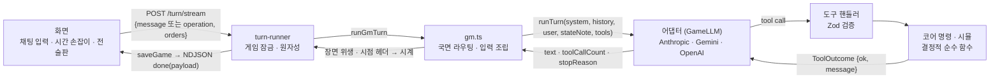
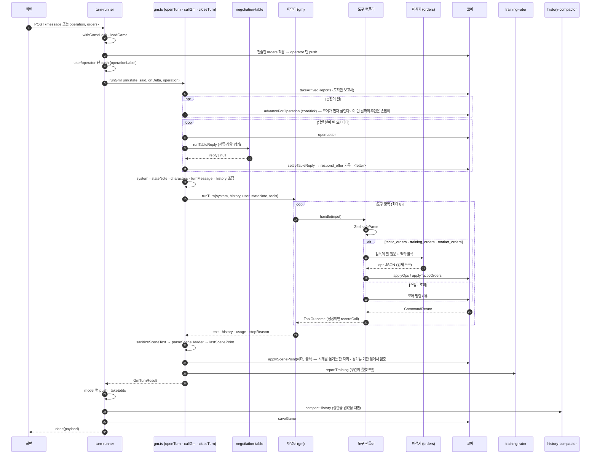
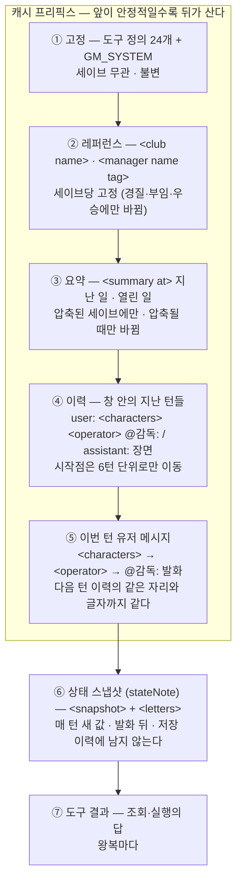
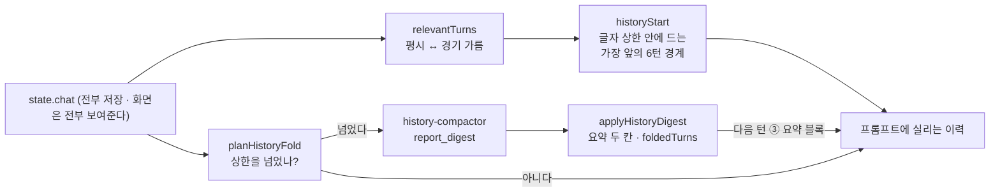
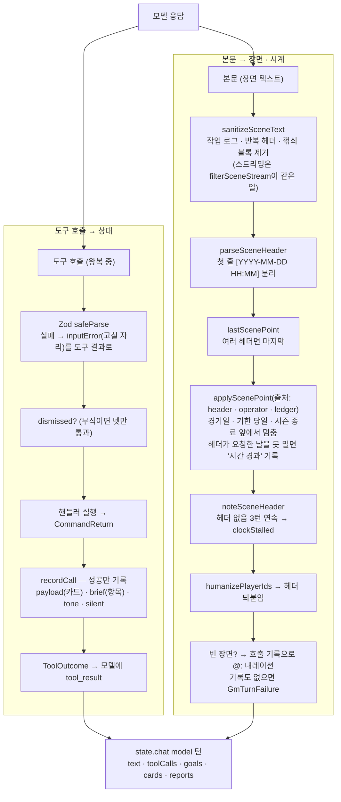
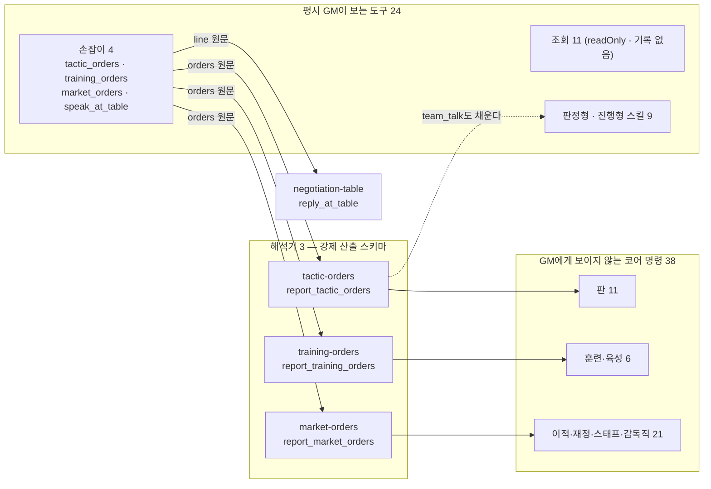
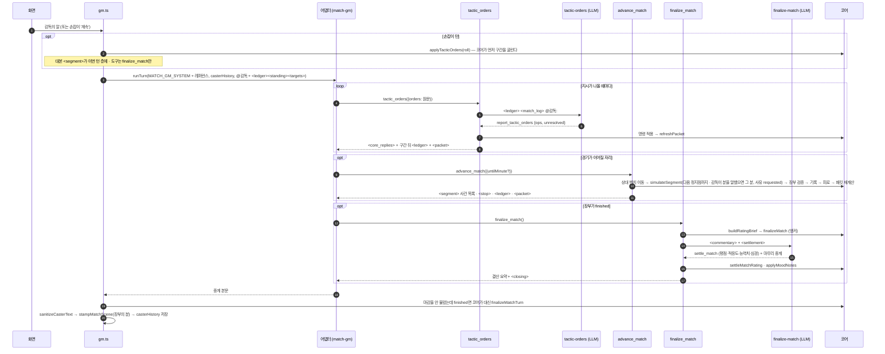
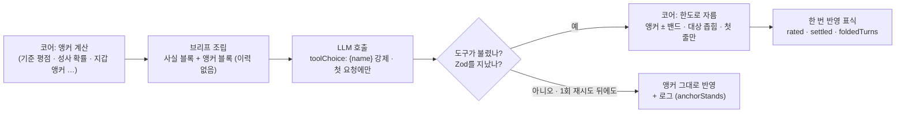
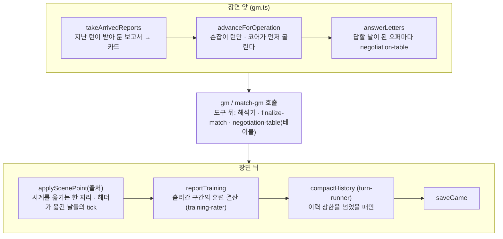
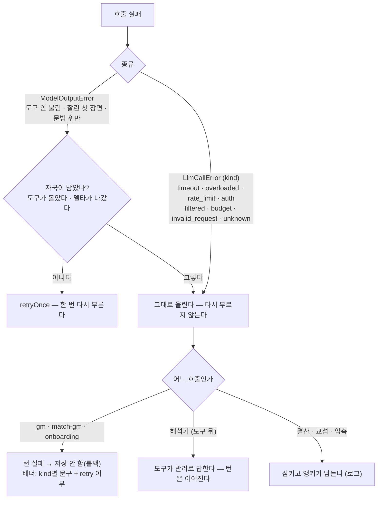

# 한 턴의 파이프라인 — 입력 조립 · 모델 · 출력 · 코어

**감독의 한마디가 모델에 어떻게 들어가고, 모델이 낸 것이 어떻게 게임 상태가 되는가**를
코드의 순서 그대로 그린다. 각 부분의 규칙과 이유는 [agents.md](./agents.md)(누가 무엇을
하나) · [prompts.md](./prompts.md)(무엇을 어떻게 말하게 하나) · [models.md](./models.md)
(어느 모델·어댑터·예산)가 원본이고, 이 문서는 그 셋을 **한 흐름으로 잇는 지도**다.

읽는 법: §1이 전체 그림, §2·§3이 평시 턴의 입력과 출력, §4가 도구의 세 겹, §5가 경기
턴, §6이 판정형 호출의 공통 뼈대(앵커 ± 한도), §7이 턴 앞뒤에 도는 부속 호출, §8이 실패.

## 1. 한 요청의 생애

- **상태를 바꾸는 길은 하나다** — `도구 호출 → Zod → 코어 명령`. 모델의 본문(장면)이
  상태에 닿는 유일한 자리는 **평시 시점 헤더**이고, 그것도 코어가 경기일·기한·시즌 종료
  앞에서 멈춰 세운다(§3).
- **저장은 성공한 턴만이다.** `runTurnLocked`는 턴이 끝까지 돌았을 때만 `saveGame`을
  부르므로, 실패한 턴의 부분 실행은 메모리에만 있다가 버려진다 — 저장하지 않는 것이 곧
  롤백이다. 실패는 채팅에 남지 않고 화면의 배너로 간다(§8).
- **한 채팅 턴은 모델 호출 하나가 아니다.** 평시 턴은 `gm` 앞에 교섭 상대, 뒤에 훈련
  결산과 압축이 붙을 수 있고, 경기 턴은 `match-gm`의 도구 뒤에서 해석·마감이 돈다(§7).

### 요청과 응답의 모양

| 방향 | 무엇                                                                                                                            | 어디                                                              |
| ---- | ------------------------------------------------------------------------------------------------------------------------------- | ----------------------------------------------------------------- |
| 요청 | `message`(감독의 말) **또는** `operation`(`skip_days` · `skip_to_next_match` · `advance_match`) — 둘 중 하나                    | `TurnSchema` — `apps/web/app/api/games/[id]/turn/stream/route.ts` |
| 요청 | `orders[]` — 전술판에서 쌓인 조작(자리·역할·교체·6축). 모델을 거치지 않고 코어가 먼저 적용한다                                  | `applyMatchBoardOrder` — `apps/web/lib/turn-runner.ts`            |
| 응답 | NDJSON 스트림: `delta`(장면 조각) · `ping`(10초 하트비트) · `done`(게임 페이로드) · `error`(문구 · `retry` · dev 전용 `detail`) | 같은 라우트                                                       |

## 2. 평시 턴 — 입력은 어떻게 조립되는가

### 2-1. 순서

### 2-2. 층 — 무엇이 어디서 오고, 어디까지 캐시되는가

입력은 **변경 빈도 순**으로 쌓인다. 앞의 층이 그대로면 그 뒤가 캐시(0.1×)로 읽히고,
앞이 1바이트라도 바뀌면 뒤가 전부 정가다 (→ [agents.md](./agents.md) §5).

| 층          | 블록                                     | 조립 함수                                | 담는 것 · 담지 않는 것                                                                     |
| ----------- | ---------------------------------------- | ---------------------------------------- | ------------------------------------------------------------------------------------------ |
| ① 고정      | 도구 정의 · `GM_SYSTEM`                  | `buildGmTools` · `gm-prompt.ts`          | 규칙 전부. 세이브에 따라 달라지는 값(날짜·id·구단·선수)은 없다                             |
| ② 레퍼런스  | `<club name>` · `<manager name tag>`     | `buildGmReference`                       | 구단 이름·역대·홈구장, 감독 이름·태그·배경. **선수 이름·감독 수치·인물 카드는 없다**(캐시) |
| ③ 요약      | `
`                           | `buildGmDigest`                          | `HistoryDigest.text`(지난 일) · `.open`(열린 일)                                           |
| ④ 이력      | 지난 턴들                                | `buildGmHistory` → `renderTurnGroup`     | 그 턴에 실렸던 인물 카드를 같은 자리에 다시 그린다 — 기억 줄은 빼고 신원까지               |
| ⑤ 이번 턴   | `<characters>` → `<operator>` → `@감독:` | `buildGmTurnMessage` → `renderTurnGroup` | 카드 최대 셋(`selectCharacters`) · 조작 표시 문구(`operationLabel`) · 감독의 말            |
| ⑥ 스냅샷    | `<snapshot>` 안의 태그들 · `<letters>`   | `buildGmStateNote` · `answerLetters`     | 오늘의 사실만 — 태그는 내용이 있을 때만 선다. 태그 목록은 [agents.md](./agents.md) §6      |
| ⑦ 도구 결과 | 텍스트                                   | 각 도구의 `handle`                       | 코어의 답(`CommandReturn.message`) · 조회 뷰 · 해석기가 옮기지 못한 말                     |

- **⑤와 ④는 같은 함수가 그린다.** 보낼 때(`buildGmTurnMessage`)와 다음 턴 이력에서
  다시 그릴 때(`buildGmHistory`) 둘 다 `renderTurnGroup`이므로 바이트까지 같고, 캐시
  프리픽스가 지난 발화를 지나 이어진다.
- **⑥의 자리는 어댑터가 정한다** — `operator_channel`이 참이면 유저 턴 **뒤** 오퍼레이터
  롤 메시지로, 거짓(기본·Gemini)이면 유저 메시지 꼬리에 접어 넣는다. 어느 쪽이든 돌려주는
  이력에서는 걷어낸다 ([models.md](./models.md) §3-3).
- **경기 턴의 층은 다르다** — §5.

### 2-3. 이력 창과 압축

- 판정은 코어의 결정적 함수다(`packages/engine/src/core/history-window.ts` —
  `HISTORY_CHAR_LIMIT` · `HISTORY_CHAR_KEEP` · `HISTORY_STEP`). 접히는 구간마다
  `[장부] …` 줄(`turnFactLines`)이 함께 가서 요약이 대사에서 사실을 다시 짓지 않는다.
- 압축은 저장 직전에 돌고, 실패하면 **접지 않는다** (→ [agents.md](./agents.md) §5-1).

## 3. 평시 턴 — 출력은 어떻게 게임이 되는가

모델이 내는 것은 둘이다 — **도구 호출**과 **본문(장면)**. 둘의 길이 다르다.

| 산출               | 검사하는 곳                                                | 상태에 닿는 것                                                                                |
| ------------------ | ---------------------------------------------------------- | --------------------------------------------------------------------------------------------- |
| 도구 인자          | 그 도구의 Zod (`buildToolSpecs`의 `wrap`)                  | 코어 명령이 바꾼 것 그대로. 판정형은 라벨(`outcome`·`intensity`)만 받고 델타는 코어 표가 낸다 |
| 시점 헤더          | `parseSceneHeader` · `applyScenePoint`(출처 `ClockSource`) | 날짜·시각. **되감기 없음**, 경기일·기한·시즌 종료 앞 정지                                     |
| 장면 본문          | `sanitizeSceneText` · `hasSceneLine`                       | 채팅에만 남는다 — 상태를 1비트도 바꾸지 않는다                                                |
| 심경 한 줄(`mood`) | `applyMoodNotes` — 대상·길이·불만 인지                     | `PlayerState`의 심경 문장 (열흘 뒤 코어 카드가 이긴다)                                        |

- **경기 턴은 헤더를 읽지 않는다** — 시각은 장부의 분이고 코어가 `stampMatchScene`으로
  붙인다. 위생도 꺾쇠 규칙 하나(`sanitizeCasterText`)만 읽는다.
- **골·카드 표식은 장부의 사건에서 만든다**(`collectMatchMarks`) — 중계 문장을
  되읽지 않는다.
- **장면이 비면 코어가 기록으로 세운다**(`sceneFromToolCalls`) — 도구가 이미 돌아
  되돌릴 수 없는 턴이라, 지어낸 대사 없이 `@: *…*` 줄로 장부의 사실만 적는다.

## 4. 도구의 세 겹 — 스킬 · 손잡이와 해석기 · 코어 명령

「스킬」은 LLM이 직접 부르는 도구만이다 (→ [../overview.md](../overview.md) §0).

- **손잡이 넷은 감독의 말을 원문 그대로 넘긴다**(`OrdersArgsSchema.orders`, 2,000자).
  뒤의 해석기가 명령 이름 아래 인자 배열을 채우고(`{ ops: { send_offer: [{…}] },
unresolved }`), `parseOps`가 명령별 상한(`TACTIC_CAPS` 또는 `OPS_PER_COMMAND` 4)으로
  자르고, `applyOps`/`applyTacticOrders`가 **그 명령의 도구 spec을 직접 불러** 적용한다.
  검증도 그 명령의 Zod다 — 스키마는 도구 정의에서 그대로 묶는다(`buildOpsSchema`).
- **결과는 문장으로 GM에게 돌아간다** — 걸린 것 · 반려된 것 · 잘린 수
  (`truncatedNote`) · 옮기지 못한 말(`unresolvedNote`). GM은 그것을 픽션 안에서 되묻는다.
- **기록은 코어 명령의 이름으로 남는다** — 화면의 칩은 `set_lineup`·`send_offer`로 선다.

### 4-1. 카탈로그 — 이름 전부

| 겹                        | 이름                                                                                                                                                                                                                                                                                                                                                                                                                                                    |
| ------------------------- | ------------------------------------------------------------------------------------------------------------------------------------------------------------------------------------------------------------------------------------------------------------------------------------------------------------------------------------------------------------------------------------------------------------------------------------------------------- |
| 조회 (11, readOnly)       | `search_players` · `get_squad` · `get_team` · `get_league` · `get_match_report` · `get_opponent_report` · `get_career` · `get_history` · `get_finance` · `deal_odds` · `list_negotiations`                                                                                                                                                                                                                                                              |
| 스킬 (9)                  | `start_match` · `resign` · `team_talk` · `respond_to_media` · `respond_to_approach` · `record_incident` · `apply_finance_event` · `scout_player` · `scout_mission`                                                                                                                                                                                                                                                                                      |
| 손잡이 (4)                | `tactic_orders` · `training_orders` · `market_orders` · `speak_at_table`                                                                                                                                                                                                                                                                                                                                                                                |
| 코어 명령 — 판 (11)       | `set_lineup` · `set_squad_level` · `set_captain` · `substitute` · `set_tactics` · `set_player_tactic` · `set_match_plan` · `exploit_point` · `set_set_piece_takers` · `set_set_piece_routine` · `set_shootout_order` (+ 해석기는 `team_talk`도 채운다 — `TACTIC_OPS` 12, 그 순서가 적용 순서)                                                                                                                                                           |
| 코어 명령 — 훈련·육성 (6) | `sign_youth` · `set_squad_number` · `set_reserve_training` · `set_development_focus` · `set_mentor` · `set_training` (`TRAINING_OPS`)                                                                                                                                                                                                                                                                                                                   |
| 코어 명령 — 시장 (21)     | `respond_offer` · `accept_deal` · `respond_transfer_request` · `withdraw_offer` · `set_transfer_list` · `send_offer` · `open_renewal` · `open_release` · `release_player` · `exercise_buyback` · `recall_loan` · `adjust_transfer_budget` · `request_board` · `fund_transfer_budget` · `pay_player_bonus` · `set_ticket_price` · `release_staff` · `hire_staff` · `accept_manager_offer` · `counter_manager_offer` · `apply_manager_job` (`MARKET_OPS`) |
| 경기 도구 (3, 매치 GM)    | `tactic_orders` · `advance_match` · `finalize_match` (`MATCH_TOOL_DEFINITIONS`)                                                                                                                                                                                                                                                                                                                                                                         |
| 강제 산출 스키마 (8)      | `report_tactic_orders` · `report_training_orders` · `report_market_orders` · `settle_match` · `report_training` · `report_digest` · `reply_at_table` · `report_onboarding` (`forcedTools()`)                                                                                                                                                                                                                                                            |

수는 `packages/agents/test/skill-descriptions.test.ts`가 고정한다(24 · 그룹별). 무직인
감독에게는 스킬 중 `accept_manager_offer` · `counter_manager_offer` · `apply_manager_job` ·
`respond_to_approach`만 열린다(`OUT_OF_WORK_TOOLS`). `market_orders`는 해석기까지는
지나고, 무직의 문은 해석기가 낸 명령마다 코어 명령 쪽(`wrap` · `OUT_OF_WORK_TOOLS`)이
판정한다 — 거취 셋만 통과한다. 조회는 그대로 열려 있다.

### 4-2. 해석기 셋이 읽는 것

세 해석기는 한 벌(`runOpsOrders`)이다 — 시스템 프롬프트 하나, 이력 없음, 맥락 블록 뒤에
`@감독: <원문>`, 도구 하나를 `toolChoice`로 강제.

| 해석기            | 맥락 블록                                                                                                                          | 채우는 명령      | 적용                                         |
| ----------------- | ---------------------------------------------------------------------------------------------------------------------------------- | ---------------- | -------------------------------------------- |
| `tactic-orders`   | 경기: `<ledger>`(장부·`<standing>`·`<targets>`) + `<match_log>`(이 경기의 턴 전부) · 평시: `<standing>` `<squad>` `<recent_turns>` | `TACTIC_OPS` 12  | `applyTacticOrders` — 경기면 패킷 재계산까지 |
| `training-orders` | `<schedule>`(주간 일정) · `<squad_ops>`(지금 걸린 육성·멘토·방침) · `<squad>` · `<recent_turns>`                                   | `TRAINING_OPS` 6 | `applyOps`                                   |
| `market-orders`   | `<negotiations>` · `<finance>` · `<interest>` · `<board>` · `<buybacks>` · `<seat>`(감독직) · `<recent_turns>`                     | `MARKET_OPS` 21  | `applyOps`                                   |

## 5. 경기 턴 — 매치 GM이 도구로 경기를 진행한다

| 층       | 경기 턴                                                                                                                                |
| -------- | -------------------------------------------------------------------------------------------------------------------------------------- |
| 고정     | `MATCH_GM_SYSTEM` + 경기 도구 셋(진행 턴 3 · 손잡이 턴 1 · 킥오프 턴 0)                                                                |
| 레퍼런스 | `<club name>` · `<manager name tag>` · `<characters>`(수석코치 상주) · `<pre_match>`(직전 평시 발화 셋 그대로) — `buildMatchReference` |
| 이력     | 이 경기의 제공자 원형 이력(`pendingMatch.casterHistory`) — 킥오프 턴만 평시 이력                                                       |
| 이번 턴  | `@감독:` 또는 `<operator>` · 킥오프 턴은 `<kickoff>` · 손잡이 턴은 `<segment>` + `<core_replies>`                                      |
| 스냅샷   | `buildLedgerNote` — `<ledger>` · `<standing>` · `<targets max>` (패킷은 구간이 굴렀을 때만)                                            |

- **경기를 바꾸는 도구는 없다.** 세 도구는 코어를 부르는 손잡이다 — 사건은 xG 구간
  시뮬이 정하고, 지시는 해석이 옮긴 JSON을 코어가 실재 확인 뒤 적용한다
  (→ [../simulation/match.md](../simulation/match.md) §2).
- **대화만 건 턴은 시계가 멈춘다** — 도구를 부르지 않으면 구간이 굴러가지 않는다.
- **경기 → 평시의 다리는 코어가 놓는다** — `matchDigest`가 결과·라커룸 결과·나간 사람을
  장부에서 뽑아 다음 평시 스냅샷 `<last_match>`에 싣는다.

## 6. 판정형 호출의 뼈대 — 앵커 ± 한도

자주 도는 판정은 전부 같은 모양이다. **코어가 앵커를 박고, LLM이 맥락으로 값을 고르고,
코어가 한도로 잘라 한 번만 반영한다. 실패하면 앵커가 남는다.**

| 자리      | 앵커 (코어)                                        | 산출 스키마                                    | 한도 (코어)                                                                                                              | 실패하면                 |
| --------- | -------------------------------------------------- | ---------------------------------------------- | ------------------------------------------------------------------------------------------------------------------------ | ------------------------ |
| 경기 결산 | `finalizeMatch` 기준 평점                          | `settle_match`                                 | 평점 ±`RATING_BAND`(1.2) · 적응도 −2~+8 · 능력치 ≤`MATCH_ATTR_CAP`(11)명 · 심경 ≤`MOOD_BATCH`(8) · `rated`               | 앵커 평점, 마무리는 GM   |
| 훈련 결산 | 코어는 적응도를 움직이지 않음                      | `report_training`                              | 적응도 −1~+3 · 자리 0~~2 · 능력치 3~~6명(감독 훈련 축) — 전부 × 세션 수 ÷ `SESSIONS_PER_WEEK`(5) · 세션 엔트리 `settled` | 빈 결산 카드             |
| 교섭 상대 | `counterpartyAnchor` — 확률 사다리 50 / 25 / 12.5% | `reply_at_table`                               | 판정 ±한 칸 · 금액 ±15% · 연수 ±1 · 합법 범위(`counterBoundsOf`) · 인내                                                  | 앵커 판정, 상대는 말없이 |
| 대화 판정 | 수용성 앵커(`receptivityOf`)                       | `team_talk`(`players`)의 `outcome`·`intensity` | outcome은 앵커 ± 한 단계 · 델타는 코어 표 · 선수별 사기 합계 하루 ±8 · 이레 ±20                                          | 도구 반려                |
| 온보딩    | `startingWalletAnchor` · 휴리스틱 능력치           | `report_onboarding`                            | 지갑 ±40% · 축 ±8 · 합 ±10 · 시작 사건 ≤3 (`<club>`의 id만)                                                              | **게임을 만들지 않는다** |
| 이력 압축 | 접을 지점(`planHistoryFold`)                       | `report_digest`                                | 지난 일 ≤1,500자 · 열린 일 ≤600자 · 넘으면 **거절**(자르지 않음) · 관계 등급은 아는 쌍만 한 칸(`applyRelationTiers`)     | 접지 않음                |

- **반영 표식은 상태에 둔다.** 도구 루프가 같은 도구를 두 번 부를 수 있으므로 두 번째
  호출은 "이미 반영"으로 답하고 아무것도 하지 않는다. 재시도 가드(`retryOnce`의
  `touched`)도 반환값이 아니라 이 표식을 읽는다.
- **폭·인원의 숫자는 프롬프트에 손으로 적지 않는다** — 코어 상수를 문장으로 만든다
  (`agingDeclineLine` 같은 함수 포함). 스키마는 그 밴드보다 **넓게** 열어 한 줄의 과한
  숫자로 판정 전체를 버리지 않는다 (→ [prompts.md](./prompts.md) §2).

## 7. 턴 앞뒤의 부속 호출 — 언제 무엇이 도나

| 호출               | 설정 키             | 언제                                                   | 읽는 것                                                                                                    | 실패하면                  |
| ------------------ | ------------------- | ------------------------------------------------------ | ---------------------------------------------------------------------------------------------------------- | ------------------------- |
| 교섭 상대 (편지)   | `negotiation-table` | 평시 턴 앞, 답할 날이 된 협상마다                      | `<counterparty>`(안에 `<voices>` — 누가 무엇을 답하나) `<situation>` `<table_log>` `<anchor>` + `<letter>` | 앵커 판정이 그대로 반영   |
| 교섭 상대 (테이블) | `negotiation-table` | GM이 `speak_at_table`을 부른 자리                      | 같은 넷 + `@감독: <line>`                                                                                  | 앵커 판정, 상대는 말없이  |
| 훈련 결산          | `training-rater`    | 장면 뒤, 시계가 흘러 훈련 세션을 지났으면 구간 한 묶음 | 훈련 일지 · 대화(마지막 결산 카드 이후의 턴 — 감독/장면 + `[장부]` 줄) · 대상 표                           | 앵커(변화 없음) + 빈 카드 |
| 이력 압축          | `history-compactor` | 저장 직전, 평시 이력 글자 수가 상한을 넘었을 때        | 이전 요약 · 이미 선 사람 · 지금 관계 등급 표 · 이름 없는 아크 · 접히는 원문 + `[장부]`                     | 접지 않음                 |
| 온보딩             | `onboarding-judge`  | 새 게임 생성(`POST /api/games`) — 게임당 한 번         | `<anchor>` `<club>` `<background>` `<characters>` `<snapshot>`                                             | 게임을 만들지 않는다      |

- **시계를 옮기는 자리는 코어 하나다** — `applyScenePoint(state, point, source)`
  (`packages/engine/src/core/tick.ts`). `gm.ts`는 이번 턴 날짜의 주인(`ClockSource`:
  `header` · `operator` · `ledger`)만 고르고, 경기일·기한 고정과 경기 중 고정은 출처와
  무관하게 코어가 건다. 규칙의 표는 [agents.md](./agents.md) §2.
- **훈련 결산의 대화 창은 마지막 결산 카드 이후의 턴이다** — 하루씩 진행해도 같은 턴이
  두 결산에 겹쳐 실리지 않고, 폭은 그 구간의 세션 수에 비례한다(§6).
- **`LLM_MODE=mock`**에서는 대본 어댑터(`ScriptedGameLLM` — `mock-script.ts`의 발화 →
  도구 표)가 같은 도구 핸들러와 코어 명령 경로를 그대로 지나고, 부속 호출(결산·교섭·
  압축·온보딩)은 하나도 돌지 않는다 — 앵커가 그대로 답이다 (→ [agents.md](./agents.md) §8).

## 8. 실패 — 무엇을 다시 부르고 무엇을 올리나

| `kind`            | 화면 문구                                             | 다시 시도 |
| ----------------- | ----------------------------------------------------- | --------- |
| `overloaded`      | 모델 서버가 혼잡합니다                                | 예        |
| `rate_limit`      | 요청 한도를 넘었습니다                                | 예        |
| `timeout`         | 응답이 지연돼 턴을 취소했습니다                       | 예        |
| `filtered`        | 모델이 이 요청을 거절했습니다                         | 예        |
| `unknown`         | 응답을 받지 못해 지시를 반영하지 못했습니다           | 예        |
| `auth`            | LLM 인증 정보가 올바르지 않습니다                     | 아니오    |
| `budget`          | 이 게임의 토큰 예산 상한에 닿았습니다                 | 아니오    |
| `invalid_request` | 요청이나 설정이 잘못됐습니다 — 서버 로그를 확인하세요 | 아니오    |

문구와 `retry`는 `apps/web/lib/turn-runner.ts`의 표 하나에 함께 산다. 종류의 분류는
어댑터가 코드값(HTTP 상태·SDK 오류 클래스·종료 사유)으로 붙인다 — 문장으로 분류하지
않는다 (→ [models.md](./models.md) §1-1). 시한은 `config/llm.yml`의 `timeout_ms`가
`runTurn` 한 번 전체(도구 왕복 포함)에 걸린다.

## 9. 코드 위치

| 무엇                                                                         | 어디                                                                                                 |
| ---------------------------------------------------------------------------- | ---------------------------------------------------------------------------------------------------- |
| 라우트 · 요청 스키마 · NDJSON 이벤트                                         | `apps/web/app/api/games/[id]/turn/stream/route.ts`                                                   |
| 잠금 · 원자성 · 오류 종류 → 문구 (`runTurnLocked`)                           | `apps/web/lib/turn-runner.ts`                                                                        |
| 턴 실행 — 앞 · 호출 · 뒤 (`runGmTurn` → `openTurn` · `callGm` · `closeTurn`) | `packages/agents/src/gm.ts`                                                                          |
| 시계 — 출처별 고정 규칙 (`applyScenePoint` · `advanceForOperation`)          | `packages/engine/src/core/tick.ts`                                                                   |
| 입력 빌더 (레퍼런스 · 스냅샷 · 이력 · 위생 · 헤더)                           | `packages/agents/src/gm-input.ts`                                                                    |
| 도구 카탈로그 · 배선 (`buildToolSpecs` · `buildGmTools` · `CORE_COMMANDS`)   | `packages/agents/src/gm-tools.ts` · `skill-descriptions.ts`                                          |
| 해석기 한 벌 (`runOpsOrders` · `parseOps` · `applyOps`)                      | `packages/agents/src/orders-ops.ts` · `tactic-orders.ts` · `training-orders.ts` · `market-orders.ts` |
| 경기 도구 셋 (`buildMatchTools`) · 의도 적용                                 | `packages/agents/src/match-gm.ts` · `tactic-apply.ts`                                                |
| 강제 산출 선언 여덟 (`forcedTools`)                                          | `packages/agents/src/forced-tools.ts`                                                                |
| 재시도 규약 (`retryOnce` · `requireToolCall`)                                | `packages/agents/src/retry.ts`                                                                       |
| mock 경로 — 대본 어댑터 · 발화 → 도구 표                                     | `packages/llm/src/scripted-adapter.ts` · `packages/agents/src/mock-script.ts`                        |
| 제공자 중립 계약 (`GameLLM` · `TurnRequest` · `StopReason`)                  | `packages/llm/src/game-llm.ts`                                                                       |
| 어댑터 · 도구 루프 (`MAX_TOOL_ITERATIONS` 8)                                 | `packages/llm/src/anthropic-adapter.ts` · `gemini-adapter.ts` · `openai-adapter.ts`                  |
| 팩토리 — 시한 · 계측 · 트레이스 부착                                         | `packages/llm/src/factory.ts` · `deadline.ts` · `usage-meter.ts` · `turn-trace.ts`                   |
| 이력 창 판정 (코어)                                                          | `packages/engine/src/core/history-window.ts`                                                         |
| 장부 골격 (`turnFactLines`)                                                  | `packages/engine/src/core/turn-facts.ts`                                                             |
| 명령 실행부 · 호출 결과 항목 (`CommandBrief`)                                | `packages/engine/src/commands/index.ts` · `brief.ts`                                                 |
