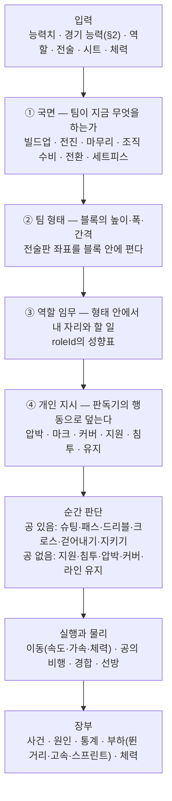
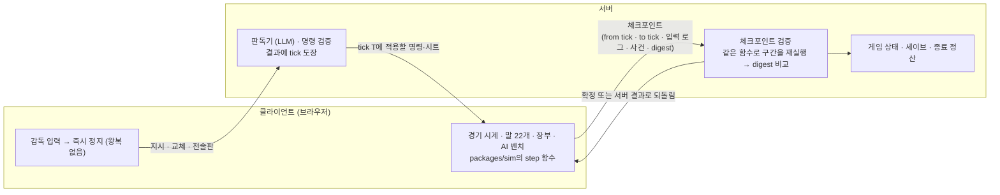

# 실시간 경기

감독의 경기는 **말 22개와 공 하나**가 실시간으로 굴러가며 진행된다. 각 말(선수)은 매
순간 자기 눈에 보이는 상황을 읽고, 역할과 전술 지시에 따라 어디로 뛸지·공을 어떻게
처리할지 정한다. 슈팅은 그 판단의 결과이고, 골은 그 슈팅이 실제로 골문에 들어간
결과다. 결과를 먼저 정해 두고 장면을 끼워 맞추지 않는다.

전술은 말의 판단 규칙 안에만 있다. 라인을 올리면 수비수들이 실제로 높이 서고, 그
뒤의 공간이 실제로 열린다. 전술의 이득과 대가, 상성은 따로 계산하지 않는다 —
말들이 움직인 결과로 나타난다.

시뮬레이션은 **클라이언트가 굴리고 서버가 검증한다**(§8). 같은 코드가 양쪽에서 같은
결과를 내야 하므로 시뮬은 결정적이다.

다른 구장 경기는 [간이 시뮬](match.md) §8이 한 번에 처리한다. 두 시뮬은 같은
기준점([football-reference.md](football-reference.md))에 맞춰진다.

요구사항:

1. **영향성** — 능력치·역할·전술·체력이 말의 행동을 바꾸고, 그 행동이 결과를 바꾼다.
2. **설명 가능성** — 모든 사건은 그 사건을 만든 행동의 사슬(누가 어디서 무엇을 했나)을
   원인으로 남긴다.
3. **결정성** — (시드, 경기, 틱, 입력 로그)가 같으면 어느 기기에서 굴려도 같은 경기다.
   LLM의 판독은 시트로 기록되고 그 시트가 리플레이의 입력이다.
4. **현실성** — 팀·선수 단위 통계의 평균·중간값·분산이 실제 축구의 범위에 선다(§9).

## 1. 층 — 말은 네 층을 거쳐 움직인다



위 셋(국면·형태·역할)이 **말이 있어야 할 자리**를 정하고, 아래 둘(순간 판단·실행)이
**그 자리에서 무엇이 일어나는가**를 정한다. 코드는 `packages/sim/src/live/`에 있다 —
형태는 `shape.ts`, 역할 성향은 `roles.ts`, 전술 파라미터는 `params.ts`, 이동과 공의
비행은 `physics.ts`, xG는 `xg.ts`, 한 틱의 판단·경합·재시작·골키퍼는 `step.ts`, 하프와
교체·벤치를 잇는 러너는 `runner.ts`다. 이 식들이 읽는 **숫자는 전부 `tuning.ts`** 한 파일에
있다 — 식을 고치는 일과 눈금을 옮기는 일을 가른다.

### 시간 눈금

- **틱**은 경기 시간 50ms다(`LIVE_STEP`). 이동·공의 비행·경합은 매 틱 계산한다.
- **판단**은 매 틱 하지 않는다. 말마다 다음 판단 시각(`decideAt`)을 갖고, 그 간격은
  반응 시간이다 — 공 없는 판단은 0.3\~0.6초, 공 받은 뒤 첫 판단은 첫 터치와 침착성이
  정한다. 공을 가진 말이 압박을 받으면 간격이 짧아지고 판단의 잡음이 커진다.
- 난수는 틱마다 채널을 연다(`live:<경기 id>:<틱>`). 계산을 몇 틱씩 묶어 돌리든,
  프레임을 얼마나 자주 그리든 결과는 같다.
- **추가시간은 시계에 있다.** 각 하프의 끝은 규정 45분에 그 하프의 중단(골·교체·부상·
  카드·페널티)에서 계산한 추가시간을 더한 시각이다(`addedTimeOf`). 실제 경기 길이는
  97\~100분이고([football-reference.md](football-reference.md) §4), 사건의 분은
  `45+2′`·`90+4′`처럼 규정분과 추가분으로 기록한다. 그래서 실측의 "경기당" 통계와 이
  게임의 "경기당" 통계가 같은 길이를 잰다.

## 2. 선수의 경기 능력 (`packages/sim/src/match-ability.ts`)

말이 쓰는 능력치는 저장된 능력치가 아니라 **오늘 이 자리에서의 능력치**다.

```
경기 능력치(축) = 능력치(축) × 경기 계수(선수)

경기 계수 = 상태(폼, 지금 체력)
          × 포지션 적응도 계수    0.10~1.00 (로그 곡선)
          × 전술 적응도 계수      0.79~1.00 (자리 민감도)
          × (1 + 시트 edge)        판독기가 준 이번 경기의 실행 품질 (§6)
```

- 포지션 적응도·전술 적응도 계수의 곡선은 [player.md](../data/player.md) §7·§8의
  것을 그대로 쓴다. 간이 시뮬도 같은 함수를 쓴다(한 규칙, 한 정의).
- **체력은 경기 중에 변한다.** 계수의 상태 항은 매 판단 시각의 체력을 읽는다. 지친
  말은 판단이 둔해지고(잡음 ↑) 느려진다(§7).
- 골키퍼는 `goalkeeping`, 필드 선수는 나머지 15축을 쓴다.
- 각 판정은 그 판정에 맞는 축을 쓴다 — 패스는 패스·시야·킥력, 태클은 태클 대
  드리블·몸싸움, 선방은 골키핑·위치선정. 종합 능력치는 어느 판정에도 쓰지 않는다.

## 3. 국면과 팀 형태 (`live/shape.ts` · `live/step.ts`)

### 3.1 국면

| 국면      | 언제                                  | 형태의 성격                                       |
| --------- | ------------------------------------- | ------------------------------------------------- |
| 빌드업    | 공을 가졌고 공이 우리 진영 1/3        | 넓게 벌리고 골키퍼·센터백이 공을 순환             |
| 전진      | 공을 가졌고 공이 중앙 1/3             | 라인 사이에 선수를 세우고 측면을 연다             |
| 마무리    | 공을 가졌고 공이 상대 진영 1/3        | 박스에 사람을 넣고 2선이 뒤를 받친다              |
| 조직 수비 | 공이 없고 상대가 공을 안정적으로 가짐 | 블록 높이가 압박·라인 지시와 공 위치로 정해진다   |
| 공격 전환 | 공을 막 뺏음 (약 5초)                 | 역습 지시면 곧장 전진, 재정비면 형태로 돌아간다   |
| 수비 전환 | 공을 막 잃음 (약 5초)                 | 압박이 높으면 즉시 되찾으러 가고, 아니면 내려선다 |
| 세트피스  | 재시작 순간                           | 루틴이 정한 배치 (§5.5)                           |

### 3.2 팀 형태 — 블록

팀은 매 판단마다 **블록** 하나를 계산한다.

```
블록 = { 수비 라인 x, 미드 라인 x, 공격 라인 x, 폭, 공 쪽 쏠림 }
```

- **수비 라인 높이**: 조직 수비에서는 전술의 수비 라인과 공 위치가 정한다. 공을
  가졌을 때는 멘탈리티가 얼마나 올라설지 정한다.
- **라인 사이 간격**: 수비 라인이 높을수록, 압박이 높을수록 좁아진다(압축).
- **폭**: 공을 가졌을 때는 전술의 폭, 없을 때는 좁게 모인다.
- **공 쪽 쏠림**: 블록 전체가 공 쪽으로 이동한다. 반대편 측면은 비는 대가를 문다.

각 말의 **자리**는 전술판 좌표를 블록 안에 편 점이다. 전술판에서 앞선 선수는 공격
라인 쪽에, 넓게 선 선수는 폭 쪽에 선다. 포메이션 이름은 쓰지 않는다.

- **앞 한계** — 공격 형태는 상대 수비 라인을 넘어 서지 않고, 수비 형태는 공보다 앞에
  서지 않는다. 그 선을 넘는 것은 침투와 압박의 몫이다.
- **형태 오차**는 소유가 바뀔 때마다 새로 선다 — 위치선정·지시 적용률·시트 `cohesion`이
  크기를 정한다. 판단마다 흔들지 않는다.
- **자리의 흔들림** — 자리에 선 말도 느린 흔들림(말마다 위상이 다르고, 진폭은 자리가
  정한다 — 중원·수비가 크고 최전방이 작다)을 따라 걸으며 자리를 고친다. 실측 선수는 경기
  시간의 절반 가까이를 걷는다.
- **블록의 오르내림** — 공격 중 뒤에 선 말도 공을 따라 오른다. 수비 중 블록이 공을 따라
  내려오는 폭은 역할의 `cover`가 정하고, 최전방은 높은 자리에 남는다.

**수비 라인은 한 줄로 움직인다.** 수비수들은 마지막에서 두 번째 수비수 기준으로 x를
맞추고, 그 정렬의 오차는 위치선정과 전술 적응도가 정한다. 오프사이드는 이 줄에서
판정되므로, 라인이 흐트러지면 오프사이드 트랩이 실제로 깨진다.

## 4. 역할 임무 (`live/roles.ts`)

역할(`roleId`, [player.md](../data/player.md)의 `ROLE_DEFS`)마다 성향표 한 줄이 있다.
자리 묶음(GK·CB·FB·DM·CM·AM·W·CF·ST)의 기본값에 역할의 차이를 얹는다 — 역할 가중치가
`ROLE_DEFS`의 `delta`로 서는 것과 같은 모양이다.

| 성향          | 뜻                                             | 큰 역할 예                          |
| ------------- | ---------------------------------------------- | ----------------------------------- |
| `advance`     | 공을 가졌을 때 자리보다 얼마나 앞으로 나가는가 | 윙백, 박스투박스, 메짤라            |
| `hold`        | 자리를 떠나지 않으려는 정도                    | 앵커, 노-넌센스 센터백              |
| `width`       | 터치라인 쪽을 지키는 정도                      | 윙어, 윙백                          |
| `inside`      | 안쪽으로 파고드는 정도                         | 인사이드 포워드, 인버티드 풀백      |
| `dropDeep`    | 공을 받으러 내려오는 정도                      | 폴스 나인, 딥라잉 포워드            |
| `runBehind`   | 수비 뒤로 침투하는 정도                        | 어드밴스드 포워드, 포처, 라움도이터 |
| `boxPresence` | 마무리 국면에 박스 안에 서는 정도              | 포처, 타깃 포워드                   |
| `roam`        | 자리를 벗어나 공을 찾아다니는 정도             | 로밍 플레이메이커, 트레콰르티스타   |
| `press`       | 공 없을 때 압박에 나서려는 정도                | 프레싱 포워드, 볼 위닝 미드         |
| `dribble`     | 공을 가졌을 때 드리블을 고르는 정도            | 윙어, 인사이드 포워드               |
| `passRisk`    | 위험한 전진 패스를 고르는 정도                 | 레지스타, 어드밴스드 플레이메이커   |
| `shoot`       | 슈팅을 고르는 정도                             | 섀도 스트라이커, 포처               |
| `cross`       | 크로스를 고르는 정도                           | 윙어, 윙백                          |
| `cover`       | 공격 중에도 뒤를 지키는 정도                   | 커버 디펜더, 하프백                 |
| `sweep`       | 골키퍼가 라인 뒤를 덮으러 나오는 정도          | 스위퍼 키퍼                         |

같은 4-3-3이라도 풀백이 윙백이면 공을 가졌을 때 측면 끝까지 올라가고, 그 뒤가 빈다.
역할은 포메이션보다 말의 움직임을 더 크게 가른다.

## 5. 순간 판단과 실행

### 5.1 공을 가진 말 (`live/step.ts`)

판단 시각이 되면 선택지마다 **효용**을 매기고 가장 큰 것을 고른다. 잡음은 판단력의
몫이다 — 시야·침착성이 낮고 압박을 받을수록 효용에 섞이는 잡음이 커진다.

```
효용(선택) = 성공 확률 × (위협 증가 + 소유의 값)
           − 실패 확률 × (상대에게 준 위협 × 위험 회피 + 소유의 값 + 지금 자리의 위협)
           + 역할 성향 + 전술 선호 + 시트 focus
```

**소유에도 값이 있다.** 전진하지 않는 패스도 공을 지키는 값으로 고르고, 잃으면 그
값과 지금 서 있던 자리의 위협을 함께 잃는다 — 그래서 공 가진 말은 무모한 돌파보다
공을 돌리는 쪽을 자주 고른다. 슈팅은 소유를 끝내므로 그 값을 치르고 고른다.

- **위협**은 공이 그 자리에 있을 때 다음 몇 번의 행동 안에 골이 날 확률이다. 정적인
  위협 격자(Expected Threat, 12×8)를 기준으로 삼는다. 경기장 위치의 가치를 공개된
  실측 모델로 두어, 말이 "전진이 왜 좋은가"를 수치로 안다. 위협은 위치의 값이고 성공
  확률은 지금 그 자리에 선 상대가 정하므로, 둘을 곱한 것이 이 순간 그 선택의 값이다.
- **성공 확률**은 기하와 능력치가 정한다: 패스 경로에 선 상대(차단 가능 시간), 받는
  말 주위의 압박, 거리, 경기 능력치(패스·시야·킥력·드리블).
- **시야**는 선택지의 수를 정한다. 시야가 낮은 말은 먼 동료나 달려가는 동료 앞 공간
  (스루패스)을 선택지에 넣지 못한다.

| 선택지    | 성공을 가르는 것                                                                          |
| --------- | ----------------------------------------------------------------------------------------- |
| 슈팅      | 슈팅 xG(§5.4) — 거리·각도·압박·길목의 수비·발/머리. 전술의 문턱 xG를 넘어야 선택지에 선다 |
| 짧은 패스 | 경로의 차단 가능성, 받는 말의 압박, 패스                                                  |
| 긴 패스   | 비행 중 차단, 떨어지는 지점의 공중볼 경합, 킥력                                           |
| 스루패스  | 달려가는 동료와 수비수 중 누가 공에 먼저 닿는가, 시야·패스                                |
| 크로스    | 박스 안 우리 말 수와 공중볼, 상대 수비의 공중볼, 킥력                                     |
| 드리블    | 앞 공간, 막아선 수비수와의 1대1(드리블 대 태클), 스피드. 길목에 상대가 있으면 짧게 몬다   |
| 걷어내기  | 우리 진영에서 압박이 클 때 — 실패해도 위험이 작다                                         |
| 지키기    | 몸싸움 — 동료가 올라올 시간을 번다                                                        |

**공을 돌리는 것은 선택이다.** 이기고 있는 팀이 위험 회피를 높여 공을 돌리면 슈팅
없는 시간이 이어진다. 그것을 깨는 것은 말의 규칙이 아니라 **상대 벤치**다(§8.3) —
압박을 올려 되찾으러 나오고 그 대가로 체력을 쓴다. 감독의 팀이 그 상황을 만나면
감독이 같은 선택을 한다.

### 5.2 공이 없는 말 (`live/step.ts`)

공격 중인 팀의 말은 자기 자리(§3·§4)를 기준으로 **지원**(공 가진 말 근처에 패스
각도를 만든다), **침투**(수비 라인 뒤 공간으로 뛴다), **폭 유지**, **박스 진입** 중에
고른다. 침투는 라인이 높을수록, 공 가진 말이 앞을 볼 수 있을수록, 침투 능력치가
높을수록 잦다.

수비 중인 팀의 말은 **압박**(공 가진 말에게 붙는다), **패스 경로 막기**, **대인 마크**,
**커버**(동료 뒤를 받친다), **라인 유지** 중에 고른다. 압박에 나서는 말의 수와 압박을
시작하는 거리는 전술의 압박과 역할의 `press`가 정한다.

- **첫 수비수** — 공 가진 상대에게 한 명은 붙는다. 골 쪽에 선 말이 먼저다: 뒤에서
  쫓는 말은 길을 막지 못한다. 압박선 밖(상대 진영)의 공에는 따라붙기만 하고, 압박선
  안과 역압박에서만 전력으로 덤빈다. 최전방은 등 뒤로 지나간 공을 전력으로 쫓지 않는다.
- **위험 지역** — 공이 우리 골 가까이 오면 둘째 수비도 좁혀 든다.
- **되돌아 뛰기** — 공을 잃었을 때 자리보다 한참 앞에 있는 말은 자리별 속도로 돌아온다
  (수비·중원은 빠르게, 최전방은 걸어서). 한참 멀면 전력이다.
- **침투 추적** — 마크한 상대가 멀어지면 따라 뛴다. 최전방은 조직 수비에서 사람을 잡지
  않는다.
- **압박은 골 쪽에서 선다** — 공 가진 말과 우리 골문 사이, 움직이면 그 앞을 잡는다.
  덤비지 않고 길을 막는 것이 압박의 몸이다.
- **느슨한 공과 날아가는 공** — 주인 없는 공은 편마다 가장 가까운 말이 쫓는다. 날아가는
  패스는 받을 말이 떨어질 자리로 가고, 상대도 그 자리에 먼저 닿을 수 있으면 간다.
- 공이 우리 진영 깊이 들어오면 마크의 반경이 넓어진다.

공격 중에는 **역습 가담**(공을 되찾은 직후 자리보다 뒤에 있는 말이 치고 나간다)과
**풀백 오버래핑**(공이 제 측면 앞쪽에 있으면 공 가진 말보다 앞, 터치라인 쪽으로 뛴다)이
있다. 급함은 국면이 정한다 — 같은 자리 이동도 되돌아오거나 앞지를 때는 뛴다.

### 5.3 실행 — 이동과 경합 (`live/physics.ts` · `live/step.ts`)

- **이동**: 말마다 최고 속도(스피드 능력치, 필드 약 8.0\~9.7 m/s)와 가속을 가진다.
  목표 지점으로 가속하고, 급한 행동(압박·침투·되돌아가기)은 최고 속도에 가깝게 간다.
  자리 조정은 남은 거리만큼만 서두른다 — 몇 미터 어긋난 자리는 걸어서 메운다. 지친
  말은 최고 속도와 가속이 떨어진다(§7).
- **공의 비행**: 패스·슈팅·크로스는 속도와 높이를 가진 비행이다. 오차는 킥 순간에
  정해진다 — 방향과 세기가 따로 빗나가고, 거리·패스 능력·압박이 키우며 뜬 공이 더 크다.
  목표만 경기장 안이고 오차는 가두지 않으므로 **빗나간 공은 줄 밖으로 나간다.**
- **구르는 공**: 아무도 거두지 못한 땅볼 패스는 남은 속도로 계속 구른다. 태클에 맞은
  공, 흘린 첫 터치, 골키퍼가 쳐낸 공도 받을 사람 없는 땅볼로 구르고, 줄을 넘으면
  스로인·코너·골킥이다. 터치라인 가까이의 경합에서는 공이 라인 쪽으로 튀기 쉽다.
- **줄 밖**은 비행 중에 판정한다 — 선을 넘는 순간 재시작이다.
- **차단**: 비행 중인 공의 경로에 상대 말이 먼저 닿으면 차단이다. 누가 먼저 닿는가는
  각 말의 위치·속도·반응으로 계산한다.
- **첫 터치**: 받는 말의 드리블·침착성, 공의 속도, 압박이 터치의 질을 정한다. 나쁜
  터치는 공을 흘리고, 흘린 공은 먼저 닿는 말의 것이다.
- **태클**: 달려오는 공 가진 말의 **앞길에 선 수비는 몸을 넣는다** — 말끼리 몸이
  부딪히지 않는 대신, 길목의 수비가 높은 빈도로 태클을 시도한다. 옆·뒤에서의 태클은
  드물다. 시도의 빈도는 태클 강도 지시·적극성이, 성공은 태클·몸싸움 대 드리블·몸싸움이
  정한다. 제쳐진 수비는 한 박자 그 자리에 남는다. 따낸 공은 둘 사이에서 구른다.
- **1대1**: 막아선 수비를 향한 드리블은 그 자리에서 드리블 대 태클로 갈린다.
- **공중볼**: 떨어지는 공 근처의 말들이 공중볼·몸싸움·위치로 경합한다. 우리 진영에서
  상대의 공중볼을 따낸 수비는 잡지 않고 **머리로 걷어낸다** — 좌우로 넓게 흩어져
  줄 밖으로도 나간다. 골문 가까이에서 크로스를 따낸 공격수는 헤더로 슛한다.
- **막힌 크로스**: 떠난 직후에 걸린 크로스는 몸에 맞고 튄다 — 골라인 밖이면 코너다.
- **파울**은 접촉이 있는 자리 모두에서 난다 — 태클, 공중볼 경합, 압박 중의 몸싸움,
  달리는 상대를 잡는 것. 확률은 접촉의 종류·타이밍(늦은 태클)·적극성·시트 `temper`가
  정한다. 자기 박스 안의 수비는 덤비지 않는다 — 파울의 확률이 줄어 페널티가 흔하지
  않다. 카드는 파울의 성질이 정한다: 역습을 끊은 파울, 뒤에서 한 태클, 같은 선수의
  반복 파울이 경고를 부르고, 명백한 득점 기회 저지와 위험한 태클이 곧장 퇴장이다.
  총량은 팀당 파울 12 · 경고 2.1 · 퇴장 0.1에 맞춘다.
- **부상**은 접촉과 부하에서 난다. 태클을 받거나 한 순간, 공중볼 충돌에 접촉 위험이,
  스프린트마다 근육 위험이 걸린다. 선수의 부상 성향과 지금 피로가 배율이다. 총량은
  `INJURY_PER_MATCH`([match.md](match.md) §4)에 맞춘다 — 간이 시뮬과 같은 값이다.

### 5.4 슈팅과 골

- **슈팅 xG**는 슈팅 순간의 기하(거리·각도), 가까운 수비수 수, **슈터와 골문 사이
  길목에 선 수비수 수**, 골키퍼 위치, 발/머리, 전달 방식(스루패스·크로스·세트피스)으로
  매긴다. 기록과 설명을 위한 값이고, 눈금은 공의 경로가 실제로 만드는 골에 맞춘다
  (득점 ≈ xG 합). 막힐 자리에서의 슛은 xG가 낮아 문턱을 못 넘으므로, 공 가진 말은
  혼전에서 막힐 슛 대신 패스나 돌파를 고른다.
- **결과는 공이 정한다.** 슈팅은 결정력·킥력·침착성·압박이 정한 오차로 목표 지점을
  향해 날아가고, 경로의 수비수가 몸으로 막을 수 있고, 골키퍼는 골키핑·위치·공의
  속도로 선방을 시도한다. 경로에서 닿지 못해도 골라인에 닿는 공이 골키퍼가 몸을
  던져 닿는 거리 안이면 선방 판정으로 간다. 골문 안으로 들어가면 골이다.
- **눈금**: 유효슈팅 비율 35%, 유효슈팅 대 골 32%, 리그 전체에서 실제 득점 ≈ xG 합.
  결정력이 좋은 선수는 자기 xG보다 많이, 나쁜 선수는 적게 넣는다.

### 5.5 세트피스와 재시작

- **코너·프리킥 전달**: 지정 키커(없으면 킥력이 가장 좋은 말)가 찬다. 박스에 들어가는
  우리 말 수는 세트피스 지시의 가담, 상대의 배치는 수비 지시(지역/대인)가 정한다. 공은
  공중볼 경합으로 이어진다.
- **직접 프리킥**: 골대에서 약 28m 안이면 키커가 직접 차는 것을 고를 수 있다.
- **페널티**: 키커와 골키퍼로 정한다(`penaltyRate` — 승부차기와 같은 식).
- **스로인·골킥**: 골킥은 GK 배급 지시(짧게/길게)를 따른다.
- **오프사이드**: 패스 순간 받는 말의 위치를 수비 라인과 비교해 판정한다.
- **재시작의 멈춘 시간**: 재시작마다 종류별로 멈춘 시간을 둔다(스로인 · 골킥 · 프리킥 ·
  코너 · 페널티 · 골 뒤 킥오프). 볼 인플레이가 경기 시간의 55\~59%가 되게 맞추고, 그
  멈춘 시간 중 중단으로 센 것이 하프 끝의 추가시간이 된다(§1).
- **골킥**: 상대는 공이 차이기 전까지 박스 밖에 선다.

### 5.6 골키퍼 (`live/step.ts`)

- **자리**: 공 위치와 골문 중심을 잇는 선 위, 공이 가까울수록 앞으로 나온다. 우리가
  공을 가졌으면 더 나오고, 역할 `sweep`이 높으면 수비 라인 뒤의 공간까지 나온다. 공이
  멀면 자리에서 천천히 움직인다.
- **슛에 반응한다**: 슛이 떠나면 반응 시간 뒤 슛의 선 위로 몸을 옮긴다. 골라인에 닿는
  공이 몸을 던져 닿는 거리(골키핑이 조금 늘린다) 안이면 선방 판정이다. 잡을지 쳐낼지는
  골키핑이 정하고, 쳐낸 공은 옆으로 굴러 골라인 밖이면 코너다.
- **나오기**: 박스 안으로 오는 크로스·긴 공에 나올지는 공중볼·위치선정·공의 높이가
  정한다. 나왔다가 닿지 못하면 골문이 빈다.
- **1대1**: 침투한 말이 골키퍼와 마주치면 골키퍼가 기다릴지 덤빌지 정한다. 덤비는
  판단의 질은 위치선정, 실행은 골키핑이다.
- **배급**: 골킥과 손에 잡은 공의 처리는 GK 배급 지시와 압박 상황이 정한다. 짧게
  풀면 빌드업이 시작되고, 길게 차면 공중볼 경합이 된다. 골키퍼의 패스 30개, 골킥 8개가
  실측 눈금이다.

## 6. 전술과 판독이 들어가는 자리

### 6.1 전술

| 전술                  | 말의 규칙에서 바뀌는 것                                                                                                                                     |
| --------------------- | ----------------------------------------------------------------------------------------------------------------------------------------------------------- |
| 멘탈리티              | 공을 가졌을 때 블록 높이, 공격에 가담하는 인원(침투·박스 진입의 빈도와 그 역할의 폭), 전진의 가치(백패스를 덜 고른다), 효용의 위험 회피, 슈팅을 고르는 문턱 |
| 압박                  | 압박에 나서는 말의 수, 압박을 시작하는 거리와 높이, 압박에 뛰어가는 반경, 수비 블록이 공을 따라 오르내리고 쏠리는 정도, 수비 전환에서 되찾으러 가는 시간    |
| 수비 라인             | 조직 수비의 라인 높이, 라인 사이 간격                                                                                                                       |
| 템포                  | 판단 간격, 전진 선택지의 선호                                                                                                                               |
| 폭                    | 공격 형태의 폭, 크로스 선호                                                                                                                                 |
| 패스 스타일           | 선호하는 패스 길이와 직접성                                                                                                                                 |
| 전환 (역습 / 재정비)  | 공격 전환에서 곧장 침투·직접 패스 / 형태 복귀와 볼 순환                                                                                                     |
| 오프사이드 트랩       | 상대의 전진 패스 순간 라인이 함께 올라선다 — 정렬 오차가 크면 뒷공간이 그대로 열린다                                                                        |
| 태클 강도             | 태클 시도율과 파울 확률                                                                                                                                     |
| GK 배급 (짧게 / 길게) | 골킥과 경기 중 골키퍼의 패스 선택                                                                                                                           |
| 세트피스 지시         | 박스 가담 인원, 수비 방식                                                                                                                                   |

**축은 3이 중립이고, 토글은 아무 갈래에도 서지 않은 상태가 중립이다.** 중립도 이름을
갖는다 — `transition: none` · `offsideTrap: false` · `tackling: normal` ·
`keeperDistribution: none`. 모델이 고를 수 있는 것은 열거 안의 값뿐이라 중립이 열거에 있어야
「그만해」가 반대쪽 값으로 걸리지 않는다([prompts.md](../llm/prompts.md) §2). **프리셋의
리그 평균은 3에 선다**(`initialTactics` — [team.md](../data/team.md) §6). 프리셋이 쏠리면
리그 전체가 같은 방향으로 뛰고, 그 대가를 리그 전체가 문다.

**지시 적용률(uptake)** 은 팀이 지시를 얼마나 몸에 익혔는가다
(`0.45 + 0.35×(감독 전술/99) + 0.20×(팀 전술 적응도)`). 적용률이 낮으면 말의 자리와
전술 파라미터가 기본값 쪽으로 섞이고 형태의 오차가 커진다 — 지시는 반쯤만 수행되고,
그 어설픈 수행이 대가를 남긴다.

**상성은 따로 없다.** 높은 라인과 느린 센터백이 빠른 스트라이커를 만나면 침투가 실제로
뒤를 뚫고, 짧은 빌드업이 높은 압박을 만나면 실제로 우리 진영에서 공을 잃는다. 어떤
상성이 나타나는지는 하네스가 확인한다(§9.3).

### 6.2 전술 포인트와 시트 — 판독기가 말에게 주는 것

판독기(LLM)는 경기를 자연어로 읽어 **전술 포인트**를 쓰고, 그 판독을 **시트**로
옮긴다([agents.md](../llm/agents.md) §3). 코어가 읽는 것은 시트뿐이고, 시트의 줄은
전부 포인트 하나를 가리킨다.

| 시트 모양  | 표적      | 말의 규칙에서 바뀌는 것                                                |
| ---------- | --------- | ---------------------------------------------------------------------- |
| `behavior` | 선수      | 개인 지시 — 압박·마크(대상 선수)·커버·지원·침투·유지, 국면과 지역 조건 |
| `edge`     | 선수      | 경기 계수의 ±% — 이번 경기의 실행 품질 (§2)                            |
| `focus`    | 팀 · 레인 | 공격 방향 선호 — 그 레인으로 가는 패스·운반의 효용 가산                |
| `temper`   | 선수      | 파울 확률 · 곧장 퇴장 확률                                             |
| `legs`     | 선수      | 부하가 체력으로 바뀌는 배율 (§7)                                       |
| `cohesion` | 팀        | 형태 오차와 라인 정렬 오차                                             |

**LLM이 고르고 코어가 값을 매긴다.** 판독기는 누구를·어느 쪽으로·얼마나(step 1\~3)만
고른다. 코어가 검증한다:

- **실재** — 그라운드의 선수인가, 가리킨 포인트가 있는가. 걸린 줄만 버리고 그 사실을
  남긴다.
- **한도** — 표적 하나의 `edge`는 `SHEET_TARGET_CAP`까지, 한 팀 `edge` 절대값 합은
  `SHEET_TEAM_BUDGET`까지. `behavior`·`temper`·`legs`·`focus`는 표적당 한 줄.
- **이득만 있는 시트는 없다** — 한 팀의 `edge` 부호 합은 `SHEET_NET_CAP`을 넘지 못한다.
- **소화율** — `edge`·`focus`의 이득(+)에는 지시 적용률이 곱해지고, 대가(−)는 온전하다.

⚠️ `edge`의 한도는 지금 값(3.5% · 8% · +2.4%)으로 시작한다. 능력치 배율 3.5%가 xG를
얼마나 움직이는지는 말의 규칙이 정하므로, 하네스가 그 크기를 재고 한도를 다시 잡는다.

`behavior`는 선수당 하나다. 대인 마크를 받은 말은 공이 없을 때 대상 옆에 붙고, 그
대가로 자기 자리가 빈다 — 그 빈자리는 말들이 움직인 결과로 드러난다.

판독기는 **킥오프 · 감독의 지시 · 정지점**에 돈다. **정지점**은 골 · 경고 · 퇴장 · 부상 ·
교체 · 상대 벤치의 전술 전환 · 하프의 끝(하프타임 · 연장 개시 · 연장 하프타임) · 종료
휘슬이다
(`STOP_EVENT_TYPES` — 도메인 한 곳에서만 정한다). 이 사건이 나오면 실행기가 그 자리에서
체크포인트를 내고, 확정되면 **정지점 턴**(`match_stop`)을 연다 — 그 턴에서 판독기가 사건으로
포인트와 시트를 다시 쓴 뒤 매치 GM이 다시 쓴 판 위에서 그 사건을 중계한다. 대부분은
재시작으로 이미 멈춘 시간이다. LLM 호출 중에는
경기 시계가 멈추고, 마지막으로 확정된 상태(§8) 위에서 해석하고 적용한다.

## 7. 부하와 체력 (`sim/src/load.ts`)

체력은 공식이 아니라 **말이 실제로 뛴 것**으로 줄어든다.

- 말은 매 틱 속도 구간별 거리를 쌓는다: 걷기(<7 km/h) · 조깅(7–14.4) · 달리기
  (14.4–19.8) · **고속**(19.8–25.2) · **스프린트**(>25.2), 그리고 스프린트 횟수와
  가속 횟수.
- **두 칸의 연료**를 둔다.
  - **경기 체력** — 경기에 걸쳐 줄어드는 장기 연료. 거리·고속·스프린트에 가중치를
    둔 부하가 줄인다. 지구력이 높을수록 같은 부하에 덜 준다. 시트 `legs`가 배율로 곱해진다.
  - **순간 여력** — 반복 스프린트를 위한 단기 연료. 고강도 주행이 빠르게 줄이고, 걷는
    동안 차오른다. 여력이 낮으면 최고 속도와 가속이 떨어져, 강한 5분 뒤에 실제로 덜 뛴다.
- 경기 체력이 떨어지면 최고 속도·가속·판단(잡음)이 함께 떨어진다. 지친 수비수는 침투를
  따라가지 못한다 — 교체를 미룬 대가는 따로 계산하지 않아도 공간에서 나타난다.
- **원정은 조금 덜 채워 나온다.** 원정 팀 말의 출발 경기 체력에 작은 감점
  (`AWAY_CONDITION_PENALTY`)이 걸린다 — 이동의 대가다. 이것이 지금 홈 이점의 전부고,
  관중·분위기가 게임 시스템으로 서는 자리는 아직 없다. 실측 홈 이점(득점 1.55 대 1.27,
  홈승 43%)에 얼마나 닿는지는 하네스가 잰다.
- **연장전**은 같은 연료로 30분을 더 뛴다. 따로 채우지 않는다.
- 경기 뒤의 체력 손실과 누적 피로는 이 부하에서 나온다([season.md](season.md)의 회복이
  그다음을 잇는다).
- 간이 시뮬은 같은 부하→체력 함수를 쓴다. 입력만 다르다 — 실제로 뛴 부하 대신 자리·
  전술별 **기대 부하표**(`EXPECTED_LOAD` · `expectedLoadOf` — `sim/src/load.ts`)를 넣는다.
  이 표는 실측 포지션 부하에 서고, 실시간 경기가 실제로 뛴 것과 같은 눈금인지는
  `live-player-load`가 잰다.

**목표**: 포지션별 총 거리·고속·스프린트와 팀 총 거리가 [football-reference.md](football-reference.md)
§7에 선다.

## 8. 경기의 문 — 클라이언트가 굴리고 서버가 검증한다

### 8.1 역할 분담



- **클라이언트가 시계를 소유한다.** 말의 이동·판단·경합·장부·AI 벤치까지 전부
  `packages/sim`의 순수 함수로 브라우저에서 굴린다. 감독이 입력을 시작하면 그 자리에서
  멈춘다 — 서버에 묻지 않는다.
- **서버가 확정한다.** 클라이언트는 **체크포인트**를 제출한다: 시작 tick, 끝 tick, 그
  사이에 적용한 입력 로그(각각 tick 도장), 사건, 상태 digest. 서버는 마지막 확정 상태에서
  같은 입력 로그로 같은 함수를 돌려 digest를 비교한다. 같으면 장부에 확정하고
  저장한다. 다르면 서버의 결과가 이기고 클라이언트는 그 상태로 되돌아간다.
- **제출 시점**: 모든 정지점(골·카드·교체·하프타임·부상), 최대 경기 시간 5분마다
  (`CHECKPOINT_MAX_MINUTES`), 그리고 **대화 턴·전술 편집 저장·판독기 호출 전에는
  반드시**. 서버가 지금 이 순간의 상태를 알아야 그 위에서 읽고 명령을 검증한다.
- **입력의 tick 도장**: 판독기 결과, 교체, 전술판 명령은 서버가 검증한 뒤 "tick T에
  적용"으로 돌려준다. 클라이언트는 멈춘 그 tick에 적용하고 로그에 남긴다. 편집 중에는
  이미 멈춰 있으므로 tick이 정해져 있다.
- **검증 비용**: 5분 구간은 6,000틱이고 실시간 속도에 묶이지 않아 서버에서 수백 ms
  안에 끝난다. 서버는 상주 루프도 프레임 전송도 하지 않는다.

### 8.2 결정성 — 같은 코드가 어디서든 같은 답을 낸다

- 시뮬 코드는 `packages/sim`에만 있고 클라이언트와 서버가 **같은 빌드**를 쓴다.
  `packages/sim`과 `packages/domain`은 Node 전용 모듈을 import하지 않는다.
- 난수는 정수 연산(mulberry32)이다.
- **초월 함수를 쓰지 않는다.** `Math.exp`·`log`·`sin`·`cos`·`atan2`·`hypot`·`pow`는
  자바스크립트 엔진마다 마지막 비트가 다를 수 있고, 창발 시뮬은 그 차이가 몇 분 안에
  다른 경기로 벌어진다. `live/`는 사칙연산과 `Math.sqrt`(IEEE가 결과를 정한다)만 쓰고,
  필요한 곡선은 `live/dmath.ts`의 결정적 구현(다항 근사·보간표)을 쓴다. 이 규칙은
  lint가 잡는다.
- 정렬은 안정 정렬이고, 같은 값은 id로 가른다.
- 결정성은 서버 검증이 매 체크포인트마다 확인한다 — 어긋나면 그 자리에서 드러난다.

### 8.3 정지 · 재개 · 상대 벤치

- 입력·전술 편집·명령 저장·LLM 해석은 각각 정지 사유다. 모든 사유가 해제되어야
  재개한다. 해석 실패나 저장 실패는 정지를 유지한다.
- 경기의 중단(골·파울·스로인)은 코어가 재개한다. 하프타임·연장 시작은 감독이 재개한다.
- 배속은 벽시계와 경기 시계의 비율이다. 계산 간격·난수·판정 규칙을 바꾸지 않는다.
  탭이 숨겨지면 멈춘다.
- **턴은 시계를 움직이지 않는다.** 시계를 미는 것은 클라이언트의 실행기뿐이다.
- **정지점에서 중계한다.** 정지점(§6.2)이 확정되면 실행기가 시계를 잡고
  정지점 턴(`match_stop`)을 연다 — 판독기가 판을 다시 쓰고 매치 GM이 그 사건을 말한다.
  턴이 끝나면 경기가 다시 흐른다(휴식이면 감독이 재개한다). 종료 휘슬의 정지점 턴이
  마감이다 — 승부차기가 남았으면 마지막 발 뒤에, 끝난 경기를 이어받았으면(새로고침) 그
  자리에서 같은 턴이 열린다. 화면 없는 실행기(`apps/match-cli/src/client.ts`)도 같은 순서를 밟는다.
- **상대 벤치는 시뮬 안에 있다.** 점수·시간·체력·수적 변화를 읽고 전술을 옮기거나
  교체한다(`planAiTacticalShift` · `planBenchSubs` — 간이 시뮬과 같은 정책). 판단 간격은
  경기 시간으로 세고, 교체는 다음 경기 중단에 실행된다. **공을 돌리는 상대에게는
  압박으로 답한다** — 뒤지거나 비긴 채로 점유가 한쪽에 쏠리고 슈팅이 끊긴 시간이
  `STALL_MINUTES`를 넘으면 압박·멘탈리티를 한 칸 올린다. 올린 압박은 실제로 더 뛰게
  하므로 대가는 체력이다.
- 지시는 판독기가 명령(`ops`)과 포인트·시트로 옮긴다. 선수의 기본 포지션을 맞바꾸는
  지시는 두 선수의 `set_player_tactic` 명령이다. 기본 배치는 즉시 바뀌고, 실제 말은
  재개 후 새 자리로 뛰어간다 — 순간이동하지 않는다.
- 전술판의 교체 요청은 다음 경기 중단에 실행된다. 휴식 때 요청한 교체는 즉시 실행된다.

### 8.4 상태 · 저장 · 임대

- `pendingMatch.live`는 마지막으로 **확정된** 상태다: 말의 위치·속도·행동·판단 시각·
  부하·연료, 공, 틱, 재시작과 휴식 상태, 입력 로그. 기본 배치와 실제 위치는 별개다.
- 새로고침·끊김은 마지막 확정 상태에서 다시 시작한다. 제출하지 못한 구간은 같은 입력이면
  같은 결과로 다시 굴러가므로 잃는 것이 없다.
- 한 경기는 한 클라이언트가 **임대**한다. 다른 탭·창은 마지막 확정 상태를 보기만 하고
  시계를 밀지 못한다. 임대는 제출마다 갱신되고, 끊기면 다음 클라이언트가 이어받는다.
- 화면 없이 끝까지 굴리는 길도 같은 함수다. `pnpm match`(match CLI)와 하네스는 실시간
  경기를 화면 없이 굴린다.

### 8.5 코드의 자리

| 어디              | 무엇                                                                        |
| ----------------- | --------------------------------------------------------------------------- |
| `packages/sim`    | 말의 규칙 전부 · 장부 · 원인 · 부하 · AI 벤치 · 체크포인트 digest · `dmath` |
| `packages/engine` | 킥오프(경기 상태 만들기) · 체크포인트 검증과 확정 · 종료 정산 · 세이브      |
| `apps/web`        | 실행기(시계·정지·제출) · 화면 · 임대                                        |
| `apps/match-cli`  | 화면 없는 실행기 하나                                                       |

화면은 `@story-fm/sim`을 값으로 import한다. `@story-fm/engine`은 타입만이다
(AGENTS.md §5).

## 9. 사건 · 원인 · 검증

### 9.1 사건과 원인

사건(골·슈팅·선방·파울·카드·부상·교체·오프사이드·코너)은 장부로 가고, 각 사건은
**원인**(`EventCause`)을 단다. 원인은 그 사건을 만든 행동의 사슬이다.

| 원인 코드 (예)  | 뜻                                                        |
| --------------- | --------------------------------------------------------- |
| `through_ball`  | 스루패스로 라인 뒤를 뚫었다 (패서·침투자)                 |
| `high_turnover` | 상대 진영에서 공을 뺏은 뒤 10초 안에 나왔다               |
| `counter`       | 공격 전환 중에 나왔다                                     |
| `cross`         | 크로스에서 나왔다 (크로서·경합 승자)                      |
| `set_piece`     | 코너·프리킥에서 나왔다 (키커·경합 승자)                   |
| `individual`    | 드리블로 수비를 제쳤다                                    |
| `error`         | 나쁜 터치·패스 실수로 잃은 공에서 나왔다                  |
| `keeper_out`    | 나온 골키퍼가 닿지 못했다                                 |
| `marking`       | 시트의 `behavior`가 걸린 말이 관여했다 — 포인트 문장 인용 |

중계·경기 리포트·GM은 이 원인을 문장으로 옮긴다(렌더러 하나 — 코어는 사실만 낸다).
감독의 전술 경험치가 시트 인용에서 서는 자리는 `marking`이 잇는다([career.md](career.md)).

### 9.2 감독이 보는 것

- **장부의 사실은 전부 보인다.** 스코어, 사건, 선수·팀 통계(점유·슈팅·xG·패스·태클·
  뛴 거리), 교체, 상대 벤치의 전환.
- **판독은 직접 보이지 않는다.** 매치 GM이 받는 포인트는 감독의 분석 능력이 허락하는
  상위 줄(`POINTS_SEEN`)뿐이고, 코치와 중계의 말로만 감독에게 닿는다.
- 실시간 판에는 양 팀과 공, 스코어, 초 단위 시각, 진행·정지 상태를 표시한다. 자동 LLM
  생중계는 없으며, 감독이 말을 걸 때 경기 상황을 해설한다.
- **경기 전 리포트**는 사실로 선다: 상대의 최근 결과와 폼, 예상 선발과 주요 선수, 전술
  스타일(6축·토글), 결장자, 더비 여부. 판독은 킥오프에 시작한다.

### 9.3 검증 — 밸런스 하네스

**요소마다 그 요소의 실측 통계에 맞춘다.** 패스는 포지션·거리별 성공률(Opta 눈금
83%)에, 태클은 성공률 61%에, 슈팅은 유효슈팅 35%·유효슈팅 대 골 32%에, 크로스는
성공 29%에, 페널티는 79%에. 그 위에 서는 팀 통계(슈팅 12.6·xG 1.49·점유 sd 11%p …)와
결과(홈 43 · 무 25 · 원정 31, 팀 득점 0/1/2/3/4+ = 26/34/23/11/6.5%)가 맞는지 다시
잰다. 팀 전력 차가 승점으로 옮겨지는 정도(팀 간 xG sd 0.40, 우승 승점 84\~93)가
어긋나면, 어느 요소의 **팀 간 편차**가 실측과 다른지 찾아 그 요소를 고친다 — 결과에
배율을 씌우지 않는다.

**순서가 있다.** 물리(속도·거리) → 점유·패스 → 슈팅·xG → 득점·결과 → 파울·카드·
코너 → 선수별 분포. 앞이 서지 않으면 뒤를 만지지 않는다.

**등급이 있다.** 득점 분포·홈/무/원정·슈팅·xG·점유·뛴 거리는 `guard`(벗어나면
하네스가 빨개진다), 나머지는 `reference`다([balance-harness.md](balance-harness.md) §2).

**연속값으로 잰다.** 승·무·패 비율을 ±2%p로 재려면 1,500경기가 필요하다. 전술의
방향성과 두 시뮬의 눈금은 승패가 아니라 **xG·기대 슈팅·점유** 같은 연속값의 차이로
재서 200경기 안에서 답을 얻는다.

| 하네스             | 무엇을 재는가                                                                                                                                                                  |
| ------------------ | ------------------------------------------------------------------------------------------------------------------------------------------------------------------------------ |
| `live-match-stats` | 실제 팀들로 굴린 경기의 팀 통계(득점 분포·슈팅·유효슈팅·xG·패스·성공률·점유·태클·인터셉트·드리블·파울·카드·코너·크로스·오프사이드·거리·경기 길이·볼 인플레이)의 평균·중간값·sd |
| `live-player-load` | 풀타임 선수의 포지션별 총 거리·고속·스프린트 — 실측과 기대 부하표에 서는가                                                                                                     |
| `live-tactics`     | 같은 대진에서 홈 팀 전술 하나만 바꿔(멘탈리티 5 · 압박 5 · 수비 라인 1 · 템포 5) 굴렸을 때 슈팅·xG·점유·거리가 예상한 방향으로 움직이는가                                      |
| `sim-parity`       | 같은 대진을 실시간 경기와 간이 시뮬로 굴렸을 때 득점·xG·슈팅·홈 이점·전력 차에 따른 기울기가 같은 눈금인가                                                                     |

모든 밴드의 근거는 [football-reference.md](football-reference.md)다.

⚠️ **득점은 공의 경로에서 나온다.** 밸런스의 손잡이는 결과를 자르는 상·하한이 아니라
말의 규칙(판단·오차·선방)이다. 한 경기가 7-0이 되는 꼬리도 실제 분포만큼은 남는다.

## 10. 실행 범위

- 공중볼은 비행 높이와 도달 범위로 단순화한다. 몸의 충돌은 경합 판정으로 대신한다.
- 다중 서버·서버리스 배포는 체크포인트 검증이 상태를 갖지 않으므로 막히지 않지만,
  임대와 세이브 잠금의 분배는 지금 단일 서버의 것이다.
- 승부차기는 한 발씩 진행하는 기존 경로를 쓴다([match.md](match.md) §2 승부차기).
