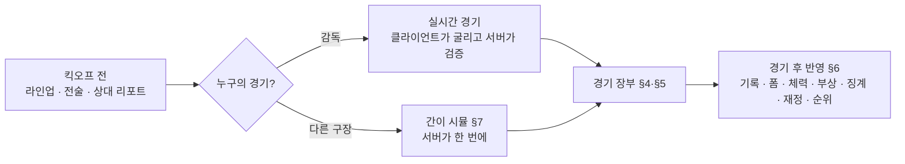
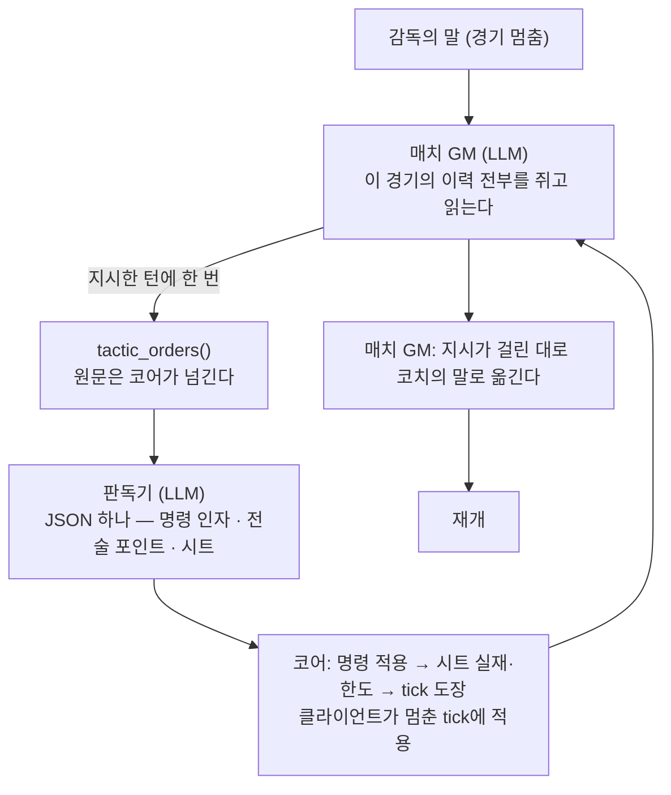

# 경기 시뮬레이션

경기는 두 가지 방식으로 굴러간다. **감독의 경기**는 [실시간 경기](live-match.md)다 —
말 22개와 공이 실시간으로 움직이고 골은 공이 골문에 들어간 결과다. **다른 구장의
경기**는 이 문서 §7의 **간이 시뮬**이 한 번에 처리한다 — 라인업에서 팀의 공격·수비
평점을 내고 통계 모델로 사건을 뽑는다.

둘은 결과를 만드는 방식이 다르되 **같은 기준점**에 맞춰진다:
[football-reference.md](football-reference.md)의 실제 축구 통계. 그리고 아래의 것을
**한 벌씩만** 갖는다 — 규칙이 두 벌이면 리그의 95%와 감독의 38경기가 다른 축구를 한다.

| 공유하는 것                     | 어디                                              |
| ------------------------------- | ------------------------------------------------- |
| 선수의 경기 능력 (§2)           | `sim/match-ability.ts`                            |
| 부하 → 체력 (§6)                | `sim/load.ts`                                     |
| 경기 장부와 검증 (§5)           | `sim/match-ledger.ts`                             |
| 벤치 정책 — 교체·전술 전환 (§3) | `sim/bench.ts`                                    |
| 카드·부상의 총량과 수신자 (§4)  | `sim/discipline-model.ts` · `sim/injury-model.ts` |
| 페널티 성공률 (§3 승부차기)     | `sim/shot-model.ts` `penaltyRate`                 |
| 세트피스 키커 선택              | `sim/set-piece-taker.ts`                          |
| 경기 후 반영 전부 (§6)          | `engine/match/`                                   |

**LLM은 결과를 정하지 않는다.** 감독의 지시는 판독기가 명령과 시트로 옮기고, 그 명령과
시트가 말의 규칙에 닿는다([live-match.md](live-match.md) §6). 매치 GM은 확정된 사건을
중계·연출·대화로 옮긴다.

요구사항:

1. **영향성** — 능력치·역할·전술·체력이 결과에 통계적으로 반영된다.
2. **일관성** — 경기 장부(스코어·시계·인원·스탯)에 모순이 없다.
3. **설명 가능성** — 주요 사건은 원인(`EventCause`)으로 설명된다.
4. **결정성** — 같은 시드·경기·입력이면 같은 경기다.
5. **현실성** — 팀·선수 통계의 평균·중간값·분산이 실제 축구의 범위에 선다(§9).

## 1. 한 경기의 길



## 2. 선수의 경기 능력 (`sim/match-ability.ts`)

저장된 능력치가 아니라 **오늘 이 자리에서의 능력치**다. 두 시뮬이 같은 함수를 쓴다.

```
경기 능력치(축) = 능력치(축) × 경기 계수

경기 계수 = 상태(폼, 체력)                                  stateModifier
          × 포지션 적응도 계수  0.10~1.00 (정규화 log1p)      profFactor
          × 전술 적응도 계수    0.79~1.00 (× 자리 민감도)     famFactor
          × (1 + 시트 edge)      감독의 경기에만
```

- `stateModifier = 1 + 폼 × 0.09 + (체력 − 75) × 0.0025`, 하한 0.4. 실시간 경기는 매
  판단마다 지금 체력을 읽고, 간이 시뮬은 킥오프 체력과 교체 시각의 추정 체력을 읽는다.
- `profFactor = 0.10 + 0.90 × log(1 + clamp(적응도, 0, 99)/5) / log(1 + 99/5)` —
  0 → 0.10 · 25 → 0.63 · 70 → 0.90 · 99 → 1.00. 목록에 없는 자리의 폴백은 25다.
  자리는 커리어가 만들므로 감점 폭이 크다(→ [player.md](../data/player.md) §8).
- `famFactor = 1 − (1 − clamp(적응도, 0, 100)/100) × 0.15 × 자리 민감도`. 민감도는
  중원 1.4 · 수비 1.2 · AM 1.0 · 윙/CF 0.7 · ST 0.6 · GK 0.8(`TACTICAL_SENSITIVITY`) —
  판을 몸으로 기억하는 것이라 중원이 최전방보다 크게 문다(→ [player.md](../data/player.md) §7).
- **지시 적용률**(`uptake` 0.45\~1.0)만은 팀 값이다 — 열한 명이 함께 소화한다.
  `0.45 + 0.35 × (감독 전술/99) + 0.20 × (팀 전술 적응도)`.
- 명단의 `적응` 게이지는 두 적응도의 저장값을 섞은 표시용 파생값이고 계산은 위 두
  계수를 각각 곱한다(`ADAPTATION_GAUGE_BAND`).

⚠️ **종합 능력치는 어느 판정에도 쓰지 않는다.** 실시간 경기의 판정은 그 판정의 축을
쓰고(패스는 패스·시야·킥력), 간이 시뮬의 팀 평점도 축의 가중합이다(§7.1).

## 3. 경기의 문 (`start_match` · 지시 · 벤치 · 승부차기)

### 3.1 킥오프는 세 걸음이다

| 걸음              | 누가                   | 무슨 일                                                                                                                                                   |
| ----------------- | ---------------------- | --------------------------------------------------------------------------------------------------------------------------------------------------------- |
| ① 문이 열린다     | GM이 `start_match`     | 라인업을 세우고(부상·정지는 **1군에서** 자동 대체) **판독기가 첫 전술 포인트와 시트를 쓴** 뒤 `phase`를 `match`로. 화면은 아직 평시고 입장 확인 창이 선다 |
| ② 감독이 들어선다 | 감독이 **경기장 입장** | 화면이 **누른 순간** 경기로 넘어가고 코어가 `pendingMatch.entered`를 세운다. 매치 GM이 **첫 휘슬만** 연다 — 사건이 생길 수 없는 턴이다                    |
| ③ 공이 구른다     | 클라이언트의 실행기    | 경기 시계가 굴러간다([live-match.md](live-match.md) §8). 감독이 입력하면 멈추고, 지시는 `tactic_orders`로 판에 오른다                                     |

화면은 `MatchView.beforeKickoff`(= `entered`가 아직 서지 않음)와 **감독이 지금 문을
지나는 중인가**로 ①과 ②를 가른다. 뒤엣것은 그 턴이 도는 동안만 산다 — 턴이 실패하면
화면은 게이트로 돌아가고, 다시 눌러도 `entered`가 서 있으면 보통의 턴이다.

②의 첫 마디를 여는 근거는 경기 전 대화(팀토크·브리핑)다 — 그 한 턴만 평시 이력을
그대로 넘긴다(`relevantTurns`). GM은 감독이 들어가자고 하거나 경기 전 점검이 끝나 그날
남은 일이 경기뿐일 때 되묻지 않고 `start_match`를 부른다. 문을 여는 판단은 GM이 하고,
걸어 들어가는 것은 감독이다.

**①의 명단은 양 팀이 같은 문을 지난다.**

- **1군이 먼저다** — 자동 대체도 벤치 채움도 `squadLevel`이 `first`인 선수를 먼저 뽑는다.
  그라운드의 열한 자리만은 비울 수 없어, 1군으로 못 채울 때만 2군을 부르고 그 사실을
  「2군 호출」로 밝힌다. 벤치는 1군이 모자라면 짧아질 뿐이다.
- **빈 자리는 골문부터 채운다.** 골키퍼가 없으면 골키퍼를(1군, 없으면 2군), 그다음 남은
  자리를 필드 선수의 기량순으로. 골문에 필드 선수를 세우는 길은 없다.
- **벤치의 골키퍼 한 자리는 잘리지 않는다** — 벤치가 이미 `MATCHDAY_BENCH`(9)를 채웠고
  골키퍼가 없으면 기량이 가장 낮은 필드 선수가 자리를 내준다.
- **상대의 명단은 간이 시뮬이 짠 그대로다**(`simSquadOf` — §7.6).
- **그 경기에 밟은 자리를 적는다** — 킥오프와 교체마다 `pendingMatch.positionsPlayed`에
  선수가 선 자리가 남고, 마감이 포지션 적응도에 읽는다(§6).

### 3.2 지시 — 판독기가 옮긴다



- **경기를 바꾸는 도구는 없다.** 매치 GM의 도구는 `tactic_orders`(지시)와
  `finalize_match`(마감)다. 시계를 미는 것은 실행기이고, GM이 도구를 부르지 않는 턴은
  대화만 오간다 — 시계는 멈춰 있다.
- **판을 움직이는 자연어는 시트로 간다.** 자리·역할·교체·6축·키커처럼 장부가 세는 것은
  타입 명령이고, 「붙어서 지워」·「그 뒤를 덮어」·「왼쪽으로 몰아」처럼 뜻을 읽어야 하는 말은
  판독기가 전술 포인트로 쓰고 시트(`behavior`·`edge`·`focus`·`temper`·`legs`·`cohesion`)로
  옮긴다([live-match.md](live-match.md) §6.2).
- **역할은 이름으로 부른다** — 「안쪽으로 파고들어」는 인사이드 포워드다. 코어는 이름·id·
  약어를 같은 것으로 받는다(→ [player.md](../data/player.md) §3.1).
- **판을 못 보는 쪽에 좌표를 요구하지 않는다.** `set_player_tactic`은 좌표 대신 `move`
  (레인 × 밴드)를 받고, 수미·공미처럼 밴드로 닿지 않는 자리는 `position` 코드로 부른다.
  좌표는 화면의 드래그가 쓰는 값이다.
- **자연어 전술 변경은 차이만 적용한다.** 기존 좌표·역할·축은 유지하고 꼭 필요한 선수만
  옮긴다. 자리를 옮겨도 기존 역할이 유효하면 유지하고, 호환되지 않을 때만 새 자리의 기본
  역할로 돌아간다.
- **판에 닿지 못한 줄은 그 사실이 남는다.** 실재가 없는 표적·한도에 잘린 줄·포인트 없는
  줄은 노트에 오르고 중계가 인용한다. 시트는 판독기가 매번 전체를 다시 쓰므로 지금 판독에
  없는 줄은 없는 것이다.
- **경기 중 스냅샷은 지금 걸어 둔 것을 되비춘다** — 6축·포메이션·역할·세트피스 지시
  (`<standing>`)와 감독의 분석이 허락한 전술 포인트(`<points>`), 그리고 지금까지의 경기
  통계(`<match_state>` — 점유·슈팅·xG·패스·부하)가 매 턴 실린다(`buildLedgerNote`).
  시트는 GM에게 가지 않는다 — 수치는 화자가 입에 담지 않는다.
- **교체 투입은 자리를 잇고 역할은 자기 것을 쓴다** — 빈 자리의 포지션·좌표는 나간 선수
  것을 잇고, 역할은 들어온 선수가 그 자리에서 맡던 것(역할 기억)이 먼저다. 어느 자리를
  잇는지는 교체 사건의 `actors` 짝이 정한다.
- **그 경기의 대응은 그 경기에서 끝난다** — 종료 시 6축·자리·역할과 적응도가 킥오프 값으로
  되돌아가고 전술 포인트와 시트는 걷힌다(`restoreTactics`). 경기 중 거친 전술은 전술
  기억(`drilled`)에도 역할 기억에도 적히지 않는다.
- mock과 실모드가 같은 시뮬레이터를 쓴다 — 차이는 서술 주체뿐.

**경기 중 대화 규칙.** 킥오프 전·하프타임(라커룸)은 선수 전체와, 진행 중 정지점은
수석코치·벤치 선수와만. 그라운드 위 선수에게 닿는 것은 외침뿐이다 — 한 사람에게 무엇을
하라는 말은 판독기가 시트로 옮기고, 팀 전체를 향한 한마디는 `occasion: "shout"`인
팀토크다. 외침은 경기당 `SHOUT_PER_MATCH`(3), 폭은 팀토크의 1/3에 ±`SHOUT_MORALE_BOUND`(2)
(→ [career.md](career.md) §2). **정지점은 감독의 차례다** — 매치 GM은 감독의 대사·판단을
대신 쓰지 않고, `team_talk`은 감독이 그 말을 한 턴에만 불린다. 부름은 판정이 아니다.
같은 선수를 몇 번 불러도 사기 합계는 하루 ±8을 넘지 않는다.

### 3.3 벤치 — 두 시뮬이 같은 정책을 부른다 (`sim/bench.ts`)

**교체**(`planBenchSubs`)의 갈래는 셋이고 순서가 우선순위다.

1. **부상** — 무조건 뺀다. 같은 계열이 벤치에 없을 때 골키퍼와 필드를 가른다: 골키퍼가
   쓰러졌는데 벤치에 키퍼가 없을 때만 필드 선수가 장갑을 낀다.
2. **스코어와 남은 시간** — 뒤지면 `SUB_CHASE_MINUTE`(두 골 이상이면 `SUB_CHASE_MINUTE_TWO`)
   부터 벤치 최고 공격 자원을 넣고 가장 지친 수비 자원을 뺀다. 앞서면 `SUB_HOLD_MINUTE`부터
   그 반대다. 줄이 무너지지 않는 선까지만이고 경기당 `SUB_CHASE_MAX`·`SUB_HOLD_MAX`장이다 —
   그 수는 교체 사건의 `subCause`로 센다.
3. **피로** — 문턱(`SUB_FATIGUE`)을 넘은 필드 선수를 지친 순서로 같은 계열 최고 벤치 자원으로.
   실시간 경기는 말의 실제 체력을, 간이 시뮬은 기대 부하로 추정한 체력을 읽는다(§6).

한 정지점은 교체 창 하나다 — 한 창의 상한은 `SUB_WINDOW_MAX`, 경기 전체는 장부의
`subLimitsOf`(5인/3창 · 연장 +1 · 친선 9인)를 같은 함수로 본다. 휴식 정지점의 교체는 창을
쓰지 않는다(§5). **부상 정지점에서 빼지 않으면 그 선수는 그대로 뛴다** — 실시간 경기에서는
느려진 말로, 간이 시뮬에서는 낮아진 경기 계수로. AI 벤치는 언제나 빼지만 창을 다 썼거나
이을 자원이 없으면 같은 규칙으로 남는다.

**전술 전환**(`planAiTacticalShift`)은 스코어·남은 시간(결정적)과 상대의 지금 전술(확률로)을
읽는다. 뒤지면 던지고 앞서면 물러선다 — 뒤지면 55분부터 한 칸, 두 골 앞서면 55분부터 한 칸
물러서고, 남은 시간이 없으면(72분) 한 골 차도 템포·압박·라인까지 얹는다. 크기는 실측의 경기 상황 효과에 맞춘다: 한 골 앞선 팀의 xG는
동점일 때의 0.85\~0.9배, 뒤진 팀은 1.05배 남짓이다(§8.2). 추격이 이보다 세면 전력 차가 만든
리드가 경기 안에서 지워진다. 스코어가 손을 부르지 않을 때는
`AI_COUNTER_CHANCE`로 상대를 읽는다 — 높은 압박에는 템포를 올리거나 라인을 내리고, 높은
라인에는 뒷공간을, 내려앉은 상대는 두드린다. **공을 돌리는 상대에게는 압박으로 답한다** —
비기거나 뒤진 채 점유가 쏠리고 슈팅이 끊긴 시간이 `STALL_MINUTES`를 넘으면 압박·멘탈리티를
한 칸 올린다([live-match.md](live-match.md) §5.1). 6축은 킥오프 값에서 `AI_SHIFT_BOUND`(2)
눈금까지만 벌어진다 — 정지점마다 다시 불리므로 상한이 지금 값이 아니라 킥오프 값에 걸린다.

**AI 벤치는 6축만 옮긴다** — 판의 모양(포메이션·배치)은 경기 중에 바꾸지 않는다.

**벤치가 판을 옮기면 사건이 남는다** — `tactical_shift` 한 줄(§4). 6축이 실제로 움직였을 때만
서고, 근거 하나(`ai-shift` — 갈래 `chase`·`hold`·`counter`·`press`와
옮긴 뒤의 값)를 싣는다. 상태만 바꾸면 중계가 「상대가 던졌다」를 말할 수 없다. 종료 휘슬에는
적지 않는다.

### 3.4 승부차기 — 코어가 굴리고 매치 GM이 한 발씩 옮긴다 (`competition/shootout.ts`)

연장까지 치르고도 같으면 승부차기다. **킥 하나가 사건 하나로 장부에 남는다** —
누가 찼고 누가 막아섰고 들어갔는지, 그 킥의 성공 확률까지(`ShootoutKick`).

- **성공률은 키커와 골키퍼가 함께 정한다**(`penaltyRate`). 키커의 기량은 결정력·침착성·
  킥력(0.5 · 0.3 · 0.2), 골키퍼는 골키핑·침착성(0.7 · 0.3). 차가 0이면 `PENALTY_BASE`,
  기량 차 1당 `PENALTY_EDGE`씩 오르내리되 대역은 `PENALTY_FLOOR`\~`PENALTY_CEILING`이다 —
  실력이 덜 갈리는 무대라 폭이 좁고, 그래서 이변이 여기서 태어난다. 경기 중 페널티도
  같은 함수다(실측 성공률 79%가 기준점이다 — §9).
- **차는 사람은 그 경기를 끝낸 열한 명이다**(온필드 — 퇴장이 있었으면 그보다 적다). 기본
  순서는 승부차기 기량 내림차순, 골키퍼가 맨 뒤. 막아서는 골키퍼도 그 열한 명 중의 GK다.
- **먼저 차는 쪽은 동전이 정한다** — 시드에서 떨어지는 결정적 동전이다.
- **규정대로 조기 확정한다.** 5킥씩 차고도 같으면 서든데스, 상한은 없다(`shootoutSettled`).

감독의 경기는 정지점을 하나 더 갖는다 — 120분 뒤 `shootout_start`에서 감독은 키커 순서를
지시할 수 있고(`set_shootout_order`), 그 뒤 진행 한 번에 한 발이다. 승부가 갈리면
`finalizeMatch`가 `MatchResult.penalties`에 합계와 킥 목록을 적는다. 타 팀 경기는
`resolveShootout` 한 번에 킥 목록이 실린다 — 대진 승자를 묻는 자리(`domesticTieWinner` ·
`euroTieWinner`)는 읽기만 하고, 굴리는 것은 대회를 진행시키는 함수뿐이다.

### 3.5 키커 지정과 세트피스 지시 — 평시에도 경기 중에도 같은 명령

「코너는 사카가 차」는 팀 전술의 `setPieceTakers { corner, freeKick, penalty }`로
가고(`set_set_piece_takers`), 평시와 경기 중이 같은 명령 하나를 지난다. 말한 자리만 바뀌고
`null`을 주면 그 자리의 지정이 풀려 코어의 기본값(킥력 최고 · `penaltySkill` 최고 —
`setPieceTakersOf`)으로 돌아간다. 우리 선수만, 이름으로(`pickOurPlayer`). 그라운드에 없으면
그 경기에서만 기본값이 선다 — 지정은 남는다. 팀을 떠나면 지정도 걷힌다(`releaseFromTactics`).

**화면에도 같은 문이 있다** — 스쿼드 화면의 세트피스 줄. 지정과 실제로 서는 사람이 나란히
서고, 지정한 사람이 선발 밖이라 다른 사람이 차는 어긋남에만 색이 선다. 라우트는 값을 옮길
뿐이고 우리 선수인지 보는 문은 명령 하나다.

**같은 줄에 가담·수비 두 축이 함께 선다**(`setPieceRoutine` — 가담 적게 3 · 보통 4 · 많이 6,
수비 지역/대인). 값을 옮기는 문은 `setSetPieceRoutine` 하나이고 채팅에서는 평시 도구
`set_set_piece_routine`, 경기 중에는 판독의 갈래가 그 도구를 부른다. 지시를 푸는 값은
`normal`이다 — 모델이 고를 수 있는 것은 열거 안의 값뿐이라 중립이 열거에 있어야 「그만해」가
반대쪽 값으로 걸리지 않는다. AI 팀도 이 값을 싣는다 — 리그의 나머지 경기가 이 축 없이
굴러가면 죽은 공 규칙이 감독의 경기에만 있는 규칙이 된다.

### 3.6 경기 전 — 상대 리포트 (`engine/match/preview.ts`)

킥오프 전에 감독이 읽는 상대의 사실이다(`buildOpponentReport`). GM의 `<opponent>` 블록,
조회 도구 `get_opponent_report`, 대회 탭의 다음 경기 카드가 같은 함수를 읽는다.

- **예상 XI는 직전 경기 선발에서 투영한다** — 부상·정지로 빠진 사람은 결장자로 서고
  그 자리는 간이 시뮬이 채우는 규칙(`simSquadFor`)으로 채운다. 예상은 예상이라
  「예상」으로 표기한다.
- **우리 XI는 킥오프에 설 그 열한 명이다** — 저장된 배치에서 부상·정지를 뺀 것.
- **사실만 있다**: 최근 결과와 폼, 예상 XI와 주요 선수, 전술 스타일(모양·중립이 아닌
  6축·갈래), 결장자와 이유, 더비 여부와 `heat`. 판독은 킥오프에 시작한다 — 리포트에는 없다.
- **팀의 바로 다음 경기에만 선다.** 3주 뒤 대항전 상대의 예상 XI는 그 사이 벌어질 일 때문에
  값이 없다. 경기 중에는 서지 않는다.

## 4. 사건과 기록

```ts
MatchEvent { minute, added?, type, team, actors[], causes: EventCause[], xg, goalProbability, shotOutcome, shotOrigin }
EventCause { code, playerIds, values?, pointId? }
```

- **원인은 사건을 만든 행동의 사슬이다** — `through_ball` · `high_turnover` · `counter` ·
  `cross` · `set_piece` · `individual` · `error` · `keeper_out` · `marking`
  ([live-match.md](live-match.md) §9.1). `marking`은 시트의 `behavior`가 걸린 말이 관여했다는
  사실이고 `pointId`로 포인트 문장을 인용한다 — 감독의 전술 XP 근거가 여기서 선다(§6).
  자유 문자열은 없다 — 문장은 렌더러 하나가 만든다.
- **간이 시뮬의 골도 원인을 갖는다** — 어느 채널에서 나왔는가(`set_piece` · `counter` ·
  `open`)와 슈터·도움까지. 행동의 사슬은 없다 — 장부가 없다.
- **교체의 갈래는 `subCause`가 갖는다**(`injury` · `chase` · `hold` · `fatigue`).
- **AI 벤치가 판을 옮긴 것도 사건이다**(`tactical_shift`) — 팀 사건이고 `actors`는 비어
  있다. 근거 하나가 갈래와 옮긴 뒤의 값을 싣는다.
- `actors` 순서가 뜻을 갖는다 — goal은 [득점자, (도움)], substitution은 [아웃, 인].
  도움은 골을 무효로 만들지 못한다(`sanitizeEvent`).
- **사건이 될 만한 것만 사건이다.** 골·슛·선방·카드·교체·부상·오프사이드·코너는
  `MatchEvent`, 패스·태클·인터셉트·드리블·크로스·파울·뛴 거리·고속·스프린트·xG 합은
  `MatchLedgerState.stats`에 선수별 숫자로 쌓인다. 실시간 경기는 실제로 일어난 것을
  세고, 간이 시뮬은 팀 총량을 뽑아 나눈다(§7).
- **모든 슛에는 어디서 나왔는지가 붙는다**(`shotOrigin` — `open` · `corner` · `free_kick` ·
  `penalty`). 골도 같은 칸을 갖고 결과(`MatchResult.goalOrigins`)에 `scorers`와 같은
  순서로 남는다. 모든 슛에는 기회의 질 `xg`와 결정력 반영값 `goalProbability`가 붙는다.
  골은 `shotOutcome="goal"`인 슈팅이다.
- **한 값은 한 곳에서만** — 뷰의 슛·선방·패스는 `stats`가 원본, 골·도움·카드만 사건에서 센다.
- **도움은 결과까지 살아남는다**(`MatchResult.assists` — `scorers`와 같은 순서·길이).
- **매치데이 벤치도 남는다 — 우리 경기에만**(`homeBench`/`awayBench`). 못 뛴 선수가 벤치에
  앉아 있었는지 명단에 없었는지는 감독의 다른 결정이고 근황 줄이 그것으로 갈린다.

**종료 휘슬이 장부를 걷어 가지 않는다.** 마감은 장부의 사건·선수별 기록·점유를 결과에
그대로 옮긴다(`MatchResult.events` · `playerStats` · `possession`). 사건은 자르지 않고 전부
옮긴다 — 몇 줄을 남길지 고르는 순간 그 기준이 두 번째 원본이 된다. 사건·선수별 기록은
감독의 경기에만 남고(간이 시뮬에는 장부가 없다), 점유는 모든 경기에 남는다. 시즌 합계에는
양쪽이 같은 눈금으로 접힌다(§6).

### 4.1 카드·부상의 총량 (`sim/discipline-model.ts` · `sim/injury-model.ts`)

두 시뮬이 같은 총량 상수와 같은 수신자 규칙을 쓴다.

- **파울 12 · 경고 2.07 · 퇴장 0.10** (팀·경기당 — `FOULS_PER_MATCH` · `YELLOWS_PER_MATCH` ·
  `REDS_PER_MATCH`, [football-reference.md](football-reference.md) §5). 경고는 파울의 성질에서
  나온다(`CARD_ON_FOUL` — 파울 하나가 경고가 되는 비율 약 17%, 역습을 끊은 파울과 반복
  파울이 그 몫을 올린다). 두 번째 경고는 경고 한 줄 + 퇴장 한 줄이다(§5).
- **강도**(`matchIntensity` 0.70\~1.30)가 총량에 곱해진다 — 압박·템포·태클 강도와 더비
  `heat`. 실시간 경기에서는 이 값이 접촉의 빈도로 들어가고, 간이 시뮬에서는 팀 총량에
  곱해진다. 어느 쪽이든 강도 1의 리그 평균이 위 값이다.
- **누가 받는가**는 `bookingWeight`(거칠기 + 태클 미숙, 이미 경고면 `BOOKED_AGAIN_WEIGHT`)와
  시트 `temper`다. 실시간 경기에서는 접촉을 만든 말이 받으므로 가중은 접촉 확률에 들어간다.
- **부상은 `INJURY_PER_MATCH`**(팀당 0.05\~0.07)가 총량이다. 실시간 경기는 접촉과
  스프린트 부하에 위험을 걸고(`INJURY_CONTACT_RISK` · `INJURY_SPRINT_RISK`), 간이 시뮬은
  베르누이 한 번이다. 누가 다치는가는 `injuryWeight`(성향 · 체력 · 부하)다. 부상은 명단을
  바꾸지 않고(§5) 뛴 선수 전원의 성향이 움직인다(`easeProneness` — 뛰고 안 다쳤으면 하강).
  난수 채널은 `injury:<경기 id>` 한 모양이다.

## 5. 장부의 무결성 (`sim/match-ledger.ts`)

| 규칙      | 내용                                                                                                                                                 |
| --------- | ---------------------------------------------------------------------------------------------------------------------------------------------------- |
| 시간 순증 | 사건은 (규정분, 추가분) 순으로 단조 증가. 전반 0\~45+x · 후반 45\~90+x · 연장 90\~105+x · 105\~120+x                                                 |
| 추가시간  | 각 하프의 추가분은 그 하프의 중단에서 계산한 값(`addedTimeOf`)이고 하프 끝 사건이 그 값을 싣는다. 사건의 `added`는 규정분이 그 하프의 끝일 때만 선다 |
| 국면      | 전반→후반→(연장 전반→연장 후반)→종료. 종료는 90+x 또는 120+x 뒤에만                                                                                  |
| 인원      | 퇴장·교체아웃 재등장 금지 · 교체 5인/3창(**연장 6인/4창** · **친선 9인/3창**) · 휴식 정지점의 교체는 창 미소모 · 미등록 선수 금지                    |
| 스코어    | goal 사건 수 = 스코어                                                                                                                                |
| 배치 크기 | 장부가 한 번에 받는 사건 `LEDGER_LIMITS.maxEventsPerBatch` — 처리 단위만 끊고 분포는 자르지 않는다                                                   |
| 파생 스탯 | 요약 스탯은 사건과 `stats`에서 코어가 재계산                                                                                                         |
| 퇴장      | 경고 누적 퇴장은 `yellow_card` + `red_card` 두 줄 — 뒷줄 레드만 통과                                                                                 |
| 부상      | `injury`는 온필드 명단을 바꾸지 않는다 · 같은 선수의 두 번째 `injury`는 없다                                                                         |
| 전술 전환 | `tactical_shift`는 team이 필요하고 명단·스코어·국면을 바꾸지 않는다 — 한 정지점에 한 줄, 정지 사건 **앞**에 선다                                     |

사건을 만드는 쪽이 코어이므로 이 검증은 LLM 방어가 아니라 **시뮬레이터의 계약 검사**다 —
반려는 시뮬레이터의 버그를 뜻한다. 실시간 경기에서는 체크포인트 검증이 같은 검사를
서버에서 다시 한다([live-match.md](live-match.md) §8).

- **친선은 명단에 든 사람 전부를 바꿀 수 있다** — 9인(`MATCHDAY_BENCH`)/3창. 프리시즌은
  영입의 정착·유망주 시험을 위한 자리라 다섯 장으로는 그 시험이 열리지 않는다. 한도는
  명수만 열고 창은 3회 그대로다 — 창이 세는 것은 경기를 몇 번 끊느냐다. AI 벤치도 같은
  한도를 본다.
- **창을 면제받는 자리는 분이 아니라 정지점이 정한다.** 휴식 정지점(하프타임 · 연장 개시 ·
  연장 하프타임)의 교체는 창을 쓰지 않는다 — 정지 사건의 앞뒤 양쪽이 면제다(뒤는 감독의
  교체, 앞은 벤치의 AI 교체·전술 전환). 경기가 재개되면 창이 다시 선다.
- **부상은 명단을 바꾸지 않는다.** `injury`는 쓰러졌다는 사실만 적고 그라운드에서 빼는 것은
  교체뿐이다. 같은 선수는 한 경기에서 두 번 쓰러지지 않는다.
- **두 번째 경고는 경고 한 줄과 퇴장 한 줄로 남는다.** 경기 후 반영은 사건 타입만 읽으므로
  `red_card` 줄이 없으면 정지도 평점의 감점도 생기지 않는다. 두 시뮬이 같은 모양이라 중계는
  그 쌍을 경고 누적 퇴장(`second_yellow`)으로 읽는다.

## 6. 부하와 체력 (`sim/load.ts` · `sim/stamina.ts`)

체력은 **뛴 것**으로 줄어든다. 실시간 경기는 말이 실제로 쌓은 속도 구간별 거리·스프린트
횟수를 읽고, 간이 시뮬은 자리·역할·전술별 **기대 부하표**(`EXPECTED_LOAD` — `sim/load.ts`)를 읽는다.
함수는 하나다.

```
부하 = LOAD_WEIGHT.distance × 총 거리 + LOAD_WEIGHT.highSpeed × 고속 거리 + LOAD_WEIGHT.sprint × 스프린트 거리
소모 = 부하 × (1 − 지구력/99 × STAMINA_RELIEF) × 시트 legs
체력 = 지수 감쇠 — log(남은 체력)이 부하에 선형으로 준다
```

- **기대 부하표는 실시간 경기를 굴려 잰 값이다** — `pnpm balance live-player-load --report`가
  자리 묶음 × 전술 배율의 표를 다시 만든다. 자리별 총 거리(센터백 10.2 → 중앙 미드 11.7km)와
  고속·스프린트의 비가 [football-reference.md](football-reference.md) §7이다. 압박·템포·라인·폭이
  부하를 움직이는 폭은 실측 팀 간 총 거리 sd(약 2km, ±5%)와 고강도 주행의 폭(±30%) 사이다.
- **원정은 조금 덜 채워 나온다**(`AWAY_CONDITION_PENALTY`) — 홈 이점의 전부다. 관중·분위기가
  게임 시스템으로 서는 자리는 아직 없다(§10).
- **정산도 이 값 그대로**(`pendingMatch.matchFatigue`) — 화면에서 본 소모와 장부에 남는 소모는
  같은 숫자다. 상대 팀도 같은 장부에서 정산된다.
- **누적 피로**(시즌의 몸)는 출전 분과 본훈련이 쌓고 휴식이 뺀다(`fatigueFromMinutes` ·
  `fatigueAfterDay` — [player.md](../data/player.md) §5.5). 회복에만 걸고 소모에는 걸지 않는다 —
  양쪽에 걸면 12월의 스쿼드가 통째로 바닥에 눕는다.

### 6.1 회복 (`dailyRecovery`)

소모와 같은 축(`stamina`)이 회복도 정한다: 본훈련 11 · 훈련 없는 날/휴식/경기일 13 ·
회복 세션 16. 그 위에 회복 배율이 곱해진다:

```
회복 배율 = (0.84 + 지구력/99 × 0.33) × (1 − 누적 피로/100 × 0.42)
```

**만 7일이면 누구든 온전히 돌아오고, 사흘은 누구도 못 채운다.** 그 사이가 감독이 판단하는
구간이다. 리그와 대항전이 겹치는 구간의 경기 간격은 3\~5일이라 **로테이션은 선택이 아니라
스쿼드 운영의 기본**이다. 회복이 지구력으로 갈리는 폭(0.84\~1.17)은 소모가 갈리는 폭보다
훨씬 좁아야 한다 — 한 축이 양쪽에 곱으로 걸리면 격차가 복리로 벌어진다. 하루의 회복은
하루에 한 번이다.

### 6.2 수적 열세

실시간 경기에서 열 명은 실제로 한 자리가 빈다 — 블록이 그만큼 얇고 그 공간을 상대가 쓴다.
간이 시뮬은 빠진 한 명마다 팀 평점을 `SHORTHANDED_PENALTY`(12%)씩 깎는다(최대 세 명). 실측
기준은 열 명이 된 팀의 실점 +15\~30% · 득점 −20\~25%이고, `sim-parity`가 두 시뮬의 값을 나란히
찍는다.

## 7. 경기 후 반영 (코어, 결정적)

스탯 적재 → 평점·결과의 폼 Δ → 피로 정산 → 부상 확정 → 재정 → 리그 테이블. 장부의 사건·
선수별 기록·점유는 그 첫 줄에서 결과로 옮겨진다(§4) — 마감이 끝나면 `pendingMatch`는
사라진다. `finalizeMatch`는 결과를 갈래로 나눠 돌려준다(`MatchDigest` — `ours` · `finance` ·
`others`). 말풍선은 우리 경기만 싣고 모델은 셋을 다 읽는다.

### 7.1 마감은 양 팀에 적는다

| 무엇                                                  | 우리 | 상대   |
| ----------------------------------------------------- | ---- | ------ |
| 시즌 기록 (`SEASON_STAT`)                             | ○    | ○      |
| 폼 Δ (`squad/form.ts` `formDeltaFromMatch`)           | ○    | ○      |
| 체력 소모 (`pendingMatch.matchFatigue` 그대로)        | ○    | ○      |
| 부상 확정 · 부상 성향 하강 (`squad/injury.ts`)        | ○    | ○      |
| 카드 → BOOKING·SUSPENSION (`match/discipline.ts`)     | ○    | ○      |
| 출장 정지 소화 (`serveSuspensions`)                   | ○    | ○      |
| 연패·연승의 라커룸 (`squad/slump.ts`)                 | ○    | ○      |
| 더비 결과의 라커룸                                    | ○    | ○      |
| 포지션 적응도                                         | ○    | ○      |
| 사건·선수별 기록·점유 (`MATCH.result`)                | ○    | ○      |
| 경기별 평점 (`MATCH.result.ratings`) · 결산 판정(LLM) | ○    | 결승만 |
| 말풍선 한 줄 (카드·정지·부상 일수·무드)               | ○    | ✗      |
| 마일스톤 (`MILESTONE`)                                | ○    | ✗      |

### 7.2 시즌 기록 — 두 시뮬이 같은 눈금으로 적는다

한 경기가 시즌 행에 얹는 몫은 한 함수가 센다(`domain/records.ts` `addToSeasonStat`). 행의
열쇠는 (선수, 시즌, 팀, 대회)라 리그 경기는 리그 행에, 컵 경기는 컵 행에 쌓인다
(`ensureSeasonStat`). 친선은 이 문을 지나지 않고 2군 경기는 `reserve*` 칸이 따로 받는다.

| 칸                | 무엇         | 실시간 경기의 원본                          | 간이 시뮬의 원본                    |
| ----------------- | ------------ | ------------------------------------------- | ----------------------------------- |
| `apps`            | 출전         | 그라운드를 밟은 사람                        | 같음(`playedIn`)                    |
| `minutes`         | 출전 분      | `matchMinutesOf`(사건 목록)                 | 교체·퇴장의 분                      |
| `goals`·`assists` | 골·도움      | `goal` 사건의 `actors`                      | `scorers`·`assists`                 |
| `ratingSum`       | 평점 합계    | `matchRating`                               | 같은 함수                           |
| `shots`·`xg`      | 슛·기회의 질 | `ledger.stats`                              | 슛 한 발마다 슈터에게               |
| `saves`           | 선방         | `save` 사건                                 | 유효슈팅이 막힌 분의 골문에 선 사람 |
| `cleanSheets`     | 클린시트     | 무실점 + 골키퍼 + `CLEAN_SHEET_MINUTES`(60) | 같은 함수(`keptCleanSheet`)         |
| `yellows`·`reds`  | 카드         | `recordCard`                                | 같은 문                             |
| `distance`        | 뛴 거리      | `ledger.stats`                              | 기대 부하표                         |

연장은 같은 경기에 덧붙는 몫이다 — `apps`는 0으로 얹고 분·슛·xG·선방·골·도움만 더하며,
연장에서 실점하면 90분의 클린시트는 물린다. 0인 칸은 적지 않는다.

### 7.3 더비 · 마일스톤 · 포지션 적응도 · 평점

- **더비의 결과는 승점 3보다 무겁다** — `applyResultMood`에서 승리면 스쿼드 전원의 폼이
  `+DERBY_MOOD_STEP(0.02) × heat`, 패배면 같은 폭으로 내려간다. 한 경기 안에서 두 라커룸이
  정확히 반대로 갈리므로 폭이 대칭이다.
- **마일스톤은 스탯을 적은 그 자리가 센다**(`milestonesReached`): `debut` · `first-goal` ·
  `apps` 50·100·200·300·400·500 · `goals` 25·50·100·150·200 · `hat-trick`. 클럽 단위고
  감독 팀 선수 것뿐이며 2군·친선은 문턱을 밀지 않는다. 무직 구간에는 서지 않는다.
- **포지션 적응도는 실제로 밟은 자리가 올린다** — `pendingMatch.positionsPlayed`의 자리가
  `MATCH_PROFICIENCY_GAIN`(1)만큼(상한 99, 양 팀 공통).
- **평점**(`engine/match/ratings.ts`)은 기준선 6.0에서 장부 사실만으로 조정한다(난수 없음):
  승 +0.4/패 −0.3 · 골 GK +2.0 · DF +1.4 · MF +1.1 · FW +0.9 · 도움 +0.6 · 무실점 GK +0.8/
  DF +0.5 · 실점(첫 골 면제) GK −0.3/DF −0.2 · 경고 −0.3 · 퇴장 −1.5, 범위 3.0\~10.0. 출전
  시간은 그라운드를 떠난 시각까지다(교체·퇴장). 경기 후 결산 에이전트가 중계 전부와 결산
  표를 읽어 앵커 ±`RATING_BAND`(1.2) 안에서 재채점한다(→ [pipeline.md](../llm/pipeline.md) §5).
  실패하면 앵커가 남는다.

### 7.4 징계 — 카드가 정지가 되는 길 (`engine/match/discipline.ts`)

카드 한 장은 `BOOKING` 한 줄로 남고 두 시뮬이 같은 문(`recordCard`)을 지난다.

**징계는 대회 단위다.** 경고는 그 대회 안에서만 쌓이고(`seasonYellowsOf`), 정지는 그 대회
경기에서만 소화된다(`isSuspendedFor` · `serveSuspensions`). `SUSPENSION`은 어느 대회에서
왔는지(`competitionId`)와 어디까지 미치는지(`scope` — `competition` 그 대회뿐 · `jurisdiction`
그 대회가 속한 관할 전체)를 든다. 관할은 다섯 나라와 `uefa`다.

**규정 표는 대회가 아니라 협회가 갖는다**(`engine/data/discipline-catalog.ts`) — 더비 표와
같은 결의 별도 표다.

| 대회                                                     | 누적 눈금                                                                           | 그 뒤 주기 | 사면     | 퇴장 범위 |
| -------------------------------------------------------- | ----------------------------------------------------------------------------------- | ---------- | -------- | --------- |
| 잉글랜드 리그 (EPL · 챔피언십)                           | 5장 → 1경기(19R까지) · 10장 → 2경기(32R까지) · 15장 → 3경기(38R까지) · 20장 → 4경기 | 없음       | —        | 관할      |
| 스페인 · 독일 · 프랑스 리그 (1·2부)                      | 5장 → 1경기                                                                         | 5장        | —        | 그 대회   |
| 이탈리아 리그 (세리에 A·B)                               | 5 · 9 · 13 · 16 · 18장 → 1경기                                                      | 1장        | —        | 그 대회   |
| FA컵 · 카라바오컵                                        | 2장 → 1경기                                                                         | 2장        | 8강 이후 | 관할      |
| 코파 델 레이 · 코파 이탈리아 · DFB-포칼 · 쿠프 드 프랑스 | 5장 → 1경기                                                                         | 5장        | —        | 그 대회   |
| UCL · UEL · UECL                                         | 3장 → 1경기                                                                         | 2장        | 8강 이후 | 관할      |
| 슈퍼컵 (단판)                                            | 없음                                                                                | —          | —        | 관할      |

실제 규정을 그대로 옮긴 값이다. 매치위크 문턱은 잉글랜드에만 있고(`round`로 잰다), 사면은
8강까지이며 8강에서 받은 장으로 걸린 정지는 그대로 4강에서 소화된다. 친선과 2군 경기는 어느
표에도 없다. 2부는 1부와 한 값을 나눠 갖는다(`checkDisciplineCoverage`).

**한 사건에 정지는 하나.** 경고 누적은 그 대회의 세는 경고가 눈금에 닿을 때, 퇴장은 `red_card`
한 줄이 그 자체로 1경기(`cause: "red"`). 두 번째 경고의 정지는 퇴장 하나뿐이고 그 경기의 두
장은 누적에서 빠진다 — 첫 장이 이미 누적 정지를 걸었다면 두 번째 장이 그 정지를 물린다.
다이렉트 퇴장은 다르다 — 그 경기의 경고는 누적에 남는다. 소화는 새 카드보다 먼저다. 정지
선수는 그 대회 명단에서 자동으로 빠지고(`isAvailableFor`), 정지가 걸리면 어느 대회 몇
경기인지 한 줄로 감독에게 간다. 남의 팀 정지는 브리핑하지 않는다.

## 8. 간이 시뮬 (`engine/match/quick-sim.ts`)

시즌 2,100여 경기 중 감독의 경기만 실시간으로 굴고 나머지는 여기서 한 번에 처리한다.
**팀의 평점에서 경기의 xG를 내고, 그 xG에서 슈팅과 골을 뽑는** 통계 모델이다 — 실측 득점
분포가 팀 전력이 정해진 뒤 푸아송에 가깝다는 사실([football-reference.md](football-reference.md)
§1)이 이 모델의 근거다.

### 8.1 팀 평점 — 선발 열한 명에서

선수마다 경기 능력치(§2)를 낸 뒤 자리 묶음별로 세 평점에 접는다.

```
공격 = Σ 공격 기여 가중(자리) × (결정력 · 침투 · 드리블 · 스피드 · 시야 · 패스의 가중합)
수비 = Σ 수비 기여 가중(자리) × (태클 · 위치선정 · 몸싸움 · 공중볼 · 스피드의 가중합) + 골키퍼(골키핑 · 위치선정)
중원 = Σ 중원 기여 가중(자리) × (패스 · 시야 · 침착성 · 지구력 · 태클의 가중합)
```

기여 가중(`QUICK_ZONE_CONTRIBUTION`)은 자리 묶음이 정하고 전술판의 전진 깊이가 연속으로
옮긴다 — 4-3-3의 윙어가 공격에, 5-4-1의 윙백이 수비에 더 실린다. 축의 가중은
`POSITION_WEIGHTS`([player.md](../data/player.md) §4)를 읽는다 — 자리별 종합이 쓰는 그 표라
새 표가 아니다.

### 8.2 팀 xG — 평점의 지수

```
ln xG(우리) = ln QUICK_XG_BASE
            + QUICK_RATING_SLOPE × (우리 공격 − 상대 수비)
            + QUICK_MIDFIELD_SLOPE × (우리 중원 − 상대 중원)
            + ln 홈 계수 (홈 1.12 · 원정 0.89 · 중립 1)
            + 전술 항 (§8.5)
            − QUICK_LEAD_LOG_RATE × 앞선 골 차 + QUICK_TRAIL_LOG_RATE × 뒤진 골 차
            − 수적 열세 (§6.2)
```

- **전력은 평점의 지수다.** 축구 득점의 표준 통계 모델(Maher 1982 · Dixon–Coles 1997)은
  `ln λ`가 공격·수비 평점의 차에 선형이다 — 같은 5점 차는 60 대 65에서도 80 대 85에서도
  같은 승률 차다. 기울기(`QUICK_RATING_SLOPE`)는 리그의 팀 간 xG sd가 **0.40**, 우승 승점이
  84\~93, 스무 팀 승점의 sd가 19\~20에 서도록 잡는다(`league-spread` 하네스).
- **홈 계수는 실측 그대로다** — 홈 xG 1.67 · 원정 1.32 (평균 1.49). 감독의 경기는 원정
  체력 감점 하나로 홈 이점을 내므로(§6) 두 시뮬의 홈 이점은 `sim-parity`가 나란히 찍는다.
- **스코어 상황은 골마다 같은 배가 곱해진다** — 앞선 팀 `e^(−0.10 × 골 차)`(한 골 0.90 ·
  두 골 0.82), 뒤진 팀 `e^(0.05 × 골 차)`. 실측 xG의 경기 상황 분해(한 골 앞서면 0.85\~0.9,
  두 골 0.7\~0.75)를 지난다. 골 정지점마다 다시 세운다.

### 8.3 슈팅과 골 — 세 번의 확률

```
슈팅 수      N ~ Poisson(xG / QUICK_XG_PER_SHOT)           슈팅당 xG 0.12
슛 하나의 질 q ~ Beta(μ κ, (1−μ) κ)                       μ = xG / N 근처, κ = SHOT_XG_CONCENTRATION
골 확률      logit p = logit q + FINISHING_LOGIT_WEIGHT × (결정력 − FINISHING_PIVOT) / FINISHING_SCALE
결과         goal ~ Bernoulli(p) · 아니면 saved / blocked / off_target (유효슈팅 35% · 골/유효 32%)
```

`Σq`는 기회 xG, `Σp`는 결정력 반영 기대 득점, `Σgoal`은 실제 득점이다. `FINISHING_PIVOT`
(75)은 게임 데이터의 슈팅 가중 리그 평균이라 리그 전체에서 `Σp ≈ Σq`다.

**누가 차는가**는 포지션별 슈팅 몫(`QUICK_SHOT_SHARE` — ST 27% · 윙어 27% · CM 22% ·
AM 9% · FB 8% · CB 7%, [football-reference.md](football-reference.md) §8)에 역할의 `shoot`
성향과 결정력·침투를 곱해 뽑는다. 도움은 골의 `ASSIST_RATE`(0.68)에만 붙고 온필드에서
시야·패스로 뽑는다.

**세트피스는 같은 총량 안의 몫이다** — 슈팅의 `SET_PIECE_SHOT_SHARE`(0.27)가 코너·프리킥
채널로 가고, 그 슛의 질은 키커의 킥력과 박스 안 공중볼이 정한다. 세트피스 골의 도움은
키커다. 페널티는 팀당 `PENALTY_PER_MATCH`(0.154)에 상대의 거칠기와 우리 공격 몫을 곱해
뽑고 `penaltyRate`(§3.4)로 성공을 정한다. 코너는 `CORNERS_PER_MATCH`(4.9)에 공격 몫을 곱해
음이항으로 뽑는다(실측 분산 8.0 — 과산포).

⚠️ **슈팅 수·xG·득점에 상·하한을 두지 않는다.** 푸아송·베타·베르누이가 대부분의 경기를
현실적인 구간에 모으되 7-0의 꼬리도 실제 분포만큼 남긴다.

### 8.4 점유 · 분 · 흐름

- **점유**는 중원 평점 차의 로지스틱에 패스 스타일·압박 항을 더하고, 경기별 잡음을 얹어
  sd 11%p·팀 간 sd 8.5%p에 맞춘다(`QUICK_POSSESSION_SLOPE` · `QUICK_POSSESSION_NOISE`).
  결과의 `possession`과 벤치의 체력 추정(공 없는 팀이 더 뛴다)이 읽는다.
- **사건의 분**은 후반이 조금 더 붐빈다 — 전반 `QUICK_FIRST_HALF_SHARE`(0.45), 실측 골의
  전반 비중 45.1%. 추가시간은 각 하프의 중단 수에서 계산해(`addedTimeOf` — 실시간 경기와
  같은 함수) 그 안에도 사건이 앉는다.
- **경기를 시간순으로 굴린다** — 정지점(골·퇴장·하프타임·조용한 25분)마다 벤치가 판을 읽고
  (`planBenchSubs` · `planAiTacticalShift`, §3.3) 온필드가 바뀌면 평점을 다시 세운다. 골에서
  멈출 때 그 분 뒤로 굴려 둔 슛은 버리고 다시 굴린다 — 푸아송은 무기억이라 총량이 변하지
  않는다.
- **선수별 슛·xG·선방은 시즌 기록으로만 접힌다** — 장부가 없어 `MatchResult`에 선수별 기록을
  남기지 않지만 시즌 합계는 같은 함수로 얹는다(§7.2). 리그 2,100경기의 선수별 기록을 남기면
  세이브가 시즌마다 수 MB 불어나는데 읽는 자리는 시즌 합계뿐이다.

### 8.5 전술 항 — 실시간 경기가 잰 값

간이 시뮬의 전술은 여섯 축과 토글의 **거친 항**이다 — 시트가 없다. 각 축이 xG·
피xG·점유를 얼마나 움직이는지(`QUICK_TACTIC_EFFECTS`)는 실시간 경기를 같은 스쿼드로 전술만
바꿔 굴린 `live-tactics` 하네스의 측정값에서 온다. 이 표를 손으로 고치지 않는다 — 말의 규칙이
바뀌면 하네스가 표를 다시 내고, `sim-parity`가 두 시뮬의 기울기가 같은 밴드에 서는지 본다.

### 8.6 라인업 · 연장 · 옆 구장

**AI 로테이션**(`engine/core/tick.ts` `simSquadOf`)은 스쿼드 운영의 기본이다. 자리를 내주는
이유는 둘 — 오늘의 몸(피로 `ROTATION_FATIGUE` 20 이상)과 시즌의 몸(누적 피로 「지침」 위).
같은 포지션군에서 `ROTATION_OVR_DROP` 안의 더 신선한 선수(`ROTATION_FRESHER`)가 대신 선다.
정지·부상은 `isAvailableFor`로 같은 문에서 빠진다. 벤치도 같은 함수가 짠다.

**연장**(`resolveExtraTime`)의 30분은 90분과 같은 원본(자리·역할·전술·적응도)에서 선다.
연장을 뛰는 사람은 종료 시점 온필드(`homeOnPitch`)이고 승부차기도 같은 열한 명이다. 연장의
슈팅은 분당 `EXTRA_TIME_DENSITY`(0.84), 카드·부상은 90분 그대로이고 90분의 경고와 이어진다.
연장에 교체는 없다(§10).

**같은 시각에 킥오프한 경기는 우리 경기 동안 진행이 보인다.** `startMatch`가 같은 대회·같은
시각의 미진행 경기를 한 번 굴려 골의 분과 편만 `PendingMatch.otherScores`에 남기고, 뷰는
우리 장부의 분 이하인 골만 센다. 라이브 스코어와 나중에 적히는 결과는 같은 난수
채널(`quickSimKeyOf`)이라 같은 숫자다. **같은 날 경기는 킥오프 순서를 지킨다** — tick은 우리
킥오프 이전 경기까지만 굴리고 나머지는 `finalizeMatch`가 잇는다.

**리그 전체가 같은 축 위에서 움직인다.** 폼이 리그 전체에서 오르내리고(간이 시뮬의 평점이
폼에 실린다), AI 팀도 전술을 익히고(`FAMILIARITY_DRIFT_CAP` 80), 연패·연승이 라커룸에
남고(`squad/slump.ts`), 부상 성향이 벤치에서도 움직인다. 폼·적응도·성향이 감독 팀에만 쌓이면
나머지 95%가 상태 없는 세계가 된다.

## 9. 경기 화면 (`apps/web/components/match-view.tsx` · `views/views.ts`)

경기장 칸에는 실시간 판만 서고, 터치라인 칸의 탭 넷이 번갈아 선다: **대화** · **팀**(전술판 +
명단, 우리/상대) · **경기 기록**(쌓인 xG 계단선 + 팀 통계 + 전술 포인트 + 경기 사건) ·
**대회**(순위표 + 옆 구장 + 다음 경기). 전술 6축은 전술판에만. 상대 쪽은 조작
없음 + 수치 흐림(체력은 구간, 능력은 ±오차 — `observationOf`). 6축과 배치 골격, 등번호·
나이·시즌 평점은 흐리지 않는다(90분 동안 보이는 사실). 킥오프 전·종료 후엔 탭이 없다.

- **판이 그리는 것은 말과 공의 실제 위치다.** 마커를 누르면 그 선수의 카드가 열린다(우리도
  상대도 — 안개는 코어가 씌운다). 묶음 하나가 탭 정지점 하나고 방향키는 그 방향에 실제로 선
  가장 가까운 마커를 고른다(`nextInDirection`).
- **전술 포인트는 문장만 선다.** 감독의 분석이 허락한 줄(`POINTS_SEEN`)만 「경기 기록」 탭에
  서고, 판독기의 시트는 화면에 서지 않는다. 줄의 색은 걸린 시트가 어느 편에 이로운가다.
- **상대가 판을 옮긴 정지점에는 표식이 선다** — 팀 탭 상대 전술 카드 머리에 `68′ 전환`.
  장부의 마지막 `tactical_shift`에서 파생한 값이다.
- **경기 중 체력은 두 탭이 한 값이다** — 감독이 읽은 값(`readCondition`)을 구간 막대로.
- **쌓인 xG 계단선**(`MatchView.xgTimeline`)은 장부의 슛·골 사건에서 파생한다 — 선의 평평한
  구간이 아무 일도 없던 시간이다. 90분 예보는 판에 서지 않는다 — 감독이 물을 것은 「지금까지
  무엇을 만들었나」다.
- **팀 통계**는 장부의 `stats` 합이다 — 점유 · 슈팅 · 유효 · xG · 패스와 성공률 · 태클 ·
  파울 · 코너 · 뛴 거리. 상대 것도 같은 열이다(공개 사실).
- **교체 표기의 한도는 뷰가 싣는다**(`subs.limit` ← `subLimitsOf`).
- **세트피스 키커도 판에서 지시한다** — 다음 정지점에 실리는 오퍼레이터 지시(`MatchBoardOrder`).
  「지금 차는 사람」은 `setPieceTakersOf`가 정한 값이다.
- 승부차기로 넘어가면 스코어 옆에 합계가 서고 킥 하나하나가 찬 순서대로 남는다.
- 경기 중 채팅에는 현재 `matchId`의 중계와 감독 지시만 보인다. 경기가 끝나면 평시 채팅으로
  돌아가고 경기 기록은 결과 한 줄 아래에 접힌다.

### 9.1 경기의 앞뒤 — 카드 한 쌍

**킥오프 게이트**는 데이트라인(대회 · 단계 · 경기장 · 날짜) · 대진(홈·원정 꼬리표와 **XI
평균 종합** — 우리·상대를 각각 제 채널로 접은 값) · 팀시트(두 열, 등번호·포지션·이름 —
수치 없음) · 감독 노트(포메이션 · 중립이 아닌 6축 · 걸린 갈래 — 코어의 사실만) · **경기장
입장** 버튼 하나. **종료 카드**는 스코어보드 해부 + 결과어 · 주요 사건 목차 · 팀 스탯 막대 ·
선수 표(MOTM 금 밑줄) · 순위 변화(리그 경기에만). 스켈레톤 막대가 없다 — 스코어와 골은
채팅 턴의 사건 표식에 이미 있어 표 자리에만 분필 점이 돈다. `matchLogs`는 문장이 아니라
사실(두 팀 · 스코어)을 싣는다.

**모션**: 입장을 누르면 게이트가 160ms 물러나고 100ms 뒤 스코어보드가 280ms 내려온다.
종료 카드의 확인 뒤에는 역순이다. `prefers-reduced-motion`이면 전부 0이다. 700 아래에서
두 카드는 바닥 시트가 되고 팀시트는 「선발 11명」 한 행으로 접힌다.

### 9.2 대회 탭 — 옆 구장과 다음 경기

일정 표에는 옆 구장의 스코어가 함께 선다(§8.6) — 진행 중인 줄은 분이 붙고, 늦게 시작하는
줄은 킥오프 시각만 남는다. 팀 이름 옆에는 전력 숫자(상위 열한 명 평균 종합)가 남은 경기에만,
상대 것만 선다. **다음 경기** 카드에는 §3.6의 리포트가 접힌 채로 붙는다 — 머리줄에 결장자
수가 선다. 경기 중 대회 탭의 다음 경기는 팀의 것이다.

### 9.3 경기 리포트 — 끝난 뒤에도 되돌아본다

끝난 경기 하나를 통째로 읽는 자리가 하나다(`MatchReportView` · `buildMatchReport`): 스코어
(연장·승부차기 포함) · 타임라인 · 팀 스탯 · 선수별 스탯 · 평점과 한 줄 근거 · MOTM · 순위
변화. 읽는 곳이 셋(달력 상세 · 종료 카드 · GM 조회 `get_match_report`)이라 셋이 각자 접으면
같은 경기가 세 가지로 보인다.

- **순위 변화는 이 경기 하나의 몫이다** — `after`는 이 경기의 킥오프 시각까지 치러진 경기로
  세운 표, `before`는 거기서 이 경기만 뺀 표. 리그전이 아니면 `null`.
- **두 xG 줄** — `xG`는 Σq, `기대 득점`은 Σp. 소수는 뷰가 자른다(xG 두 자리 · 점유 세 자리).
- **타임라인에 서는 것**: 골 · 경고 · 퇴장 · 교체 · 부상 · 상대 전술 전환 · 국면 표식 ·
  **큰 기회**(`BIG_CHANCE_XG` 0.30 이상). 골과 전환에는 원인이 문장으로 함께 선다.
- **사건이 없는 경기도 리포트를 갖는다** — 간이 시뮬 경기는 결과에 남은 것(`scorers` ·
  `goalMinutes` · `goalOrigins`)으로 득점 줄만 세우고 `hasDetail`로 그 사실을 말한다.
- **MOTM은 평점에서 파생한다**(`motmOf`) — 저장하면 결산 판정이 지나간 뒤 옛 값으로 남는다.
- **리포트는 매 턴 오는 짐에 싣지 않는다** — 열 때 가져온다
  (`GET /api/games/[id]/match-report/[matchId]`).

## 10. 상수와 근거

경기 진행의 밸런스 손잡이 전부다. 값은 코드가 갖고, 이 표는 **어느 실측에 매인 값인가**를
갖는다. 실측에 대응하는 자리가 없는 값은 「하네스」로 표기했다 — 시작값에서 출발해 §9.3의
하네스가 다시 잡는 값이다. 실시간 경기의 자리별 역할 성향표와 위협 격자(xT)는 상수가 아니라
데이터다([live-match.md](live-match.md) §4·§5.1).

| 묶음            | 상수                                                                                                                           | 근거 ([football-reference](football-reference.md))   |
| --------------- | ------------------------------------------------------------------------------------------------------------------------------ | ---------------------------------------------------- |
| **공유 — 총량** | `FOULS_PER_MATCH` 12 · `YELLOWS_PER_MATCH` 2.07 · `REDS_PER_MATCH` 0.10 · `CARD_ON_FOUL`                                       | §5                                                   |
|                 | `INJURY_PER_MATCH` · `INJURY_WEIGHT_*`                                                                                         | 시즌 부상 건수(`injury-rate`)                        |
|                 | `ASSIST_RATE` 0.68                                                                                                             | 실측 도움 비율                                       |
|                 | `PENALTY_PER_MATCH` 0.154 · `PENALTY_BASE` · `PENALTY_EDGE` · `PENALTY_FLOOR/CEILING`                                          | §2 성공률 79%                                        |
|                 | `SET_PIECE_SHOT_SHARE` 0.27 · `CORNERS_PER_MATCH` 4.9                                                                          | §2 · §5                                              |
|                 | `matchIntensity` 폭 0.70\~1.30 · `DERBY_INTENSITY_STEP` · `TACKLING_INTENSITY_STEP`                                            | 팀 간 파울 sd 1.6(§5)                                |
| **공유 — 체력** | `LOAD_WEIGHT` (거리·고속·스프린트) · `STAMINA_RELIEF` · `AWAY_CONDITION_PENALTY`                                               | §7 자리별 거리 · §1 홈 이점                          |
|                 | `RECOVERY_BASE` · `RECOVERY_STAMINA_BONUS` · `RECOVERY_FATIGUE_DRAG` · `FATIGUE_*`                                             | 7일 회복 불변식(§6.1)                                |
|                 | 기대 부하표 `EXPECTED_LOAD`                                                                                                    | 실시간 경기 측정(`live-player-load`)                 |
| **공유 — 벤치** | `SUB_*` 11 · `AI_*` 10 · `STALL_MINUTES`                                                                                       | §6 교체 분포(평균 68분, sd 15)                       |
| **공유 — 장부** | `LEDGER_LIMITS` · `EXTRA_TIME_SUBS` · `FRIENDLY_SUBS` · `YELLOWS_TO_SEND_OFF`                                                  | 규정                                                 |
| **간이 시뮬**   | `QUICK_XG_BASE` 1.49 · 홈 1.12/원정 0.89                                                                                       | §1·§2                                                |
|                 | `QUICK_RATING_SLOPE` · `QUICK_MIDFIELD_SLOPE`                                                                                  | 팀 간 xG sd 0.40 · 승점 sd 19\~20(`league-spread`)   |
|                 | `QUICK_LEAD_LOG_RATE` 0.10 · `QUICK_TRAIL_LOG_RATE` 0.05                                                                       | 경기 상황 xG 분해                                    |
|                 | `QUICK_XG_PER_SHOT` 0.12 · `SHOT_XG_CONCENTRATION` · `FINISHING_*` · `SAVED_*` · `BLOCKED_SHARE`                               | §2 슈팅 12.6 · 유효 35% · 골/유효 32%                |
|                 | `QUICK_SHOT_SHARE` (자리별)                                                                                                    | §8                                                   |
|                 | `QUICK_POSSESSION_SLOPE` · `QUICK_POSSESSION_NOISE`                                                                            | §4 sd 11%p · 팀 간 8.5%p                             |
|                 | `QUICK_FIRST_HALF_SHARE` 0.45 · `EXTRA_TIME_DENSITY` 0.84                                                                      | §2 시각 분포                                         |
|                 | `QUICK_TACTIC_EFFECTS`                                                                                                         | 실시간 경기 측정(`live-tactics`)                     |
|                 | `SHORTHANDED_PENALTY` 0.12                                                                                                     | 열 명의 실점 +15\~30%                                |
| **실시간 경기** | 값은 전부 **`packages/sim/src/live/tuning.ts` 한 파일**에 있다 — 그 값을 읽는 파일 순서로 절이 나뉜다                          | —                                                    |
|                 | `LIVE_STEP` 0.05 · `CHECKPOINT_MAX_MINUTES` 5 (도메인) · `DECIDE_INTERVAL` · `CARRIER_DECIDE_INTERVAL` · `FIRST_TOUCH_SECONDS` | —                                                    |
|                 | `TOP_SPEED_*` · `ACCELERATION` · `URGENCY` · `AMBLE_*` · `SHAPE_DRIFT` · `RECOVERY_*` · `OVERLAP_*`                            | §7 최고 속도 29\~35 km/h · 자리별 거리·고속          |
|                 | `PASS_*_ERROR` · `TOUCH_ERROR_BASE` · `SHOT_ERROR_*` · `SAVE_*` · `DIVE_*` · `XG_*` · `BLOCK_*`                                | §3 패스 83% · §2 유효 35% · 골/유효 32% · xG/슛 0.12 |
|                 | `THREAT_VALUE` · `KEEP_VALUE` · `LOSS_SHARE` · `HOLD_*` · `DRIBBLE_BIAS` · `CROSS_RESERVE`                                     | §2 슈팅 12.6 · §5 드리블·크로스                      |
|                 | `TACKLE_ATTEMPT` · `TACKLE_IN_PATH` · `DUEL_*` · `FOUL_ON_*` · `HOLDING_FOUL` · `BOX_*_RESTRAINT`                              | §5 태클 18\~20 · 성공 61% · 파울 12 · 페널티 0.154   |
|                 | `RESTART_DEAD_SECONDS` · `GOAL_DEAD_SECONDS` · `STOPPAGE_SECONDS` · `ADDED_TIME_BASE`                                          | §4 인플레이 55\~59% · 경기 길이 97\~101분            |
|                 | 전술 축 → 파라미터 (`teamParamsOf` · `*_PER_*_STEP`)                                                                           | 하네스 `live-tactics` · §7 팀 간 총 거리 sd 2km      |
|                 | `SHEET_TARGET_CAP` 3.5% · `SHEET_TEAM_BUDGET` 8% · `SHEET_NET_CAP` +2.4% · `SHEET_*_STEP`                                      | 하네스                                               |

## 11. 미해결

- **홈 이점이 원정 체력 감점 하나다.** 실측 홈 이점(득점 1.55 대 1.27 · 홈승 43%)에 얼마나
  닿는지는 `live-match-stats`가 재고, 간이 시뮬은 실측 홈 계수를 그대로 쓴다 — 두 시뮬의 홈
  이점이 다를 수 있고 `sim-parity`가 그 차이를 `reference`로 찍는다. 관중·응원·라커룸의 사기가
  게임 시스템으로 서면 그 자리에서 홈 이점이 나오고 감점은 물러난다.
- **간이 시뮬에는 시트가 없다** — 판독기는 감독의 경기에서만 돈다. 부호가 양쪽으로 열려 있어
  평균은 중립이지만 분산은 다르다.
- **간이 시뮬의 연장에는 교체가 없다** — 명단은 90분 종료 온필드 그대로 30분을 뛴다.
- **포지션 적응도는 감독의 경기에서만 오른다** — 우리와 붙은 클럽은 받지만 간이 시뮬에는 그
  경로가 없다.
- **감독 팀의 능력치·전술 적응도는 결산 판정(LLM)에만 걸려 있어** mock 모드에서는 자라지
  않는다. 하네스가 `drillUserTactics`로 「훈련하는 감독」을 대신 모델링한다.
- **분포 하네스는 PR 게이트가 아니다** — 시드당 몇 분이라 주 1회 스케줄로 돌고 손으로는
  `pnpm balance`다([balance-harness.md](balance-harness.md) §5).

## 코드 위치

| 무엇                                        | 어디                                                                                  |
| ------------------------------------------- | ------------------------------------------------------------------------------------- |
| 시드 난수 (`makeRng`·`shuffled`)            | `packages/sim/src/rng.ts` — 엔진(`core/rng.ts`)과 match-cli가 같이 부른다             |
| 선수의 경기 능력                            | `packages/sim/src/match-ability.ts`                                                   |
| 실시간 경기 (말의 규칙 전부)                | `packages/sim/src/live/` (→ [live-match.md](live-match.md) §8.5)                      |
| 부하 → 체력 · 회복 · 기대 부하표            | `packages/sim/src/load.ts` · `stamina.ts`                                             |
| 장부                                        | `packages/sim/src/match-ledger.ts`                                                    |
| 벤치 정책                                   | `packages/sim/src/bench.ts`                                                           |
| 카드·부상 총량과 수신자                     | `packages/sim/src/discipline-model.ts` · `injury-model.ts`                            |
| 슈팅 결과 표집 · 페널티                     | `packages/sim/src/shot-model.ts`                                                      |
| 세트피스 키커                               | `packages/sim/src/set-piece-taker.ts`                                                 |
| 판독기 (전술 포인트·시트·명령)              | `packages/agents/src/match-reader.ts`                                                 |
| 경기 흐름 · 킥오프 · 체크포인트 검증 · 마감 | `packages/engine/src/match/match-flow.ts` · `packages/sim/src/live/checkpoint.ts`     |
| 경기 전 상대 리포트                         | `packages/engine/src/match/preview.ts` (`buildOpponentReport`)                        |
| 간이 시뮬 · 평점 · 징계                     | `packages/engine/src/match/quick-sim.ts` · `ratings.ts` · `discipline.ts`             |
| 연장 · 승부차기                             | `packages/engine/src/competition/extra-time.ts` · `shootout.ts`                       |
| 경기 리포트 뷰 · MOTM · xG 계단선           | `packages/engine/src/views/views.ts` (`buildMatchReport` · `motmOf` · `xgTimelineOf`) |
| 더비 표                                     | `packages/engine/src/data/derbies.ts` · `club/derby.ts`                               |
| 경기 화면 · 실행기                          | `apps/web/components/match-view.tsx` · `apps/web/lib/use-live-match.ts`               |
| 화면 없는 실행기                            | `apps/match-cli/src/main.ts`                                                          |
